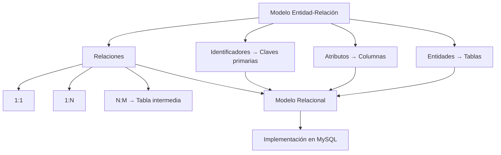

# Resumen

Con esta clase hemos completado uno de los pasos más importantes de todo el curso: la transición desde el **Modelo Entidad-Relación** hacia el ​**Modelo Relacional**​.

Hasta ahora habíamos trabajado desde una perspectiva conceptual, preocupándonos por comprender el negocio y representar correctamente sus elementos. A partir de esta sesión hemos aprendido cómo traducir ese conocimiento a una estructura que un sistema gestor de bases de datos puede comprender e implementar.

Comenzamos analizando por qué es necesaria esta transformación y comprendimos que un diagrama ER es una herramienta de análisis, mientras que un modelo relacional constituye el puente entre el análisis y la implementación física.

A continuación recordamos los componentes fundamentales del Modelo ER y estudiamos las reglas que permiten convertirlos en tablas, columnas y claves.

Aprendimos que toda entidad fuerte se transforma en una tabla y que las entidades débiles también generan tablas, aunque normalmente dependen de otra entidad para su identificación.

Después vimos cómo los atributos pasan a convertirse en columnas y cómo los identificadores del modelo conceptual se transforman en claves primarias capaces de identificar de forma única cada registro.

Una parte esencial de la clase estuvo dedicada a la transformación de las relaciones.

Aprendimos que:

* las relaciones **1:1** suelen implementarse mediante una clave foránea;
* las relaciones **1:N** trasladan la clave primaria del lado "uno" al lado "muchos";
* las relaciones **N:M** requieren siempre una tabla intermedia.

También estudiamos el tratamiento de atributos especiales, como los multivaluados y los compuestos, así como distintas estrategias para representar jerarquías y generalizaciones dentro del Modelo Relacional.

Finalmente validamos el resultado, recorrimos un caso práctico completo basado en nuestra empresa comercial y analizamos los errores más frecuentes que aparecen durante esta fase del diseño.

### Mapa conceptual

### Lo que deberías ser capaz de hacer

Al finalizar esta clase deberías ser capaz de:

* Explicar las diferencias entre el Modelo ER y el Modelo Relacional.
* Transformar correctamente entidades fuertes y débiles en tablas.
* Convertir atributos en columnas.
* Seleccionar claves primarias adecuadas.
* Transformar relaciones 1:1, 1:N y N:M.
* Representar atributos multivaluados y compuestos.
* Comprender las principales estrategias para modelar jerarquías.
* Validar un modelo relacional antes de implementarlo.

### Relación con la siguiente clase

Con el modelo relacional completamente definido, estamos preparados para comenzar la implementación física de la base de datos.

En las próximas clases dejaremos de trabajar únicamente con diagramas y empezaremos a utilizar **SQL** para crear bases de datos reales en MySQL.

Aprenderemos a utilizar instrucciones como:

* `CREATE DATABASE`
* `CREATE TABLE`
* `PRIMARY KEY`
* `FOREIGN KEY`
* `NOT NULL`
* `UNIQUE`
* `CHECK`
* `DEFAULT`

A partir de ese momento nuestro caso práctico dejará de ser únicamente un diseño sobre papel y se convertirá en una base de datos completamente funcional.

### Ideas clave

* El Modelo Relacional constituye el puente entre el análisis y la implementación.
* Cada elemento del Modelo ER posee una regla de transformación bien definida.
* Las claves primarias y las claves foráneas son la base de la integridad relacional.
* Las relaciones N:M siempre se implementan mediante tablas intermedias.
* Un modelo relacional correctamente validado facilita enormemente la implementación en MySQL y servirá como base para todo el resto del curso.

