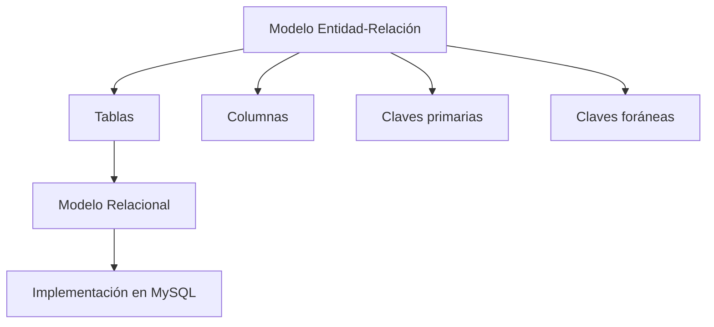

# Clase 7 — Transformación del Modelo Entidad-Relación al Modelo Relacional

Hasta ahora todo el trabajo realizado ha pertenecido al ​**diseño conceptual**​. Hemos aprendido a comprender el negocio, identificar entidades, atributos, relaciones, cardinalidades y reglas de negocio utilizando el Modelo Entidad-Relación (ER).

Sin embargo, un diagrama ER no puede ejecutarse en un sistema gestor de bases de datos. MySQL no entiende conceptos como "entidad", "participación" o "cardinalidad". Lo que entiende son ​**tablas, columnas, claves primarias y claves foráneas**​.

Por ello necesitamos una metodología que nos permita transformar el modelo conceptual en un modelo lógico que pueda implementarse posteriormente mediante SQL.

Esta transformación no consiste en copiar el diagrama ER dentro de MySQL. Cada elemento del modelo conceptual debe convertirse siguiendo una serie de reglas precisas que garantizan que la información, las restricciones y las relaciones del negocio permanezcan intactas.

Durante esta clase aprenderemos dichas reglas de transformación y las aplicaremos continuamente sobre nuestro caso de estudio de la empresa comercial. Al finalizar la sesión dispondremos del primer ​**Modelo Relacional completo**​, listo para implementarse en MySQL.

### Objetivos de aprendizaje

Al finalizar esta clase el estudiante será capaz de:

* Comprender la diferencia entre el Modelo ER y el Modelo Relacional.
* Transformar entidades fuertes y débiles en tablas.
* Convertir atributos en columnas.
* Seleccionar correctamente claves primarias.
* Transformar relaciones 1:1, 1:N y N:M.
* Representar atributos compuestos y multivaluados.
* Comprender distintas estrategias para representar jerarquías.
* Validar un modelo relacional antes de implementarlo.

### Contenido

1. [¿Por qué transformar un modelo?](01_por_que_transformar_un_modelo.md)
2. [Recordatorio del Modelo ER](02_recordatorio_del_modelo_er.md)
3. [Entidades fuertes a tablas](03_entidades_fuertes_a_tablas.md)
4. [Entidades débiles a tablas](04_entidades_debiles_a_tablas.md)
5. [Transformación de atributos](05_transformacion_de_atributos.md)
6. [Claves primarias](06_claves_primarias.md)
7. [Relaciones 1 a 1](07_relaciones_1_a_1.md)
8. [Relaciones 1 a N](08_relaciones_1_a_n.md)
9. [Relaciones N a M](09_relaciones_n_a_m.md)
10. [Atributos multivaluados](10_atributos_multivaluados.md)
11. [Atributos compuestos](11_atributos_compuestos.md)
12. [Jerarquías y generalización](12_jerarquias_y_generalizacion.md)
13. [Validación del modelo relacional](13_validacion_del_modelo_relacional.md)
14. [Caso práctico completo](14_caso_practico_completo.md)
15. [Errores frecuentes](15_errores_frecuentes.md)
16. [Resumen](16_resumen.md)

### Mapa conceptual

### Relación con el resto del curso

Esta clase constituye uno de los puntos de inflexión más importantes de la asignatura.

Hasta ahora hemos trabajado pensando como analistas del negocio.

A partir de esta sesión comenzaremos a pensar como diseñadores de bases de datos.

Todo lo aprendido aquí será utilizado inmediatamente en las siguientes clases, donde implementaremos físicamente nuestro modelo mediante SQL, aprenderemos el lenguaje DDL y construiremos nuestra primera base de datos completamente funcional en MySQL.

