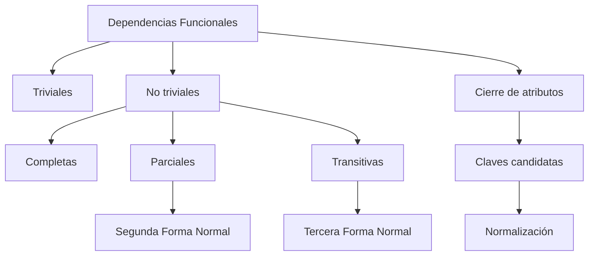

# Resumen

En esta clase hemos introducido uno de los pilares matemáticos del Modelo Relacional: las ​**dependencias funcionales**​.

Hasta ahora habíamos aprendido a construir modelos conceptuales y a transformarlos en tablas. Sin embargo, todavía no disponíamos de una herramienta para evaluar si esas tablas estaban correctamente diseñadas.

Las dependencias funcionales proporcionan precisamente ese mecanismo de análisis.

Comenzamos comprendiendo que los atributos de una tabla no son independientes, sino que mantienen relaciones determinadas por las reglas del negocio.

A continuación definimos formalmente una dependencia funcional y aprendimos a representarla mediante la notación:

```text
A → B
```

Posteriormente clasificamos las dependencias en triviales y no triviales, distinguiendo aquellas que aportan información útil para el diseño de las que son verdaderas por definición.

Después analizamos tres tipos especialmente importantes:

* ​**Dependencias completas**​, fundamentales para la Segunda Forma Normal.
* ​**Dependencias parciales**​, responsables de muchas redundancias.
* ​**Dependencias transitivas**​, que constituyen el principal objetivo de la Tercera Forma Normal.

También estudiamos el concepto de ​**clave candidata**​, aprendimos a calcular el **cierre de atributos** y vimos cómo utilizar esta técnica para determinar si un conjunto de atributos puede identificar de forma única una fila.

Finalmente aplicamos todos estos conceptos a nuestro caso de estudio, analizamos los errores más frecuentes y dejamos preparada la transición hacia el estudio de la normalización.

### Mapa conceptual



### Lo que deberías ser capaz de hacer

Al finalizar esta clase deberías poder:

* Explicar qué es una dependencia funcional.
* Diferenciar dependencias triviales y no triviales.
* Identificar dependencias completas, parciales y transitivas.
* Calcular el cierre de un conjunto de atributos.
* Determinar claves candidatas.
* Analizar dependencias funcionales en modelos reales.
* Detectar errores frecuentes durante el análisis.
* Comprender por qué las dependencias constituyen la base de la normalización.

### Relación con la siguiente clase

En la siguiente sesión comenzaremos el estudio de la ​**normalización**​, uno de los procesos más importantes del diseño de bases de datos.

Aplicaremos las dependencias funcionales aprendidas en esta clase para transformar tablas con redundancias en modelos más consistentes, eficientes y fáciles de mantener.

A partir de ese momento veremos cómo un buen diseño no depende únicamente de representar correctamente el negocio, sino también de organizar los datos de manera que eviten inconsistencias y faciliten la evolución del sistema.

### Ideas clave

* Las dependencias funcionales son el fundamento matemático del Modelo Relacional.
* Permiten descubrir claves candidatas y analizar la estructura de una tabla.
* Las dependencias parciales y transitivas son la causa de muchos problemas de diseño.
* El cierre de atributos proporciona un método sistemático para calcular claves.
* Todo lo aprendido en esta clase servirá como base para el estudio de las Formas Normales y la construcción de bases de datos relacionales de calidad.

