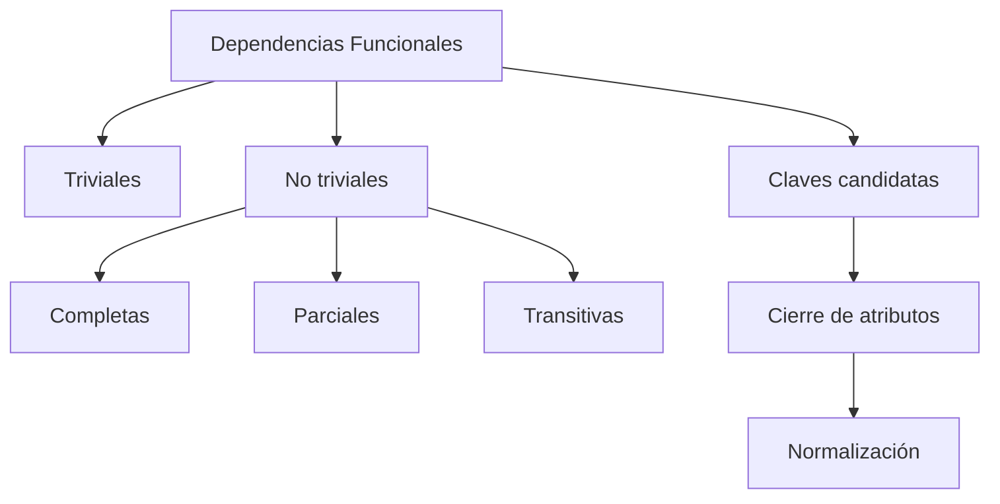

# Clase 8 — Dependencias Funcionales y Preparación para la Normalización

Hasta este momento del curso hemos aprendido a analizar un problema, construir un Modelo Entidad-Relación y transformarlo en un Modelo Relacional. Ya sabemos obtener tablas, columnas, claves primarias y claves foráneas.

Sin embargo, todavía no hemos respondido a una pregunta fundamental:

> **¿Cómo sabemos si una tabla está bien diseñada?**

Dos bases de datos pueden representar exactamente la misma información y, aun así, una de ellas ser mucho más eficiente, más fácil de mantener y mucho menos propensa a errores.

La diferencia se encuentra en las ​**dependencias funcionales**​.

Las dependencias funcionales constituyen el fundamento matemático del diseño de bases de datos relacionales. Gracias a ellas podremos descubrir redundancias, identificar claves candidatas y, en las próximas clases, aplicar el proceso de ​**normalización**​.

Aunque a primera vista puedan parecer un concepto teórico, en realidad describen relaciones que existen de forma natural dentro del negocio. Comprenderlas correctamente permitirá diseñar bases de datos mucho más robustas.

Durante esta clase estudiaremos los distintos tipos de dependencias, aprenderemos a calcular claves candidatas mediante el cierre de atributos y prepararemos el terreno para comenzar el estudio de las Formas Normales.

### Objetivos de aprendizaje

Al finalizar esta clase el estudiante será capaz de:

* Comprender el concepto de dependencia funcional.
* Diferenciar dependencias triviales y no triviales.
* Identificar dependencias completas, parciales y transitivas.
* Calcular el cierre de un conjunto de atributos.
* Determinar claves candidatas.
* Analizar dependencias en casos reales.
* Detectar errores habituales durante el análisis.
* Comprender por qué las dependencias son la base de la normalización.

### Contenido

1. [Introducción a las dependencias](01_introduccion_a_las_dependencias.md)
2. [¿Qué es una dependencia funcional?](02_que_es_una_dependencia_funcional.md)
3. [Dependencias triviales](03_dependencias_triviales.md)
4. [Dependencias no triviales](04_dependencias_no_triviales.md)
5. [Dependencias completas](05_dependencias_completas.md)
6. [Dependencias parciales](06_dependencias_parciales.md)
7. [Dependencias transitivas](07_dependencias_transitivas.md)
8. [Claves candidatas](08_claves_candidatas.md)
9. [Cierre de atributos](09_cierre_de_atributos.md)
10. [Cálculo de claves](10_calculo_de_claves.md)
11. [Dependencias en casos reales](11_dependencias_en_casos_reales.md)
12. [Errores habituales](12_errores_habituales.md)
13. [Preparación para la normalización](13_preparacion_para_normalizacion.md)
14. [Resumen](14_resumen.md)

### Mapa conceptual

### Relación con el resto del curso

Esta clase marca el paso desde el diseño estructural hacia el análisis matemático del Modelo Relacional.

Todo lo aprendido aquí será utilizado inmediatamente en las siguientes clases para estudiar la Primera, Segunda, Tercera Forma Normal y la Forma Normal de Boyce-Codd.

En otras palabras, esta sesión constituye el puente entre **construir tablas** y ​**construir tablas correctamente**​.

