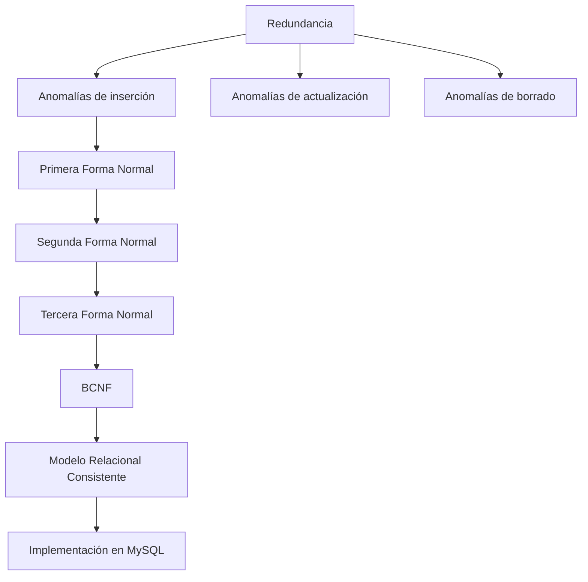

# Resumen

En esta clase hemos estudiado uno de los procesos fundamentales del diseño de bases de datos relacionales: ​**la normalización**​.

Comenzamos comprendiendo que una base de datos puede almacenar correctamente la información y, aun así, presentar un diseño deficiente debido a la redundancia de datos.

Analizamos cómo esa redundancia da lugar a tres grandes tipos de anomalías:

* anomalías de inserción;
* anomalías de actualización;
* anomalías de borrado.

Estas situaciones dificultan el mantenimiento de la base de datos y aumentan el riesgo de inconsistencias.

Posteriormente estudiamos las principales Formas Normales.

La **Primera Forma Normal (1FN)** nos enseñó que cada atributo debe contener un único valor atómico y que los grupos repetitivos deben eliminarse.

La **Segunda Forma Normal (2FN)** introdujo el concepto de dependencias parciales y mostró cómo reorganizar las tablas para que todos los atributos dependan de la clave completa.

La **Tercera Forma Normal (3FN)** eliminó las dependencias transitivas, consiguiendo que todos los atributos no clave dependan exclusivamente de la clave primaria.

Finalmente conocimos la ​**Forma Normal de Boyce-Codd (BCNF)**​, una versión más estricta de la Tercera Forma Normal que resuelve algunos casos especiales relacionados con determinantes que no son claves candidatas.

También analizamos el concepto de ​**desnormalización**​, comprendiendo que, aunque la normalización constituye el diseño lógico ideal, en determinados sistemas de alto rendimiento puede ser conveniente introducir cierta redundancia de forma controlada.

Durante toda la clase utilizamos el caso de estudio de la empresa comercial para observar cómo una base de datos inicialmente mal estructurada evolucionaba progresivamente hacia un modelo limpio, consistente y preparado para implementarse en un sistema gestor de bases de datos.

### Mapa conceptual

### Lo que deberías ser capaz de hacer

Al finalizar esta clase deberías poder:

* Explicar por qué es necesaria la normalización.
* Detectar redundancias en un modelo relacional.
* Identificar anomalías de inserción, actualización y borrado.
* Aplicar correctamente la Primera, Segunda y Tercera Forma Normal.
* Comprender cuándo es necesario utilizar BCNF.
* Analizar las ventajas y limitaciones de la desnormalización.
* Justificar cada decisión de diseño utilizando dependencias funcionales.

### Relación con la siguiente clase

Con el modelo completamente normalizado estamos preparados para comenzar una nueva etapa del curso.

A partir de la siguiente clase abandonaremos el diseño puramente teórico y comenzaremos a construir físicamente la base de datos utilizando ​**MySQL**​.

Aprenderemos a crear bases de datos y tablas mediante SQL, definir claves primarias y foráneas, establecer restricciones de integridad y comprobar que el modelo diseñado durante las clases anteriores puede implementarse exactamente igual en un sistema gestor de bases de datos.

En otras palabras, pasaremos del ​**papel al código**​.

### Ideas clave

* La normalización mejora la calidad del diseño lógico.
* Cada Forma Normal elimina un tipo específico de redundancia.
* Las dependencias funcionales constituyen el fundamento de todo el proceso.
* BCNF resuelve situaciones especiales que pueden escapar a la 3FN.
* Un modelo correctamente normalizado es más consistente, más fácil de mantener y constituye la base para una implementación profesional en SQL.

