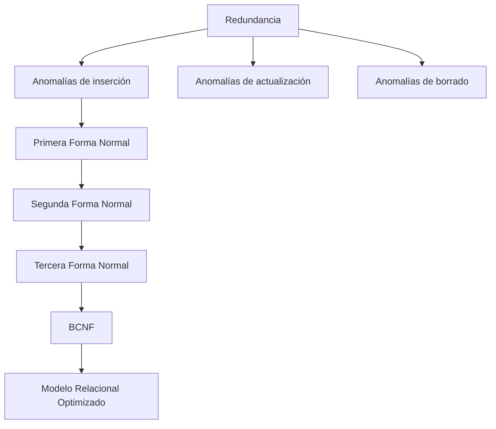

# Clase 9 — Normalización de Bases de Datos

En la clase anterior descubrimos que las **dependencias funcionales** permiten describir matemáticamente las relaciones existentes entre los atributos de una tabla. Sin embargo, conocer estas dependencias es solo el primer paso.

La siguiente pregunta es inevitable:

> **¿Qué hacemos cuando una tabla presenta dependencias que provocan redundancia o inconsistencias?**

La respuesta es la ​**normalización**​.

La normalización es una metodología sistemática para reorganizar una base de datos con el objetivo de eliminar redundancias innecesarias, reducir anomalías y mejorar la integridad de la información.

A lo largo de esta clase aprenderemos por qué surgió la normalización, qué problemas intenta resolver y cómo aplicar progresivamente la Primera, Segunda y Tercera Forma Normal, así como la Forma Normal de Boyce-Codd (BCNF).

Como en las clases anteriores, utilizaremos el caso práctico de nuestra empresa comercial para observar cómo una base de datos mal diseñada evoluciona paso a paso hasta convertirse en un modelo robusto y preparado para implementarse en MySQL.

Es importante comprender que normalizar no significa simplemente dividir tablas.

Cada descomposición debe estar respaldada por dependencias funcionales y conservar el significado del modelo original.

### Objetivos de aprendizaje

Al finalizar esta clase el estudiante será capaz de:

* Comprender la finalidad de la normalización.
* Identificar redundancias en un modelo relacional.
* Detectar anomalías de inserción, actualización y borrado.
* Aplicar correctamente la Primera Forma Normal (1FN).
* Aplicar correctamente la Segunda Forma Normal (2FN).
* Aplicar correctamente la Tercera Forma Normal (3FN).
* Comprender cuándo aplicar la Forma Normal de Boyce-Codd (BCNF).
* Analizar cuándo una desnormalización puede ser conveniente.

### Contenido

1. [¿Por qué normalizar?](01_por_que_normalizar.md)
2. [Problemas de redundancia](02_problemas_de_reduncancia.md)
3. [Anomalías de inserción](03_anomalias_de_insercion.md)
4. [Anomalías de actualización](04_anomalias_de_actualizacion.md)
5. [Anomalías de borrado](05_anomalias_de_borrado.md)
6. [Primera Forma Normal](06_primera_forma_normal.md)
7. [Ejercicios de 1FN](07_ejercicios_1fn.md)
8. [Segunda Forma Normal](08_segunda_forma_normal.md)
9. [Ejercicios de 2FN](09_ejercicios_2fn.md)
10. [Tercera Forma Normal](10_tercera_forma_normal.md)
11. [Ejercicios de 3FN](11_ejercicios_3fn.md)
12. [Forma Normal BCNF](12_forma_normal_bcnf.md)
13. [Desnormalización: cuándo conviene](13_desnormalizacion_cuando_conviene.md)
14. [Caso completo paso a paso](14_caso_completo_paso_a_paso.md)
15. [Errores frecuentes](15_errores_frecuentes.md)
16. [Resumen](16_resumen.md)

### Mapa conceptual

### Relación con el resto del curso

La normalización constituye una de las habilidades más importantes que debe dominar cualquier diseñador de bases de datos.

Todo lo aprendido en esta clase será utilizado posteriormente cuando diseñemos bases de datos reales mediante SQL, optimicemos consultas y analicemos el rendimiento de sistemas empresariales.

Comprender las Formas Normales permitirá tomar decisiones de diseño fundamentadas y distinguir entre un modelo simplemente funcional y un modelo profesional.

