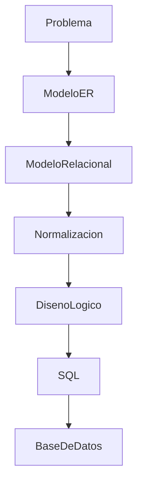

# Del modelo relacional al diseño lógico

Hasta este momento hemos trabajado principalmente con modelos.

Hemos identificado entidades, atributos, relaciones y dependencias funcionales. También hemos transformado el modelo Entidad-Relación en un modelo relacional y lo hemos normalizado.

Sin embargo, todavía estamos trabajando a un nivel conceptual.

Antes de construir físicamente la base de datos debemos convertir ese modelo en un ​**diseño lógico**​.

### ¿Qué es el diseño lógico?

El diseño lógico es la representación detallada de una base de datos preparada para implementarse en un Sistema Gestor de Bases de Datos.

Durante esta etapa dejamos de pensar únicamente en el negocio y comenzamos a considerar aspectos propios del sistema que utilizaremos.

Por ejemplo:

* cómo se llamarán las tablas;
* cómo se llamarán las columnas;
* qué tipos de datos utilizaremos;
* qué columnas serán obligatorias;
* qué restricciones necesitaremos.

Todavía no escribimos SQL, pero ya estamos preparando todo lo necesario para hacerlo.

### Del análisis a la implementación

Podemos visualizar el proceso completo mediante el siguiente esquema.



Cada etapa responde a preguntas diferentes.

| Etapa             | Pregunta principal                 |
| ------------------- | ------------------------------------ |
| Modelo ER         | ¿Qué información existe?        |
| Modelo Relacional | ¿Cómo se organiza?               |
| Normalización    | ¿Está correctamente organizada?  |
| Diseño lógico   | ¿Cómo se implementará?          |
| SQL               | ¿Cómo se construye físicamente? |

### Un ejemplo

Supongamos que nuestro modelo contiene la entidad ​**Cliente**​.

Durante el diseño lógico comenzamos a tomar decisiones concretas.

```text
CLIENTE

IdCliente

Nombre

CorreoElectronico

Telefono

FechaRegistro
```

Todavía no sabemos si **IdCliente** será un entero o un UUID.

Tampoco hemos decidido el tamaño máximo del nombre o del correo.

Estas decisiones forman parte precisamente del diseño lógico.

### ¿Por qué es importante?

Muchos errores en bases de datos reales no aparecen durante el análisis del negocio.

Aparecen cuando el modelo se implementa sin haber definido correctamente estos detalles.

Un buen diseño lógico evita:

* nombres ambiguos;
* tipos de datos incorrectos;
* restricciones olvidadas;
* claves mal definidas;
* problemas de mantenimiento.

### Nuestro caso de estudio

Durante esta clase revisaremos toda la base de datos de la empresa comercial para prepararla antes de implementarla en MySQL.

Cuando terminemos, el modelo estará listo para convertirse directamente en código SQL.

### Ideas clave

* El diseño lógico conecta el modelo relacional con la implementación física.
* En esta fase se toman decisiones técnicas importantes.
* Todavía no se escribe SQL, pero se prepara todo lo necesario para hacerlo.
* Un buen diseño lógico facilita el desarrollo y el mantenimiento.
* Constituye el último paso antes de crear la base de datos real.

