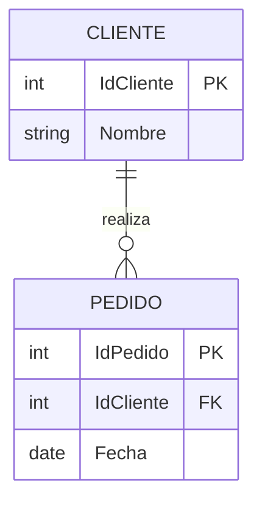

# Claves primarias y foráneas

Hasta ahora hemos utilizado las claves primarias y foráneas como parte del modelo relacional. Sin embargo, al pasar al diseño lógico debemos decidir ​**cómo implementarlas de forma consistente**​.

Estas claves constituyen la base sobre la que se construyen todas las relaciones de una base de datos relacional.

Sin ellas, las tablas serían simplemente conjuntos de datos independientes.

### Clave primaria

La **clave primaria** identifica de forma única cada fila de una tabla.

Dos registros nunca pueden compartir el mismo valor de clave primaria.

Además, una clave primaria nunca puede ser nula.

Por ejemplo:

```text
CLIENTE

IdCliente
Nombre
CorreoElectronico
Telefono
```

En esta tabla, **IdCliente** identifica de manera única a cada cliente.

### Características de una buena clave primaria

Una buena clave primaria debe ser:

* única;
* estable a lo largo del tiempo;
* obligatoria;
* sencilla de utilizar.

Siempre que sea posible, utilizaremos identificadores artificiales generados por el sistema.

Por ejemplo:

```text
IdProducto

IdPedido

IdEmpleado
```

En lugar de utilizar datos del negocio como el nombre o el correo electrónico.

### ¿Por qué no utilizar datos reales?

Imaginemos que decidimos utilizar el correo electrónico como clave primaria.

Si un cliente cambia de dirección de correo, todas las referencias deberán actualizarse.

En cambio, si utilizamos un identificador numérico, el correo podrá modificarse sin afectar a las relaciones entre tablas.

Por ello, en la mayoría de los sistemas modernos se emplean claves sustitutas (surrogate keys).

### Claves foráneas

Una **clave foránea** conecta dos tablas.

Su función consiste en indicar que un registro depende de otro existente en otra tabla.

Por ejemplo:

```text
CLIENTE

IdCliente
```

```text
PEDIDO

IdPedido

IdCliente
```

La columna **IdCliente** de PEDIDO hace referencia a la clave primaria de CLIENTE.

Gracias a ello sabemos qué cliente realizó cada pedido.

### Representación del modelo



### Buenas prácticas

Durante el diseño lógico seguiremos siempre estas recomendaciones.

* Todas las tablas tendrán una clave primaria.
* Las claves primarias utilizarán la convención ​**IdEntidad**​.
* Las claves foráneas conservarán exactamente el mismo nombre.
* Nunca utilizaremos datos modificables como clave primaria.
* Todas las relaciones importantes estarán representadas mediante claves foráneas.

### Nuestro caso práctico

En la empresa comercial encontraremos relaciones como:

```text
PEDIDO

IdCliente
```

```text
LINEA_PEDIDO

IdPedido

IdProducto
```

Estas referencias garantizarán que todos los pedidos pertenezcan a clientes existentes y que todas las líneas hagan referencia a productos válidos.

### Ideas clave

* La clave primaria identifica un registro de forma única.
* La clave foránea conecta dos tablas.
* Las claves deben ser estables y fáciles de utilizar.
* Las relaciones del modelo se implementan mediante claves foráneas.
* Un buen diseño de claves facilita el mantenimiento de toda la base de datos.

