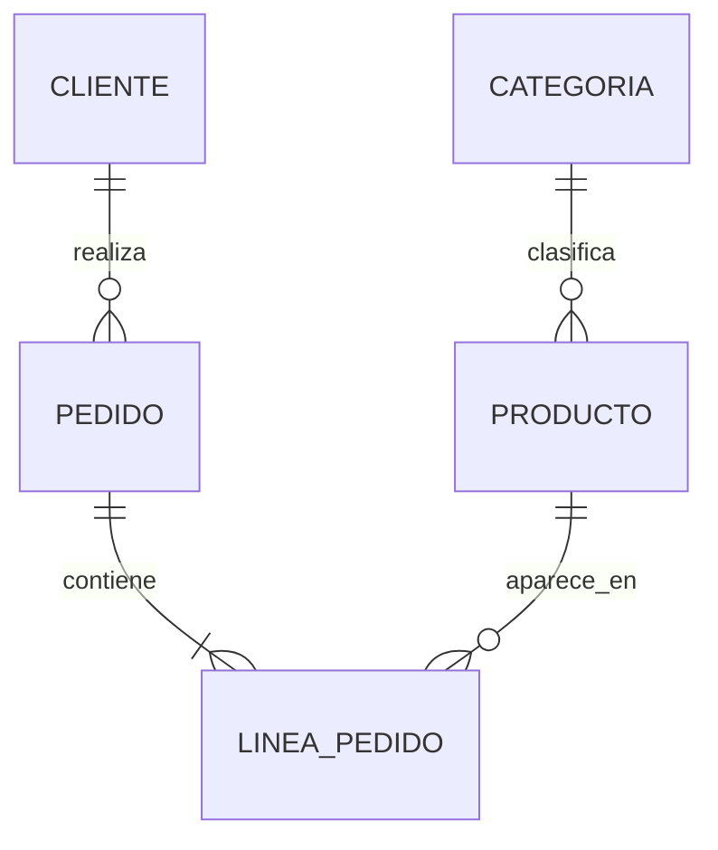

# Revisión final del caso práctico

Después de varias clases de análisis y diseño, nuestro caso práctico está preparado para dar el siguiente paso: convertirse en una base de datos real.

Antes de comenzar la implementación conviene realizar una última revisión general.

### Las entidades principales

El modelo final contiene las siguientes entidades.

```text
CLIENTE

PRODUCTO

CATEGORIA

PEDIDO

LINEA_PEDIDO

PROVEEDOR

EMPLEADO
```

Cada una representa un concepto independiente dentro de la empresa comercial.

### Relaciones

Las relaciones también han sido revisadas.



Estas relaciones reflejan correctamente el funcionamiento del negocio.

### Revisión de las claves

Cada tabla dispone de una clave primaria claramente definida.

Las relaciones se implementarán mediante claves foráneas con nombres coherentes y uniformes.

Esta decisión facilitará la escritura de consultas SQL y la comprensión del esquema.

### Preparación para MySQL

Aunque todavía no hemos escrito código SQL, ya conocemos prácticamente todos los elementos que necesitaremos implementar.

En la siguiente etapa del curso transformaremos este diseño lógico en instrucciones como:

* creación de bases de datos;
* creación de tablas;
* definición de claves;
* restricciones;
* relaciones.

Veremos que el trabajo realizado durante las clases anteriores simplifica enormemente esta tarea.

### Una reflexión final

Es habitual pensar que la parte importante de una base de datos comienza al escribir SQL.

En realidad ocurre lo contrario.

Cuando el diseño está bien realizado, la implementación suele ser sencilla.

La mayor parte del esfuerzo debe concentrarse en comprender correctamente el problema y diseñar una estructura capaz de representar fielmente el negocio.

Ese ha sido precisamente el objetivo de las diez primeras clases del curso.

### Ideas clave

* El modelo de la empresa comercial está completamente preparado para implementarse.
* Las entidades, relaciones y claves han sido revisadas.
* El diseño lógico reduce los problemas durante la implementación.
* Un buen diseño facilita el desarrollo posterior.
* La siguiente etapa del curso se centrará en traducir este modelo a SQL y MySQL.

