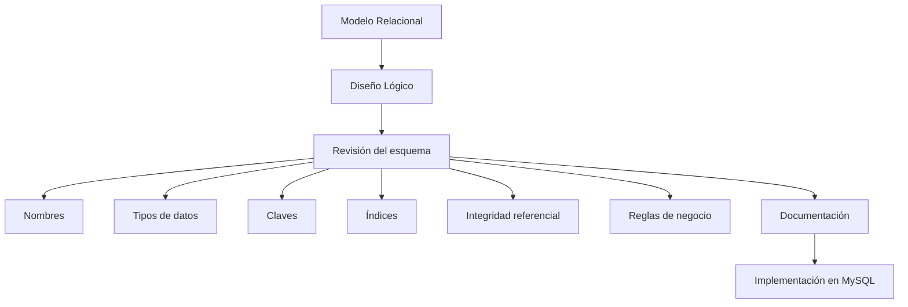

# Resumen

En esta clase hemos recorrido el último paso del proceso de diseño antes de comenzar a construir una base de datos real.

Hasta ahora habíamos trabajado principalmente con modelos conceptuales y relacionales. A partir de esta sesión hemos aprendido a convertir ese conocimiento en un ​**diseño lógico**​, es decir, en un esquema completamente preparado para ser implementado en un Sistema Gestor de Bases de Datos como MySQL.

Comenzamos diferenciando claramente el modelo relacional del diseño lógico. Mientras el primero describe la organización de la información desde un punto de vista teórico, el segundo incorpora las decisiones técnicas necesarias para su implementación.

Posteriormente revisamos el esquema completo de nuestro caso práctico, comprobando que todas las entidades, relaciones, claves y dependencias funcionales representaban correctamente el funcionamiento de la empresa comercial.

A continuación estudiamos la importancia de utilizar convenciones coherentes para nombrar tablas y columnas. Aunque pueda parecer un aspecto secundario, una nomenclatura uniforme mejora la legibilidad, facilita el mantenimiento y reduce la probabilidad de errores durante el desarrollo.

También analizamos la elección de los tipos de datos, comprendiendo que cada atributo debe almacenarse utilizando el tipo que mejor represente su naturaleza. Esta decisión afecta tanto a la integridad de la información como al rendimiento y al consumo de almacenamiento.

Después revisamos el papel de las claves primarias y foráneas como mecanismo para identificar registros y representar relaciones entre entidades, garantizando la coherencia del modelo relacional.

A continuación introdujimos la planificación de índices desde la fase de diseño. Aunque los índices se implementarán más adelante, aprendimos que anticipar las consultas más frecuentes permite tomar mejores decisiones durante el diseño lógico.

También profundizamos en el concepto de integridad referencial y en la importancia de que todas las relaciones entre tablas permanezcan siempre consistentes, evitando referencias inválidas y preservando la calidad de los datos.

Posteriormente estudiamos cómo trasladar las reglas de negocio al diseño de la base de datos. Comprendimos que muchas validaciones no deben depender únicamente de la aplicación, sino que también deben estar protegidas por el propio sistema gestor de bases de datos.

Finalmente analizamos la importancia de documentar correctamente el modelo mediante diagramas, descripciones y diccionarios de datos, realizando una revisión completa del caso práctico que utilizaremos durante toda la parte de implementación del curso.

### Mapa conceptual

### Lo que deberías ser capaz de hacer

Al finalizar esta clase deberías ser capaz de:

* Explicar qué es el diseño lógico y por qué constituye un paso independiente del modelo relacional.
* Revisar un esquema antes de implementarlo.
* Aplicar convenciones coherentes para nombrar tablas y columnas.
* Seleccionar tipos de datos adecuados según la naturaleza de la información.
* Diseñar correctamente claves primarias y foráneas.
* Identificar qué columnas requerirán índices.
* Incorporar reglas de negocio al diseño de una base de datos.
* Elaborar una documentación básica de un modelo relacional.

### Relación con la siguiente clase

Con esta sesión concluye la fase de análisis y diseño del curso.

A partir de la próxima clase comenzaremos la **implementación física** de la base de datos utilizando ​**MySQL**​.

Por primera vez escribiremos instrucciones SQL reales para crear bases de datos, definir tablas, establecer claves primarias y foráneas, aplicar restricciones y comprobar cómo todo el trabajo de diseño realizado hasta ahora se transforma en una base de datos completamente funcional.

En otras palabras, dejaremos de diseñar bases de datos para empezar a construirlas.

### Ideas clave

* El diseño lógico es el puente entre el modelo relacional y la implementación física.
* Un esquema bien revisado reduce problemas durante el desarrollo.
* La elección de nombres, tipos de datos y claves influye directamente en la calidad del sistema.
* Las reglas de negocio y la integridad referencial deben reflejarse en el diseño.
* La documentación forma parte del propio proceso de ingeniería.
* El modelo de la empresa comercial está completamente preparado para ser implementado en MySQL.

