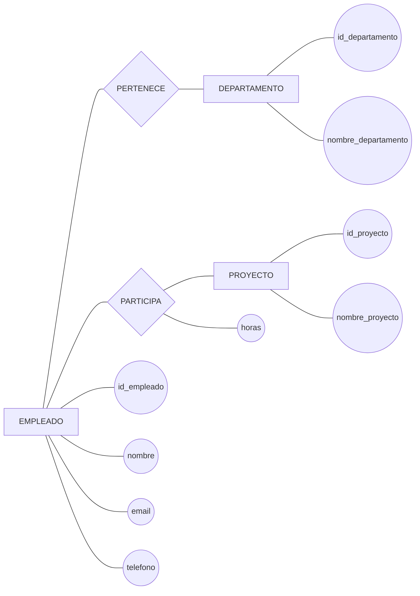
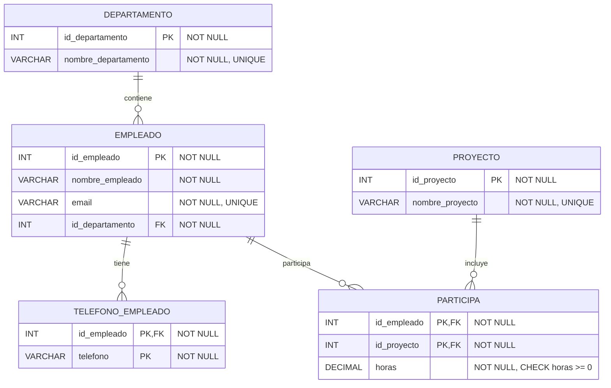

# Ejercicio 1. Normalización de una gestión de empleados

## Enunciado

Una empresa gestiona empleados, departamentos y proyectos.

Cada empleado pertenece a un departamento y puede participar en varios proyectos. Un empleado puede tener varios teléfonos.

### Modelo Chen



Se dispone además de la siguiente relación inicial:

```text
EMPLEADO_PROYECTO(
    id_empleado,
    nombre_empleado,
    email,
    telefono,
    id_departamento,
    nombre_departamento,
    id_proyecto,
    nombre_proyecto,
    horas
)
```

Dependencias funcionales:

```text
id_empleado → nombre_empleado, email, id_departamento
id_departamento → nombre_departamento
id_proyecto → nombre_proyecto
id_empleado, id_proyecto → horas
```

Se pide:

1. Identificar el atributo multivaluado.
2. Determinar la clave de la relación inicial.
3. Identificar las dependencias parciales y transitivas.
4. Normalizar hasta 3FN.
5. Indicar las relaciones finales con sus claves.

## Resolución

### 1. Atributo multivaluado

Un empleado puede tener varios teléfonos:

```text
telefono
```

Por tanto, no debe permanecer como atributo multivaluado dentro de `EMPLEADO`.

Se crea:

```text
TELEFONO_EMPLEADO(
    id_empleado,
    telefono
)
```

Clave:

```text
PK = (id_empleado, telefono)
```

### 2. Clave de la relación inicial

Un empleado puede participar en varios proyectos y un proyecto puede tener varios empleados.

Por tanto:

```text
PK = (id_empleado, id_proyecto)
```

### 3. Dependencias parciales

Partiendo de:

```text
PK = (id_empleado, id_proyecto)
```

Tenemos:

```text
id_empleado → nombre_empleado, email, id_departamento
id_proyecto → nombre_proyecto
```

Son dependencias parciales porque dependen solamente de una parte de la clave compuesta.

La dependencia:

```text
id_empleado, id_proyecto → horas
```

depende de la clave completa.

### 4. Dependencia transitiva

Tenemos:

```text
id_empleado → id_departamento
id_departamento → nombre_departamento
```

Por tanto:

```text
id_empleado → nombre_departamento
```

es una dependencia transitiva.

### 5. Primera descomposición

Creamos:

```text
EMPLEADO(
    id_empleado PK,
    nombre_empleado,
    email,
    id_departamento FK
)
```

```text
DEPARTAMENTO(
    id_departamento PK,
    nombre_departamento
)
```

```text
PROYECTO(
    id_proyecto PK,
    nombre_proyecto
)
```

```text
PARTICIPA(
    id_empleado PK FK,
    id_proyecto PK FK,
    horas
)
```

Y separamos el atributo multivaluado:

```text
TELEFONO_EMPLEADO(
    id_empleado PK FK,
    telefono PK
)
```

### 6. Resultado final en 3FN

```text
DEPARTAMENTO(
    id_departamento PK,
    nombre_departamento
)

EMPLEADO(
    id_empleado PK,
    nombre_empleado,
    email,
    id_departamento FK
)

TELEFONO_EMPLEADO(
    id_empleado PK FK,
    telefono PK
)

PROYECTO(
    id_proyecto PK,
    nombre_proyecto
)

PARTICIPA(
    id_empleado PK FK,
    id_proyecto PK FK,
    horas
)
```

### 7. Comprobación de las dependencias

```text
DEPARTAMENTO
id_departamento → nombre_departamento

EMPLEADO
id_empleado → nombre_empleado, email, id_departamento

TELEFONO_EMPLEADO
id_empleado, telefono → ninguno

PROYECTO
id_proyecto → nombre_proyecto

PARTICIPA
id_empleado, id_proyecto → horas
```

La información queda separada eliminando dependencias parciales, dependencias transitivas y el atributo multivaluado.

### 8. Diagrama Relacional



### Restricciones

```text
DEPARTAMENTO
PK: id_departamento
UNIQUE: nombre_departamento
NOT NULL: todos los atributos

EMPLEADO
PK: id_empleado
FK: id_departamento → DEPARTAMENTO(id_departamento)
UNIQUE: email
NOT NULL: todos los atributos

TELEFONO_EMPLEADO
PK: (id_empleado, telefono)
FK: id_empleado → EMPLEADO(id_empleado)
NOT NULL: todos los atributos

PROYECTO
PK: id_proyecto
UNIQUE: nombre_proyecto
NOT NULL: todos los atributos

PARTICIPA
PK: (id_empleado, id_proyecto)
FK: id_empleado → EMPLEADO(id_empleado)
FK: id_proyecto → PROYECTO(id_proyecto)
NOT NULL: todos los atributos
CHECK: horas >= 0
```

No hay atributos nullable en este modelo: las relaciones obligatorias del modelo conceptual se reflejan mediante `NOT NULL` en las correspondientes FK.

