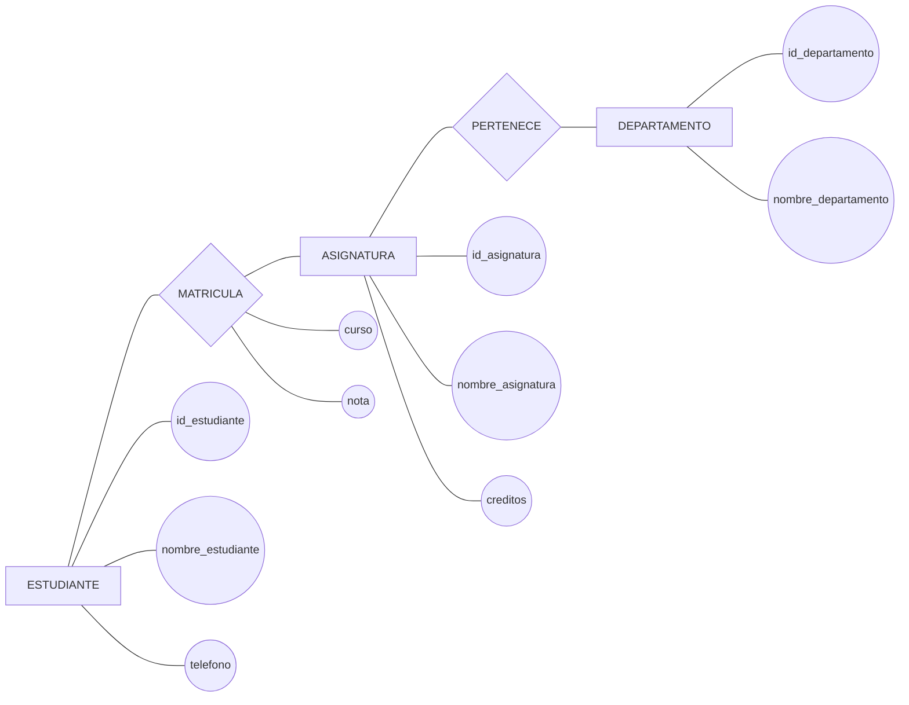
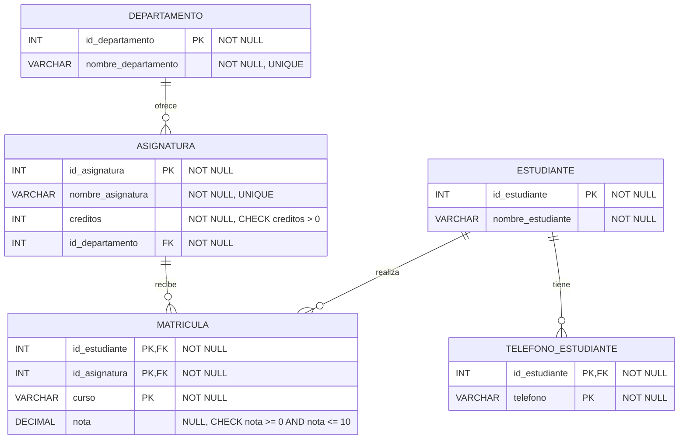

# Ejercicio 2. Normalización de matrículas universitarias

## Enunciado

Una universidad registra las matrículas de sus estudiantes.

Un estudiante puede matricularse en varias asignaturas y una asignatura puede tener muchos estudiantes. Cada asignatura pertenece a un departamento y cada estudiante puede tener varios teléfonos.

### Modelo Chen



Relación inicial:

```text
MATRICULA(
    id_estudiante,
    nombre_estudiante,
    telefono,
    id_asignatura,
    nombre_asignatura,
    creditos,
    id_departamento,
    nombre_departamento,
    curso,
    nota
)
```

Dependencias funcionales:

```text
id_estudiante → nombre_estudiante
id_asignatura → nombre_asignatura, creditos, id_departamento
id_departamento → nombre_departamento
id_estudiante, id_asignatura, curso → nota
```

Se pide:

1. Identificar el atributo multivaluado.
2. Determinar la clave.
3. Identificar dependencias parciales.
4. Identificar dependencias transitivas.
5. Normalizar hasta 3FN.
6. Indicar las relaciones finales.

## Resolución

### 1. Atributo multivaluado

Un estudiante puede tener varios teléfonos:

```text
telefono
```

Se crea:

```text
TELEFONO_ESTUDIANTE(
    id_estudiante,
    telefono
)
```

Clave:

```text
PK = (id_estudiante, telefono)
```

### 2. Clave de la relación inicial

La nota corresponde a un estudiante, una asignatura y un curso académico:

```text
PK = (id_estudiante, id_asignatura, curso)
```

### 3. Dependencias parciales

Tenemos:

```text
id_estudiante → nombre_estudiante
```

y:

```text
id_asignatura → nombre_asignatura, creditos, id_departamento
```

Ambas dependen solamente de una parte de la clave.

Por tanto, existen dependencias parciales.

La dependencia:

```text
id_estudiante, id_asignatura, curso → nota
```

depende de la clave completa.

### 4. Dependencia transitiva

Tenemos:

```text
id_asignatura → id_departamento
id_departamento → nombre_departamento
```

Por tanto:

```text
id_asignatura → nombre_departamento
```

es una dependencia transitiva.

### 5. Descomposición

#### ESTUDIANTE

```text
ESTUDIANTE(
    id_estudiante PK,
    nombre_estudiante
)
```

#### TELÉFONOS

```text
TELEFONO_ESTUDIANTE(
    id_estudiante PK FK,
    telefono PK
)
```

#### DEPARTAMENTO

```text
DEPARTAMENTO(
    id_departamento PK,
    nombre_departamento
)
```

#### ASIGNATURA

```text
ASIGNATURA(
    id_asignatura PK,
    nombre_asignatura,
    creditos,
    id_departamento FK
)
```

#### MATRÍCULA

```text
MATRICULA(
    id_estudiante PK FK,
    id_asignatura PK FK,
    curso PK,
    nota
)
```

### 6. Resultado final en 3FN

```text
ESTUDIANTE(
    id_estudiante PK,
    nombre_estudiante
)

TELEFONO_ESTUDIANTE(
    id_estudiante PK FK,
    telefono PK
)

DEPARTAMENTO(
    id_departamento PK,
    nombre_departamento
)

ASIGNATURA(
    id_asignatura PK,
    nombre_asignatura,
    creditos,
    id_departamento FK
)

MATRICULA(
    id_estudiante PK FK,
    id_asignatura PK FK,
    curso PK,
    nota
)
```

### 7. Dependencias finales

```text
ESTUDIANTE
id_estudiante → nombre_estudiante

DEPARTAMENTO
id_departamento → nombre_departamento

ASIGNATURA
id_asignatura → nombre_asignatura, creditos, id_departamento

MATRICULA
id_estudiante, id_asignatura, curso → nota

TELEFONO_ESTUDIANTE
id_estudiante, telefono → ninguno
```

Resultado: no quedan dependencias parciales ni transitivas en las relaciones resultantes.

### 8. Diagrama Relacional



### Restricciones

```text
ESTUDIANTE
PK: id_estudiante
NOT NULL: todos los atributos

TELEFONO_ESTUDIANTE
PK: (id_estudiante, telefono)
FK: id_estudiante → ESTUDIANTE(id_estudiante)
NOT NULL: todos los atributos

DEPARTAMENTO
PK: id_departamento
UNIQUE: nombre_departamento
NOT NULL: todos los atributos

ASIGNATURA
PK: id_asignatura
FK: id_departamento → DEPARTAMENTO(id_departamento)
UNIQUE: nombre_asignatura
CHECK: creditos > 0
NOT NULL: todos los atributos

MATRICULA
PK: (id_estudiante, id_asignatura, curso)
FK: id_estudiante → ESTUDIANTE(id_estudiante)
FK: id_asignatura → ASIGNATURA(id_asignatura)
NOT NULL: id_estudiante, id_asignatura, curso
NULL: nota
CHECK: nota >= 0 AND nota <= 10 cuando nota no sea NULL
```

`nota` es nullable porque una matrícula puede existir antes de que el estudiante haya recibido una calificación.

