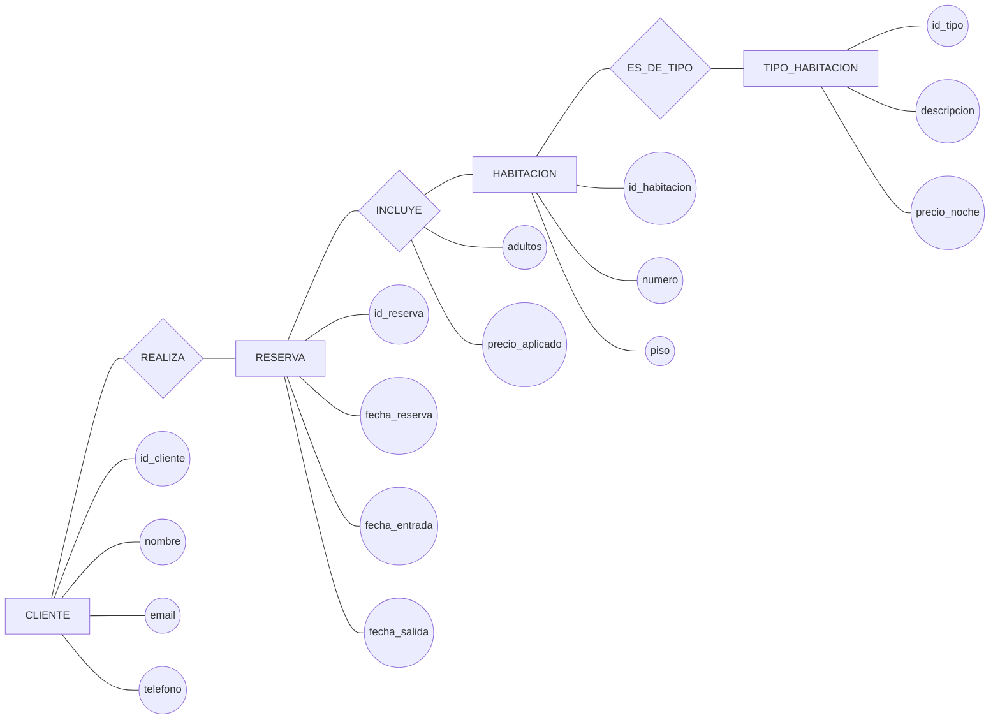
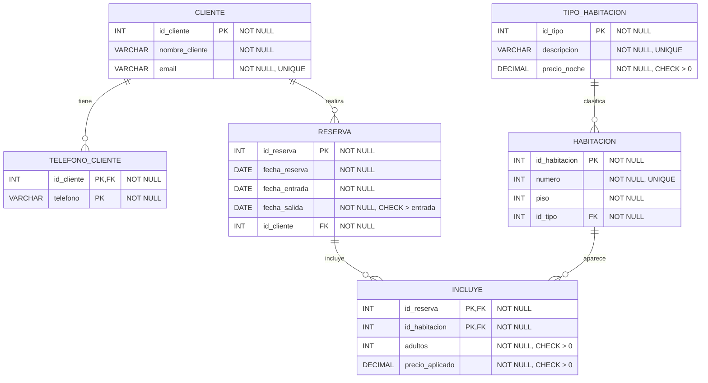

# Ejercicio 3. Normalización de un sistema de reservas hoteleras

## Enunciado

Un hotel gestiona clientes, habitaciones y reservas.

Un cliente puede realizar varias reservas y una reserva puede incluir varias habitaciones. Una habitación pertenece a un tipo. Un cliente puede tener varios teléfonos.

### Modelo Chen



Se dispone de la siguiente relación:

```text
RESERVA_HOTEL(
    id_reserva,
    fecha_reserva,
    fecha_entrada,
    fecha_salida,
    id_cliente,
    nombre_cliente,
    email_cliente,
    telefono_cliente,
    id_habitacion,
    numero_habitacion,
    piso,
    id_tipo,
    descripcion_tipo,
    precio_noche,
    adultos,
    precio_aplicado
)
```

Dependencias:

```text
id_reserva → fecha_reserva, fecha_entrada, fecha_salida, id_cliente

id_cliente → nombre_cliente, email_cliente

id_habitacion → numero_habitacion, piso, id_tipo

id_tipo → descripcion_tipo, precio_noche

id_reserva, id_habitacion → adultos, precio_aplicado
```

Se pide:

1. Identificar el atributo multivaluado.
2. Determinar la clave de la relación inicial.
3. Identificar las dependencias parciales.
4. Identificar las dependencias transitivas.
5. Normalizar hasta 3FN.
6. Indicar las relaciones resultantes.
7. Representar el modelo relacional mediante Mermaid, indicando PK, FK, `NULL/NOT NULL` y restricciones.

## Resolución

### 1. Atributo multivaluado

El teléfono del cliente puede tener varios valores:

```text
telefono_cliente
```

Se crea:

```text
TELEFONO_CLIENTE(
    id_cliente PK FK,
    telefono PK
)
```

### 2. Clave inicial

Una reserva puede incluir varias habitaciones:

```text
PK = (id_reserva, id_habitacion)
```

### 3. Dependencias parciales

```text
id_reserva → fecha_reserva, fecha_entrada, fecha_salida, id_cliente

id_habitacion → numero_habitacion, piso, id_tipo
```

Ambas dependen solamente de una parte de la clave compuesta.

### 4. Dependencias transitivas

```text
id_cliente → nombre_cliente, email_cliente

id_habitacion → id_tipo

id_tipo → descripcion_tipo, precio_noche
```

Por tanto existen dependencias transitivas.

### 5. Relaciones en 3FN

```text
CLIENTE(
    id_cliente PK,
    nombre_cliente,
    email
)

TELEFONO_CLIENTE(
    id_cliente PK FK,
    telefono PK
)

TIPO_HABITACION(
    id_tipo PK,
    descripcion,
    precio_noche
)

HABITACION(
    id_habitacion PK,
    numero,
    piso,
    id_tipo FK
)

RESERVA(
    id_reserva PK,
    fecha_reserva,
    fecha_entrada,
    fecha_salida,
    id_cliente FK
)

INCLUYE(
    id_reserva PK FK,
    id_habitacion PK FK,
    adultos,
    precio_aplicado
)
```

### 6. Diagrama relacional



### Restricciones principales

```text
CLIENTE
PK: id_cliente
UNIQUE: email

TELEFONO_CLIENTE
PK: (id_cliente, telefono)
FK: id_cliente → CLIENTE(id_cliente)

TIPO_HABITACION
PK: id_tipo
UNIQUE: descripcion
CHECK: precio_noche > 0

HABITACION
PK: id_habitacion
FK: id_tipo → TIPO_HABITACION(id_tipo)
UNIQUE: numero

RESERVA
PK: id_reserva
FK: id_cliente → CLIENTE(id_cliente)
CHECK: fecha_salida > fecha_entrada

INCLUYE
PK: (id_reserva, id_habitacion)
FK: id_reserva → RESERVA(id_reserva)
FK: id_habitacion → HABITACION(id_habitacion)
CHECK: adultos > 0
CHECK: precio_aplicado > 0
```

