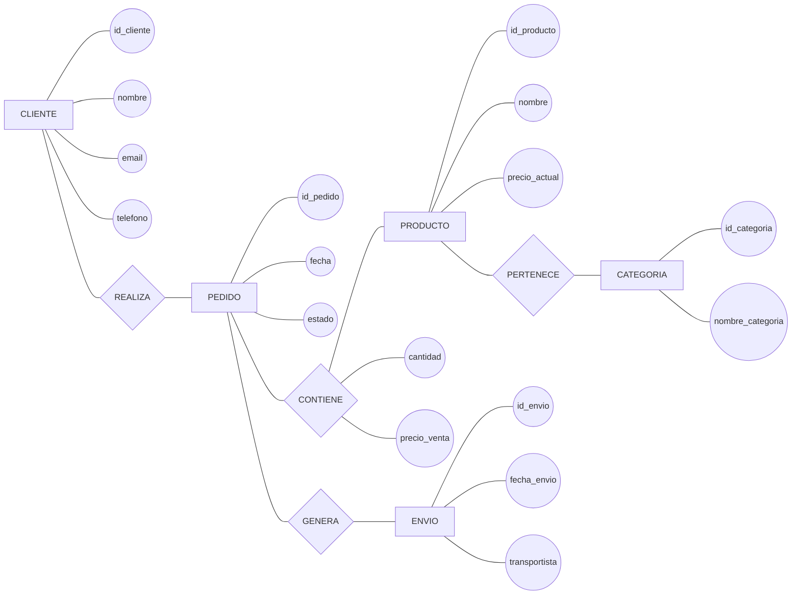
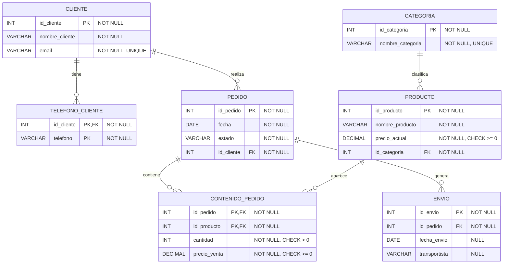

# Ejercicio 4. Normalización de un sistema de pedidos y distribución

## Enunciado

Una empresa distribuye productos a sus clientes.

Cada cliente puede realizar varios pedidos. Cada pedido contiene varios productos y un producto puede aparecer en muchos pedidos. Los productos pertenecen a categorías. Cada pedido puede generar varios envíos. Un cliente puede tener varios teléfonos.

### Modelo Chen



Relación inicial:

```text
PEDIDO_DISTRIBUCION(
    id_pedido,
    fecha,
    estado,
    id_cliente,
    nombre_cliente,
    email_cliente,
    telefono_cliente,
    id_producto,
    nombre_producto,
    precio_actual,
    id_categoria,
    nombre_categoria,
    cantidad,
    precio_venta,
    id_envio,
    fecha_envio,
    transportista
)
```

Dependencias:

```text
id_pedido → fecha, estado, id_cliente

id_cliente → nombre_cliente, email_cliente

id_producto → nombre_producto, precio_actual, id_categoria

id_categoria → nombre_categoria

id_pedido, id_producto → cantidad, precio_venta

id_envio → fecha_envio, transportista
```

Se pide:

1. Identificar el atributo multivaluado.
2. Determinar la clave.
3. Identificar las dependencias parciales.
4. Identificar las dependencias transitivas.
5. Normalizar hasta 3FN.
6. Obtener las relaciones finales.
7. Crear el diagrama relacional con PK, FK, `NULL/NOT NULL` y restricciones.

## Resolución

### 1. Atributo multivaluado

```text
telefono_cliente
```

Se separa:

```text
TELEFONO_CLIENTE(
    id_cliente PK FK,
    telefono PK
)
```

### 2. Clave inicial

Un pedido puede contener varios productos:

```text
PK = (id_pedido, id_producto)
```

### 3. Dependencias parciales

```text
id_pedido → fecha, estado, id_cliente

id_producto → nombre_producto, precio_actual, id_categoria

id_envio → fecha_envio, transportista
```

Los atributos de `id_pedido`, `id_producto` e `id_envio` no dependen de toda la clave.

### 4. Dependencias transitivas

```text
id_cliente → nombre_cliente, email_cliente

id_categoria → nombre_categoria
```

Además:

```text
id_producto → id_categoria
id_categoria → nombre_categoria
```

Por tanto:

```text
id_producto → nombre_categoria
```

es una dependencia transitiva.

### 5. Relaciones en 3FN

```text
CLIENTE(
    id_cliente PK,
    nombre_cliente,
    email
)

TELEFONO_CLIENTE(
    id_cliente PK FK,
    telefono PK
)

CATEGORIA(
    id_categoria PK,
    nombre_categoria
)

PRODUCTO(
    id_producto PK,
    nombre_producto,
    precio_actual,
    id_categoria FK
)

PEDIDO(
    id_pedido PK,
    fecha,
    estado,
    id_cliente FK
)

CONTENIDO_PEDIDO(
    id_pedido PK FK,
    id_producto PK FK,
    cantidad,
    precio_venta
)

ENVIO(
    id_envio PK,
    id_pedido FK,
    fecha_envio,
    transportista
)
```

### 6. Diagrama relacional



### Restricciones principales

```text
CLIENTE
PK: id_cliente
UNIQUE: email

TELEFONO_CLIENTE
PK: (id_cliente, telefono)
FK: id_cliente → CLIENTE(id_cliente)

CATEGORIA
PK: id_categoria
UNIQUE: nombre_categoria

PRODUCTO
PK: id_producto
FK: id_categoria → CATEGORIA(id_categoria)
CHECK: precio_actual >= 0

PEDIDO
PK: id_pedido
FK: id_cliente → CLIENTE(id_cliente)
NOT NULL: fecha, estado, id_cliente

CONTENIDO_PEDIDO
PK: (id_pedido, id_producto)
FK: id_pedido → PEDIDO(id_pedido)
FK: id_producto → PRODUCTO(id_producto)
CHECK: cantidad > 0
CHECK: precio_venta >= 0

ENVIO
PK: id_envio
FK: id_pedido → PEDIDO(id_pedido)
fecha_envio: NULL permitido
transportista: NULL permitido
```

En `CONTENIDO_PEDIDO`, `precio_venta` representa el precio utilizado en ese pedido, no el precio actual del producto.

