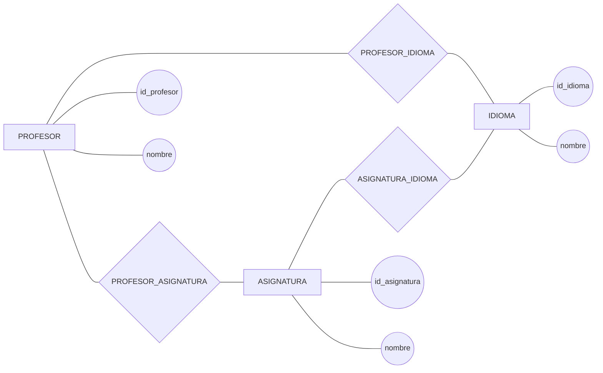
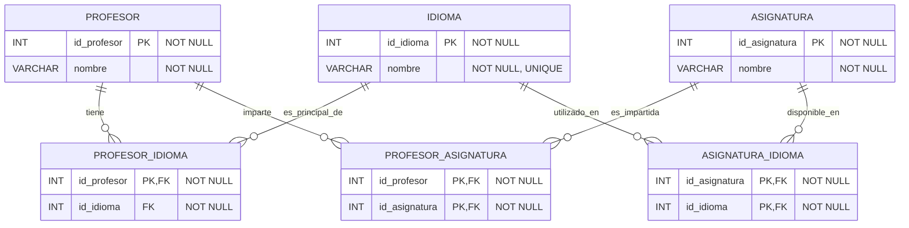

# Ejercicio complementario. 3FN pero no BCNF

## Enunciado

Una academia gestiona profesores, asignaturas e idiomas.

Un profesor puede impartir varias asignaturas y una asignatura puede ser impartida por varios profesores.

Cada profesor trabaja con un idioma principal. Un idioma puede ser el idioma principal de varios profesores.

Una asignatura puede estar disponible en varios idiomas y un idioma puede utilizarse en varias asignaturas.

Se parte de un diseño que ​**ya ha sido normalizado hasta 3FN**​.

### Modelo Chen



El diseño relacional inicial es:

```
PROFESOR_ASIGNATURA_IDIOMA(
    id_profesor,
    id_asignatura,
    id_idioma
)
```

Se conocen las siguientes dependencias funcionales:

```
id_profesor → id_idioma

id_idioma → id_profesor
```

Las claves candidatas de la relación son:

```
(id_profesor, id_asignatura)

(id_idioma, id_asignatura)
```

Se pide:

1. Comprobar que la relación ya está en 3FN.
2. Comprobar si cumple BCNF.
3. Identificar la dependencia que provoca el incumplimiento.
4. Explicar por qué 3FN permite esa dependencia y BCNF no.
5. Descomponer la relación hasta BCNF.
6. Obtener las relaciones correspondientes a profesor-idioma, profesor-asignatura y asignatura-idioma.
7. Representar el resultado mediante un diagrama relacional indicando PK, FK, `<span>NULL/NOT NULL</span>` y restricciones.

## Resolución

### 1. Claves candidatas

Tenemos:

```
id_profesor → id_idioma
```

Por tanto:

```
(id_profesor, id_asignatura)
```

determina todos los atributos.

Es una clave candidata.

También:

```
id_idioma → id_profesor
```

Por tanto:

```
(id_idioma, id_asignatura)
```

también determina todos los atributos.

Tenemos dos claves candidatas:

```
K1 = (id_profesor, id_asignatura)

K2 = (id_idioma, id_asignatura)
```

Por tanto, `<span>id_profesor</span>`, `<span>id_idioma</span>` e `<span>id_asignatura</span>` son atributos primos.

### 2. Comprobación de 3FN

La dependencia problemática es:

```
id_profesor → id_idioma
```

`<span>id_profesor</span>` no es superclave.

Sin embargo:

```
id_idioma
```

es un atributo primo porque pertenece a la clave candidata:

```
(id_idioma, id_asignatura)
```

Por tanto, la dependencia cumple la condición de 3FN.

También:

```
id_idioma → id_profesor
```

cumple 3FN porque `<span>id_profesor</span>` también es un atributo primo.

Por tanto:

```
PROFESOR_ASIGNATURA_IDIOMA ∈ 3FN
```

### 3. Comprobación de BCNF

BCNF exige que en toda dependencia funcional no trivial el determinante sea una superclave.

Tenemos:

```
id_profesor → id_idioma
```

Pero:

```
id_profesor
```

no es superclave.

Por tanto:

```
PROFESOR_ASIGNATURA_IDIOMA ∉ BCNF
```

También ocurre con:

```
id_idioma → id_profesor
```

porque `<span>id_idioma</span>` tampoco es superclave.

### 4. Diferencia entre 3FN y BCNF

```
3FN:

X → A

Permitida si:
X es superclave
O
A es atributo primo
```

En este ejercicio:

```
id_profesor → id_idioma
```

se permite porque `<span>id_idioma</span>` es atributo primo.

Pero BCNF exige:

```
X → Y

X debe ser superclave
```

Y `<span>id_profesor</span>` no lo es.

Por tanto:

```
3FN  ✓
BCNF ✗
```

### 5. Descomposición

La dependencia:

```
id_profesor → id_idioma
```

genera:

```
PROFESOR_IDIOMA(
    id_profesor PK,
    id_idioma FK
)
```

La relación entre profesor y asignatura se mantiene:

```
PROFESOR_ASIGNATURA(
    id_profesor PK FK,
    id_asignatura PK FK
)
```

Y la relación entre asignatura e idioma se representa mediante:

```
ASIGNATURA_IDIOMA(
    id_asignatura PK FK,
    id_idioma PK FK
)
```

### 6. Resultado final

```
PROFESOR(
    id_profesor PK,
    nombre
)

ASIGNATURA(
    id_asignatura PK,
    nombre
)

IDIOMA(
    id_idioma PK,
    nombre
)

PROFESOR_IDIOMA(
    id_profesor PK FK,
    id_idioma FK
)

PROFESOR_ASIGNATURA(
    id_profesor PK FK,
    id_asignatura PK FK
)

ASIGNATURA_IDIOMA(
    id_asignatura PK FK,
    id_idioma PK FK
)
```

### 7. Diagrama relacional



### Restricciones

```
PROFESOR_IDIOMA
PK: id_profesor
FK: id_profesor → PROFESOR(id_profesor)
FK: id_idioma → IDIOMA(id_idioma)
NOT NULL: todos los atributos

PROFESOR_ASIGNATURA
PK: (id_profesor, id_asignatura)
FK: id_profesor → PROFESOR(id_profesor)
FK: id_asignatura → ASIGNATURA(id_asignatura)
NOT NULL: todos los atributos

ASIGNATURA_IDIOMA
PK: (id_asignatura, id_idioma)
FK: id_asignatura → ASIGNATURA(id_asignatura)
FK: id_idioma → IDIOMA(id_idioma)
NOT NULL: todos los atributos
```

### Comprobación final

```
RELACIÓN INICIAL

PROFESOR_ASIGNATURA_IDIOMA

        ↓

Ya está en 3FN

        ↓

No está en BCNF

        ↓

Descomposición

        ↓

PROFESOR_IDIOMA
PROFESOR_ASIGNATURA
ASIGNATURA_IDIOMA
```

La idea que debe quedar clara es:

```
3FN ≠ BCNF

Una relación puede cumplir 3FN
y al mismo tiempo incumplir BCNF.
```

