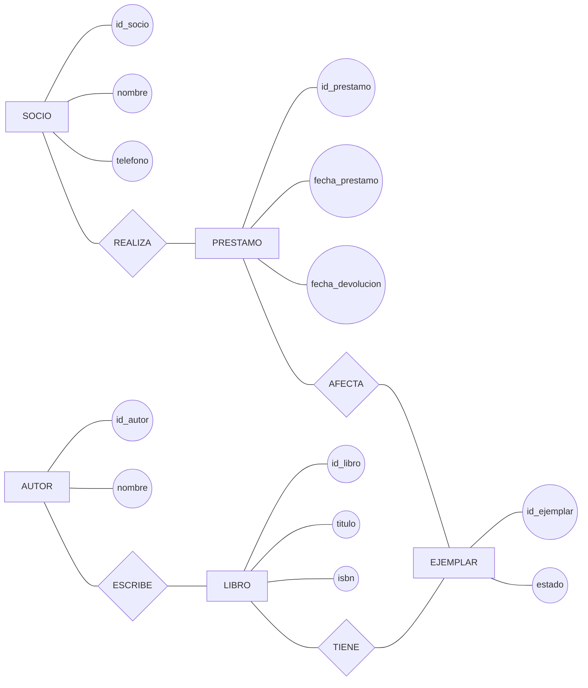
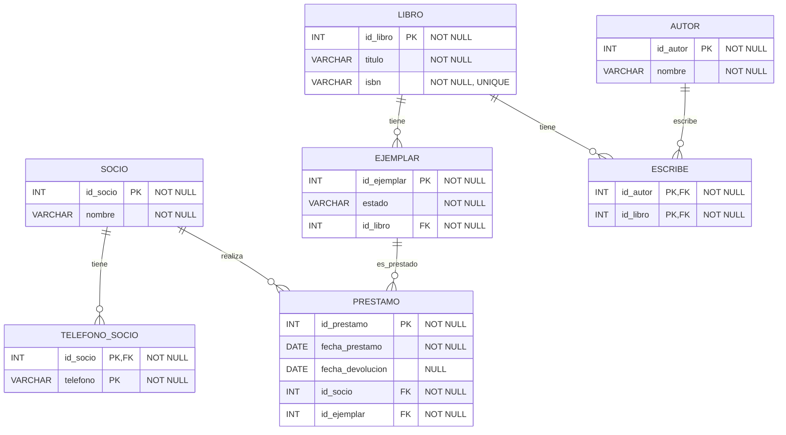
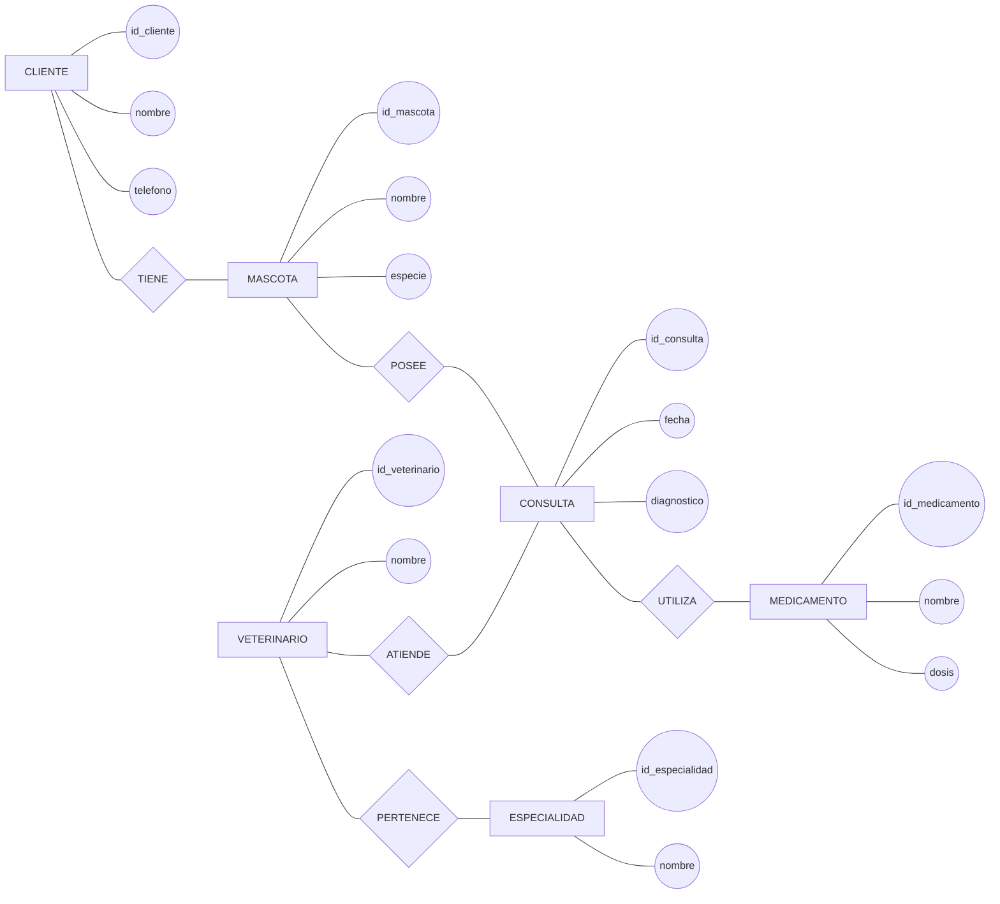
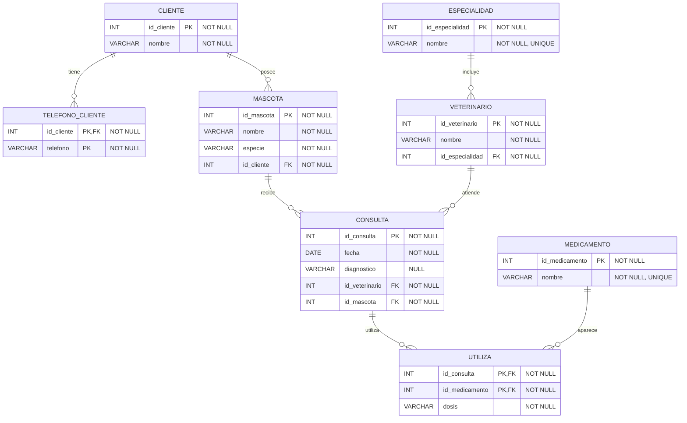

# Del modelo Chen a relaciones normalizadas

## Ejercicio 1. Biblioteca

### Enunciado

A partir del siguiente modelo Chen, obtén directamente las relaciones necesarias.



### Se pide

1. Transformar las entidades fuertes en relaciones.
2. Transformar las relaciones 1 y N.
3. Detectar el atributo multivaluado.
4. Determinar si alguna relación necesita transformación adicional para alcanzar 1FN, 2FN o 3FN.
5. Obtener el esquema final.

### Resolución

```
SOCIO(
    id_socio PK,
    nombre
)

TELEFONO_SOCIO(
    id_socio PK FK,
    telefono PK
)

LIBRO(
    id_libro PK,
    titulo,
    isbn UNIQUE
)

AUTOR(
    id_autor PK,
    nombre
)

ESCRIBE(
    id_autor PK FK,
    id_libro PK FK
)

EJEMPLAR(
    id_ejemplar PK,
    estado,
    id_libro FK
)

PRESTAMO(
    id_prestamo PK,
    fecha_prestamo,
    fecha_devolucion,
    id_socio FK,
    id_ejemplar FK
)
```

Todas las relaciones obtenidas cumplen 1FN.

Las relaciones con clave compuesta:

```
ESCRIBE
TELEFONO_SOCIO
```

no presentan atributos no clave, por lo que no introducen dependencias parciales.

No aparecen dependencias transitivas dentro de las relaciones resultantes.

Por tanto, el diseño se encuentra en 3FN.

### Diagrama relacional final



## Ejercicio 2. Clínica veterinaria

### Enunciado

A partir del siguiente modelo Chen:



### Se pide

1. Transformar las entidades fuertes en relaciones.
2. Transformar las relaciones 1.
3. Transformar las relaciones N.
4. Detectar el atributo multivaluado.
5. Determinar si las relaciones obtenidas están en 1FN.
6. Comprobar 2FN cuando exista una clave compuesta.
7. Comprobar 3FN.
8. Obtener el modelo relacional final.

### Resolución

```
CLIENTE(
    id_cliente PK,
    nombre
)

TELEFONO_CLIENTE(
    id_cliente PK FK,
    telefono PK
)

MASCOTA(
    id_mascota PK,
    nombre,
    especie,
    id_cliente FK
)

VETERINARIO(
    id_veterinario PK,
    nombre,
    id_especialidad FK
)

ESPECIALIDAD(
    id_especialidad PK,
    nombre
)

CONSULTA(
    id_consulta PK,
    fecha,
    diagnostico,
    id_veterinario FK,
    id_mascota FK
)

MEDICAMENTO(
    id_medicamento PK,
    nombre
)

UTILIZA(
    id_consulta PK FK,
    id_medicamento PK FK,
    dosis
)
```

### Comprobación de normalización

`<span>telefono</span>` es multivaluado, por lo que se crea:

```
TELEFONO_CLIENTE(
    id_cliente PK FK,
    telefono PK
)
```

La relación `<span>UTILIZA</span>` tiene clave compuesta:

```
(id_consulta, id_medicamento)
```

y `<span>dosis</span>` depende de la clave completa:

```
(id_consulta, id_medicamento) → dosis
```

Por tanto no existe dependencia parcial.

Las claves foráneas:

```
id_cliente
id_veterinario
id_mascota
id_especialidad
```

no generan dependencias transitivas dentro de sus propias relaciones.

El esquema final queda en 3FN.

### Diagrama relacional final



