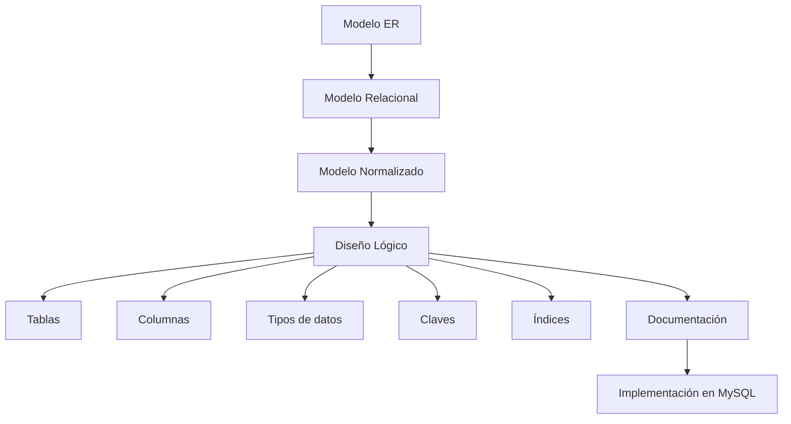

# Clase 10 — Del Modelo Relacional al Diseño Lógico

Durante las clases anteriores hemos aprendido a analizar un problema, construir un modelo Entidad-Relación, transformarlo en un modelo relacional y normalizarlo hasta obtener una estructura consistente y libre de redundancias innecesarias.

Sin embargo, todavía no hemos construido una base de datos real.

Existe un paso intermedio entre el modelo relacional y la implementación física en un Sistema Gestor de Bases de Datos (SGBD): el ​**diseño lógico**​.

El diseño lógico consiste en convertir el modelo relacional en un esquema preparado para ser implementado en un gestor como MySQL. En esta etapa se toman numerosas decisiones que afectarán a la claridad del código, al mantenimiento futuro y al rendimiento del sistema.

En esta clase aprenderemos a definir correctamente los nombres de tablas y columnas, seleccionar tipos de datos apropiados, establecer claves primarias y foráneas, planificar índices y documentar adecuadamente el modelo antes de comenzar a escribir instrucciones SQL.

Aunque todavía no utilizaremos el lenguaje SQL de forma intensiva, esta sesión servirá como puente entre el diseño teórico y la implementación práctica que realizaremos en las siguientes clases.

### Objetivos de aprendizaje

Al finalizar esta clase el estudiante será capaz de:

* Comprender la diferencia entre modelo relacional y diseño lógico.
* Revisar un esquema antes de implementarlo.
* Definir convenciones de nombres para tablas y columnas.
* Seleccionar tipos de datos adecuados.
* Diseñar correctamente claves primarias y claves foráneas.
* Identificar los índices necesarios desde la fase de diseño.
* Incorporar reglas de negocio al modelo lógico.
* Documentar profesionalmente una base de datos.

### Contenido

1. [Del modelo relacional al diseño lógico](01_del_modelo_relacional_al_diseno_logico.md)
2. [Revisión del esquema](02_revision_del_esquema.md)
3. [Nombres de tablas](03_nombres_de_tablas.md)
4. [Nombres de columnas](04_nombres_de_columnas.md)
5. [Tipos de datos](05_tipos_de_datos.md)
6. [Claves primarias y foráneas](06_claves_primarias_y_foraneas.md)
7. [Índices desde el diseño](07_indices_desde_el_diseno.md)
8. [Integridad referencial](08_integridad_referencial.md)
9. [Reglas de negocio en el diseño](09_reglas_de_negocio_en_el_diseno.md)
10. [Documentación del modelo](10_documentacion_del_modelo.md)
11. [Revisión final del caso práctico](11_revision_final_del_caso_practico.md)
12. [Resumen](12_resumen.md)

### Mapa conceptual

### Relación con el resto del curso

Esta clase marca la transición entre la fase de análisis y diseño y la fase de implementación.

Todo lo que decidamos aquí se reflejará posteriormente en instrucciones SQL reales utilizando MySQL. Un buen diseño lógico facilita enormemente el desarrollo de aplicaciones, mientras que un diseño descuidado puede generar problemas durante toda la vida útil del sistema.

