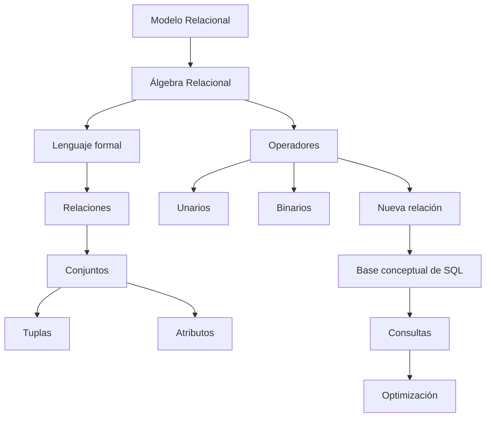

# Resumen

## Introducción

Con esta clase comenzamos un nuevo bloque de la asignatura.

Hasta ahora habíamos dedicado nuestros esfuerzos a diseñar correctamente una base de datos relacional. Aprendimos a identificar entidades, atributos, relaciones, claves e integridad referencial hasta obtener un modelo capaz de representar de forma consistente la información de nuestra empresa de venta de productos tecnológicos.

Sin embargo, una base de datos no se construye únicamente para almacenar información.

Su verdadero valor aparece cuando somos capaces de recuperar exactamente los datos que necesitamos para responder a las preguntas del negocio.

El Álgebra Relacional constituye el primer paso para comprender cómo se realiza ese proceso.

Más que un lenguaje de programación, representa una forma de pensar sobre las consultas.

---

### Resumen narrativo

Durante esta sesión descubrimos que SQL no fue el origen del modelo relacional.

Antes de que existiera SQL, Edgar F. Codd propuso una base matemática capaz de describir operaciones sobre relaciones de forma rigurosa.

Esa base fue el Álgebra Relacional.

A continuación aprendimos qué significa realmente realizar una consulta sobre una base de datos y comprendimos que un lenguaje de consulta no describe cómo acceder físicamente a los datos, sino qué información deseamos obtener.

Posteriormente adoptamos una visión más formal de las relaciones, interpretándolas como conjuntos de tuplas en lugar de simples tablas.

Esta perspectiva permitió comprender por qué el orden de las filas carece de significado y por qué el Álgebra Relacional trabaja siempre sobre conjuntos.

Después analizamos los conceptos de tupla y atributo desde un punto de vista matemático y vimos que los operadores algebraicos pueden actuar sobre ambos de formas distintas.

También clasificamos los operadores en unarios y binarios, aprendiendo que todas las operaciones producen siempre una nueva relación.

Finalmente estudiamos la notación básica del Álgebra Relacional, analizamos varios ejemplos intuitivos, establecimos la correspondencia conceptual con SQL y revisamos los errores que aparecen con mayor frecuencia durante el aprendizaje.

Aunque todavía no hemos estudiado cada operador con detalle, ya disponemos del marco conceptual necesario para hacerlo.

---

### Mapa conceptual

---

### Lo que el estudiante debería ser capaz de hacer

Al finalizar esta clase deberías ser capaz de:

* Explicar por qué nació el Álgebra Relacional.
* Diferenciar claramente el Álgebra Relacional de SQL.
* Definir qué es un lenguaje de consulta.
* Interpretar una relación como un conjunto de tuplas.
* Distinguir correctamente entre tuplas y atributos.
* Explicar la diferencia entre operadores unarios y binarios.
* Leer expresiones algebraicas sencillas.
* Razonar qué operador utilizaría para resolver un problema concreto.
* Comprender que una consulta SQL puede interpretarse como una sucesión de operaciones algebraicas.

---

### Relación con la siguiente clase

En esta sesión hemos conocido las ideas fundamentales del Álgebra Relacional.

A partir de la siguiente clase comenzaremos a estudiar cada operador de manera individual.

Analizaremos su definición formal, su funcionamiento, sus propiedades matemáticas y su traducción directa a SQL.

Veremos que detrás de prácticamente cualquier consulta SQL existe una combinación de un número muy reducido de operadores algebraicos básicos.

Comprender esos operadores permitirá escribir consultas más correctas, detectar errores con mayor facilidad e interpretar el funcionamiento interno de los optimizadores de consultas.

---

### Ideas clave finales

* El Álgebra Relacional constituye el fundamento teórico del modelo relacional y de SQL.
* Las relaciones se interpretan como conjuntos de tuplas, no como simples tablas.
* Todos los operadores algebraicos producen nuevas relaciones, lo que permite combinarlos libremente.
* SQL expresa muchas de las mismas operaciones mediante una sintaxis más cercana al lenguaje natural.
* Aprender a pensar en términos algebraicos facilitará todo el aprendizaje posterior sobre consultas SQL y optimización de bases de datos.

