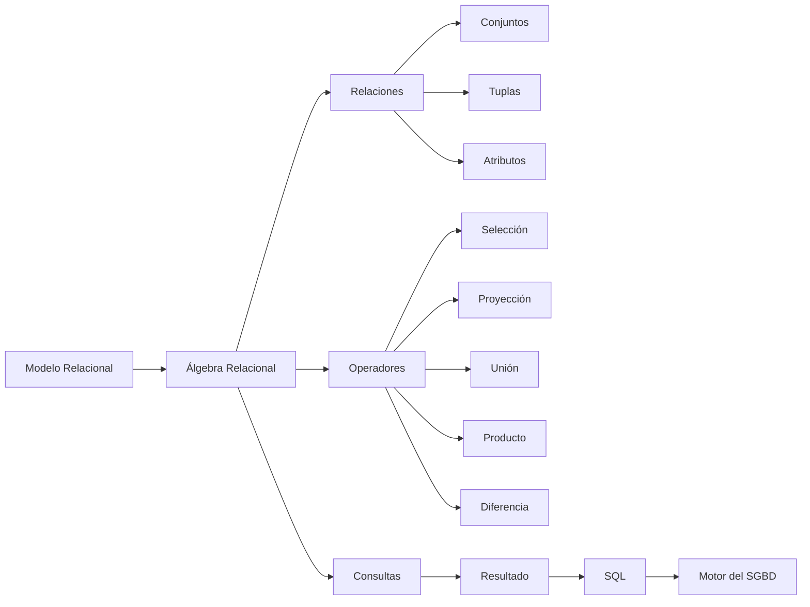

# Clase 11 — Introducción al Álgebra Relacional

## Introducción

Hasta este momento del curso hemos aprendido a analizar problemas del mundo real, construir modelos Entidad-Relación, transformarlos al modelo relacional y diseñar bases de datos consistentes.

Sin embargo, todavía no hemos respondido una pregunta fundamental:

> Una vez almacenados los datos, ¿cómo podemos obtener exactamente la información que necesitamos?

La mayoría de las personas responderían inmediatamente:

*"Con SQL."*

Pero históricamente esa respuesta no es correcta.

Antes de que existiera SQL, los investigadores necesitaban un lenguaje formal que permitiera expresar consultas sobre una base de datos de manera rigurosa y matemática.

Ese lenguaje fue el **Álgebra Relacional**.

Aunque los programadores modernos escriban consultas SQL, prácticamente todos los sistemas gestores de bases de datos siguen utilizando internamente los principios del Álgebra Relacional para comprender, transformar y optimizar las consultas.

En otras palabras, aprender Álgebra Relacional no consiste en aprender un lenguaje que ya no se utiliza.

Consiste en comprender cómo "piensa" una base de datos relacional.

Durante esta clase estudiaremos los fundamentos del Álgebra Relacional, su origen, sus operadores y su relación directa con SQL.

No aprenderemos todavía todas las operaciones complejas, sino que construiremos una base conceptual sólida que nos permitirá entender posteriormente consultas SQL mucho más avanzadas.

Como en todo el curso, utilizaremos el mismo caso de estudio de nuestra empresa de venta de productos tecnológicos, de modo que cada nuevo concepto pueda relacionarse con el modelo de datos que ya conocemos.

---

## Objetivos de aprendizaje

Al finalizar esta sesión el estudiante será capaz de:

- Comprender por qué nació el Álgebra Relacional.
- Explicar la diferencia entre Álgebra Relacional y SQL.
- Entender qué es un lenguaje de consulta.
- Interpretar las relaciones como conjuntos matemáticos.
- Comprender los conceptos de tupla y atributo desde una perspectiva formal.
- Diferenciar operadores unarios y binarios.
- Leer la notación básica del Álgebra Relacional.
- Traducir consultas sencillas entre Álgebra Relacional y SQL.
- Resolver ejercicios básicos utilizando operadores elementales.
- Identificar los errores más habituales al comenzar a trabajar con Álgebra Relacional.

---

## Competencias desarrolladas

Durante esta clase el estudiante desarrollará especialmente las siguientes competencias:

- Razonamiento formal sobre bases de datos.
- Abstracción matemática aplicada al modelo relacional.
- Comprensión del funcionamiento interno de los SGBD.
- Interpretación de consultas antes de escribir SQL.
- Capacidad para diseñar consultas de forma lógica y estructurada.

---

## Conocimientos previos

Para aprovechar correctamente esta sesión el estudiante debe dominar:

- Modelo Entidad-Relación.
- Modelo Relacional.
- Tablas, atributos y claves.
- Integridad referencial.
- Transformación del modelo conceptual al modelo relacional.

---

## Contenido

1. [¿Por qué existe el Álgebra Relacional?](01_por_que_existe_el_algebra_relacional.md)
2. [SQL no nació primero](02_sql_no_nacio_primero.md)
3. [¿Qué es un lenguaje de consulta?](03_que_es_un_lenguaje_de_consulta.md)
4. [Relaciones como conjuntos](04_relaciones_como_conjuntos.md)
5. [Tuplas y atributos desde el Álgebra](05_tuplas_y_atributos_desde_el_algebra.md)
6. [Operadores unarios y binarios](06_operadores_unarios_y_binarios.md)
7. [Notación del Álgebra Relacional](07_notacion_del_algebra_relacional.md)
8. [Ejemplos intuitivos](08_ejemplos_intuitivos.md)
9. [Comparación con SQL](09_comparacion_con_sql.md)
10. [Primeros ejercicios](10_primeros_ejercicios.md)
11. [Errores frecuentes](11_errores_frecuentes.md)
12. [Resumen](12_resumen.md)

---

## Mapa conceptual

---

## Relación con las clases anteriores

En las clases anteriores aprendimos cómo representar correctamente la información de una empresa mediante el modelo relacional.

Ahora daremos un paso más importante: aprenderemos cómo consultar esa información de manera formal.

El Álgebra Relacional constituye el puente entre el diseño de una base de datos y la obtención de información útil a partir de ella.

Muchos conceptos que parecían únicamente estructurales comenzarán ahora a adquirir un significado operativo.

---

## Relación con las siguientes clases

Esta clase servirá como fundamento para todo el bloque dedicado a SQL.

Cuando estudiemos instrucciones como:

- SELECT
- FROM
- WHERE
- JOIN
- UNION
- INTERSECT
- EXCEPT

descubriremos que cada una de ellas tiene una correspondencia directa con operadores del Álgebra Relacional.

Comprender esta relación permitirá escribir consultas más correctas, más eficientes y mucho más fáciles de entender.

---

## Tiempo orientativo

| Apartado | Tiempo |
|----------|--------:|
| Motivación histórica | 10 min |
| Lenguajes de consulta | 10 min |
| Relaciones como conjuntos | 15 min |
| Tuplas y atributos | 10 min |
| Operadores | 15 min |
| Notación | 10 min |
| Comparación con SQL | 10 min |
| Ejercicios | 15 min |
| Dudas y cierre | 5 min |

