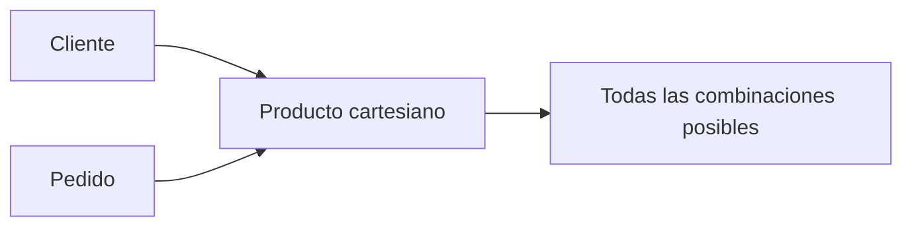

# Producto cartesiano (×)

## Introducción

Entre todos los operadores del Álgebra Relacional, probablemente el **producto cartesiano** sea el que más desconcierta a quienes comienzan a estudiarlo.

A primera vista parece una operación poco útil.

Su resultado suele contener una enorme cantidad de tuplas y, en la práctica, casi nunca aparece de forma aislada.

Sin embargo, esta primera impresión resulta engañosa.

El producto cartesiano constituye uno de los operadores fundamentales del Álgebra Relacional porque sirve como punto de partida para construir operaciones mucho más importantes, especialmente el ​**JOIN**​, que estudiaremos más adelante.

Comprender su funcionamiento permitirá entender de forma mucho más profunda cómo se relacionan varias tablas dentro de una base de datos.

---

### La intuición

Imaginemos dos conjuntos muy pequeños.

El primero representa colores.

El segundo representa tamaños.

Conjunto A:

* Rojo
* Azul

Conjunto B:

* Pequeño
* Grande

Si combinamos cada color con cada tamaño obtenemos:

* Rojo — Pequeño
* Rojo — Grande
* Azul — Pequeño
* Azul — Grande

Cada elemento del primer conjunto se combina con todos los elementos del segundo.

Eso es exactamente un producto cartesiano.

---

### Definición formal

El producto cartesiano se representa mediante el símbolo:

```text
×
```

Su forma general es:

```text
Relación A × Relación B
```

El resultado contiene **todas las combinaciones posibles** entre las tuplas de ambas relaciones.

No existe inicialmente ninguna condición.

Simplemente se generan todas las parejas posibles.

---

### ¿Cuántas tuplas se obtienen?

Supongamos que:

* la relación **Cliente** contiene 100 registros;
* la relación **Producto** contiene 250 registros.

El producto cartesiano producirá:

```text
100 × 250 = 25 000 tuplas
```

Cada cliente aparecerá combinado con todos los productos.

Evidentemente, este resultado no representa ninguna información útil por sí mismo.

Sin embargo, constituye el punto de partida para aplicar posteriormente una selección que conserve únicamente las combinaciones correctas.

Precisamente así se construye el JOIN clásico.

---

### Aplicación al caso de estudio

Consideremos las siguientes relaciones simplificadas.

**Cliente**

| IdCliente | Nombre |
| ----------: | -------- |
|         1 | Ana    |
|         2 | Luis   |

**Pedido**

| IdPedido | IdCliente |
| ---------: | ----------: |
|      101 |         1 |
|      102 |         2 |
|      103 |         1 |

Si realizamos directamente un producto cartesiano obtenemos:

| Cliente | Pedido |
| --------- | -------- |
| Ana     | 101    |
| Ana     | 102    |
| Ana     | 103    |
| Luis    | 101    |
| Luis    | 102    |
| Luis    | 103    |

Observamos inmediatamente que aparecen combinaciones incorrectas.

Por ejemplo:

* Luis con el pedido 101.
* Luis con el pedido 103.

Sabemos que esos pedidos pertenecen realmente a Ana.

Por tanto, todavía falta aplicar una condición que elimine las combinaciones inválidas.

Eso es exactamente lo que hará el JOIN.

---

### Visualizando el proceso



Obsérvese que en ningún momento se comprueba todavía si las relaciones están conectadas mediante claves.

Simplemente se generan todas las posibilidades.

---

### ¿Por qué existe entonces?

Puede parecer una operación ineficiente.

Sin embargo, desde el punto de vista matemático resulta extremadamente elegante.

Permite construir operadores mucho más sofisticados utilizando únicamente operaciones básicas.

De hecho, históricamente el JOIN se definía precisamente como:

* producto cartesiano;
* seguido de una selección.

Esta idea aparecerá inmediatamente en el siguiente capítulo.

---

### Relación con SQL

En SQL moderno rara vez escribimos productos cartesianos de forma explícita.

Sin embargo, pueden aparecer accidentalmente cuando olvidamos especificar la condición de unión entre dos tablas.

El resultado suele ser un número enorme de filas inesperadas.

Por ello, comprender este operador ayuda también a detectar uno de los errores más frecuentes al escribir consultas SQL.

---

### Errores frecuentes

El error más habitual consiste en pensar que el producto cartesiano ya relaciona correctamente dos tablas.

No lo hace.

Únicamente genera todas las combinaciones posibles.

También es frecuente sorprenderse por el enorme número de filas que produce.

Ese crecimiento es completamente normal y explica por qué normalmente se utiliza como paso intermedio para construir otras operaciones.

---

### Ideas clave

* El producto cartesiano combina todas las tuplas de una relación con todas las de otra.
* Se representa mediante el símbolo ×.
* No utiliza inicialmente ninguna condición de unión.
* Constituye la base matemática sobre la que se construye el JOIN clásico.
* Comprender esta operación facilitará enormemente el estudio de las consultas sobre varias tablas.

