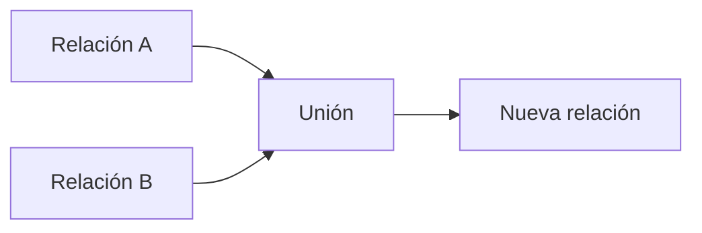

# Unión (∪)

## Introducción

Hasta ahora hemos estudiado operadores que trabajan sobre una única relación. La selección filtra tuplas y la proyección reduce el número de atributos. Incluso el producto cartesiano, aunque utiliza dos relaciones, no intenta fusionar su contenido, sino combinar todas sus tuplas posibles.

La **unión** responde a una necesidad diferente.

En muchas ocasiones la información que buscamos se encuentra repartida entre varias relaciones compatibles y necesitamos construir una única relación que reúna todos esos datos.

La unión permite precisamente eso: ​**combinar dos relaciones en una sola**​, eliminando automáticamente las tuplas duplicadas.

Este comportamiento resulta muy parecido a la unión de conjuntos estudiada en matemáticas.

---

### La intuición

Imaginemos que nuestra empresa dispone de dos almacenes.

Cada almacén mantiene una relación con los productos que tiene disponibles.

**Almacén Norte**

| IdProducto | Nombre              |
| -----------: | --------------------- |
|        101 | Monitor 27"         |
|        102 | Ratón Inalámbrico |
|        103 | Webcam HD           |

**Almacén Sur**

| IdProducto | Nombre            |
| -----------: | ------------------- |
|        103 | Webcam HD         |
|        104 | SSD 1 TB          |
|        105 | Teclado Mecánico |

La dirección desea conocer todos los productos disponibles en cualquiera de los dos almacenes.

No quiere saber de qué almacén proceden.

Simplemente necesita el conjunto total de productos.

La unión proporciona exactamente ese resultado.

---

### Definición formal

La unión se representa mediante el símbolo:

```text
∪
```

Su forma general es:

```text
Relación A ∪ Relación B
```

El resultado contiene todas las tuplas que pertenecen a la primera relación, todas las que pertenecen a la segunda y únicamente una copia de aquellas que aparezcan repetidas.

---

### Compatibilidad de unión

La unión no puede aplicarse entre dos relaciones cualesquiera.

Para que la operación tenga sentido ambas relaciones deben ser ​**compatibles**​.

En términos generales esto significa que:

* deben tener el mismo número de atributos;
* los atributos correspondientes deben representar el mismo tipo de información;
* los dominios deben ser compatibles.

Por ejemplo, tendría poco sentido intentar unir una relación de clientes con otra de productos.

No representan el mismo tipo de entidad.

En cambio, sí sería razonable unir dos relaciones que contienen clientes procedentes de distintas sucursales.

---

### Ejemplo

Supongamos las siguientes relaciones.

**ClientesMadrid**

| IdCliente | Nombre |
| ----------: | -------- |
|         1 | Ana    |
|         2 | Luis   |

**ClientesSantander**

| IdCliente | Nombre |
| ----------: | -------- |
|         2 | Luis   |
|         3 | Marta  |

El resultado de la unión será:

| IdCliente | Nombre |
| ----------: | -------- |
|         1 | Ana    |
|         2 | Luis   |
|         3 | Marta  |

Obsérvese que Luis aparece una sola vez.

El Álgebra Relacional elimina automáticamente los duplicados porque trabaja con conjuntos.

---

### Interpretación gráfica



Ambas relaciones permanecen intactas.

La operación genera una tercera relación independiente.

---

### Aplicación al caso de estudio

Imaginemos que nuestra empresa mantiene dos catálogos temporales.

Uno contiene los productos actualmente disponibles.

Otro almacena los productos que estarán disponibles la próxima semana.

Antes de publicar el nuevo catálogo comercial puede resultar interesante obtener una visión conjunta de ambos.

La unión permite construir esa lista de forma muy sencilla siempre que ambas relaciones posean la misma estructura.

---

### Relación con SQL

Más adelante descubriremos que SQL incorpora la cláusula:

```sql
UNION
```

Su comportamiento es prácticamente idéntico al del operador algebraico.

También elimina automáticamente las filas duplicadas.

Cuando el usuario desea conservarlas deberá utilizar `UNION ALL`, una variante que estudiaremos en el bloque dedicado a SQL.

---

### Errores frecuentes

Uno de los errores más habituales consiste en intentar unir relaciones con estructuras completamente distintas.

Otro error frecuente consiste en esperar que el resultado conserve los duplicados.

En el Álgebra Relacional esto nunca ocurre.

La unión trabaja sobre conjuntos y, por definición, un conjunto no puede contener elementos repetidos.

---

### Ideas clave

* La unión combina dos relaciones compatibles.
* Se representa mediante el símbolo ∪.
* El resultado contiene todas las tuplas de ambas relaciones.
* Las tuplas duplicadas aparecen una única vez.
* Constituye la base conceptual del operador `UNION` de SQL.

