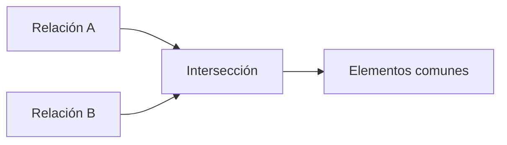

# Intersección (∩)

## Introducción

Mientras que la unión responde a la pregunta:

> "¿Qué elementos aparecen en cualquiera de las dos relaciones?"

la **intersección** responde a una cuestión distinta:

> **¿Qué elementos aparecen simultáneamente en ambas relaciones?**

Este operador permite localizar las tuplas comunes a dos relaciones compatibles.

Aunque se utiliza con menor frecuencia que la selección o la proyección, resulta muy útil para resolver determinados problemas de negocio donde interesa identificar coincidencias.

---

### La intuición

Supongamos que nuestra empresa mantiene dos campañas promocionales.

La primera está dirigida a clientes que realizaron compras superiores a 500 euros durante el último año.

La segunda incluye a los clientes inscritos en el programa de fidelización Premium.

El departamento comercial desea conocer únicamente aquellos clientes que cumplen ambas condiciones.

No necesita todos los clientes de la primera campaña.

Tampoco todos los de la segunda.

Solo interesan los que aparecen en las dos listas.

Eso es exactamente una intersección.

---

### Definición formal

La intersección se representa mediante el símbolo:

```text
∩
```

Su forma general es:

```text
Relación A ∩ Relación B
```

El resultado contiene exclusivamente las tuplas presentes en ambas relaciones.

---

### Compatibilidad

Al igual que ocurre con la unión, las relaciones deben ser compatibles.

Es decir:

* mismo número de atributos;
* atributos equivalentes;
* dominios compatibles.

Sin estas condiciones la comparación entre las tuplas carecería de significado.

---

### Ejemplo

**Clientes Premium**

| IdCliente | Nombre |
| ----------: | -------- |
|         1 | Ana    |
|         2 | Luis   |
|         3 | Marta  |

**Clientes Grandes Compradores**

| IdCliente | Nombre |
| ----------: | -------- |
|         2 | Luis   |
|         3 | Marta  |
|         4 | Pedro  |

La intersección produce:

| IdCliente | Nombre |
| ----------: | -------- |
|         2 | Luis   |
|         3 | Marta  |

Únicamente permanecen las tuplas comunes.

---

### Interpretación gráfica



---

### Aplicación al caso de estudio

Podemos imaginar una situación muy habitual.

La empresa dispone de:

* una lista de clientes que han realizado alguna compra durante este mes;
* otra lista con clientes que poseen una tarjeta de fidelización.

La dirección desea ofrecer un descuento especial únicamente a quienes aparecen en ambas relaciones.

La intersección permite obtener esa lista de forma directa.

---

### Relación con SQL

El estándar SQL incorpora el operador:

```sql
INTERSECT
```

Aunque no todos los sistemas gestores de bases de datos implementan esta instrucción, conceptualmente representa exactamente la misma operación algebraica.

Cuando un SGBD no dispone de ella, la intersección puede construirse mediante otras operaciones equivalentes.

---

### Errores frecuentes

Uno de los errores más comunes consiste en confundir la intersección con la unión.

La unión conserva todas las tuplas.

La intersección conserva únicamente las comunes.

También es frecuente olvidar que ambas relaciones deben ser compatibles.

---

### Ideas clave

* La intersección devuelve únicamente las tuplas comunes a dos relaciones.
* Se representa mediante el símbolo ∩.
* Requiere relaciones compatibles.
* Constituye la versión relacional de la intersección de conjuntos.
* Resulta especialmente útil para localizar coincidencias entre dos colecciones de datos.

