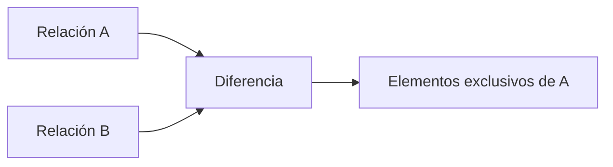

# Diferencia (−)

## Introducción

Hasta ahora hemos estudiado operadores que permiten ​**filtrar**​, ​**seleccionar atributos**​, **combinar relaciones** o ​**localizar elementos comunes**​.

Existe, sin embargo, otra pregunta muy habitual en el trabajo diario con bases de datos:

> **¿Qué elementos aparecen en una relación pero no aparecen en otra?**

Este tipo de consultas es extremadamente frecuente en el mundo empresarial.

Por ejemplo:

* ¿Qué clientes todavía no han realizado ninguna compra?
* ¿Qué productos nunca se han vendido?
* ¿Qué proveedores aún no han entregado ningún pedido?
* ¿Qué empleados todavía no han realizado la formación obligatoria?

Todas estas preguntas tienen algo en común: buscan identificar la **ausencia** de información.

El operador **diferencia** fue diseñado precisamente para responder este tipo de consultas.

---

### La intuición

Imaginemos que el departamento comercial dispone de dos listas.

La primera contiene todos los clientes registrados.

La segunda incluye únicamente los clientes que han realizado al menos una compra durante el último año.

La dirección desea localizar aquellos clientes que todavía no han comprado nada.

No quiere conocer quiénes sí compraron.

Quiere conocer precisamente quiénes faltan.

La diferencia permite obtener ese resultado de forma directa.

---

### Definición formal

La diferencia se representa mediante el símbolo:

```text
−
```

Su forma general es:

```text
Relación A − Relación B
```

El resultado contiene todas las tuplas que pertenecen a la primera relación y que **no aparecen** en la segunda.

Es importante destacar que el orden importa.

La operación:

```text
A − B
```

no produce el mismo resultado que:

```text
B − A
```

La diferencia no es una operación conmutativa.

---

### Compatibilidad

Al igual que la unión y la intersección, la diferencia únicamente puede aplicarse entre relaciones compatibles.

Ambas deben representar el mismo tipo de información y poseer una estructura equivalente.

No tendría sentido intentar calcular la diferencia entre una relación de clientes y otra de productos.

---

### Ejemplo

Supongamos las siguientes relaciones.

**Todos los clientes**

| IdCliente | Nombre |
| ----------: | -------- |
|         1 | Ana    |
|         2 | Luis   |
|         3 | Marta  |
|         4 | Pedro  |

**Clientes con compras**

| IdCliente | Nombre |
| ----------: | -------- |
|         2 | Luis   |
|         3 | Marta  |

La operación:

```text
Clientes − ClientesConCompras
```

produce:

| IdCliente | Nombre |
| ----------: | -------- |
|         1 | Ana    |
|         4 | Pedro  |

Son precisamente los clientes que todavía no han realizado ninguna compra.

---

### Interpretación gráfica



Obsérvese que únicamente sobreviven las tuplas exclusivas de la primera relación.

---

### Aplicación al caso de estudio

Nuestra empresa desea planificar una campaña para reactivar clientes inactivos.

Dispone de:

* la relación ​**Cliente**​;
* una relación derivada que contiene los clientes con pedidos realizados durante el último año.

Aplicando una diferencia puede obtener directamente la lista de clientes que no han realizado ninguna compra reciente.

Este tipo de consultas resulta muy habitual en departamentos de marketing, auditoría y control de calidad.

---

### Diferencia e integridad de datos

La diferencia también resulta muy útil para detectar inconsistencias.

Por ejemplo:

* productos registrados pero nunca almacenados;
* pedidos sin factura;
* facturas sin pago;
* proveedores sin productos asociados.

En todos estos casos la diferencia ayuda a localizar registros que deberían tener una relación con otros datos pero no la tienen.

Más adelante veremos que muchas herramientas de auditoría utilizan consultas basadas en este principio.

---

### Relación con SQL

El estándar SQL incorpora el operador:

```sql
EXCEPT
```

En algunos sistemas gestores aparece con el nombre:

```sql
MINUS
```

Ambos representan conceptualmente la misma operación que la diferencia del Álgebra Relacional.

Como ocurre con otros operadores de conjuntos, no todos los SGBD implementan exactamente la misma sintaxis, aunque la idea matemática es idéntica.

---

### Errores frecuentes

Uno de los errores más habituales consiste en olvidar que el orden de las relaciones modifica completamente el resultado.

Otro error frecuente es interpretar la diferencia como una comparación atributo a atributo.

En realidad, el operador compara ​**tuplas completas**​.

---

### Ideas clave

* La diferencia obtiene las tuplas presentes en una relación pero ausentes en otra.
* Se representa mediante el símbolo −.
* Solo puede aplicarse entre relaciones compatibles.
* El orden de los operandos es fundamental.
* Constituye la base conceptual de operadores como `EXCEPT` o `MINUS` en SQL.

