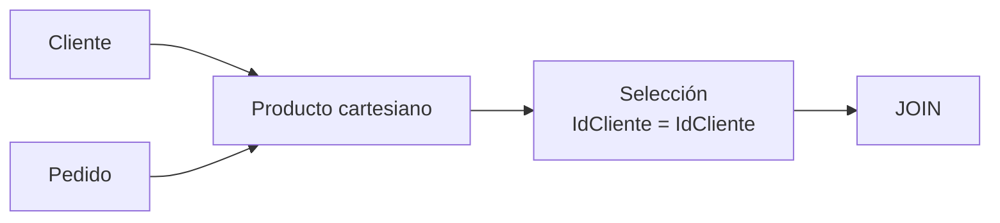

# JOIN como operación derivada

## Introducción

Si preguntáramos a un administrador de bases de datos cuál es la operación que utiliza con mayor frecuencia en SQL, es muy probable que respondiera sin dudar:

> **JOIN**

La inmensa mayoría de las consultas reales necesitan combinar información procedente de varias tablas.

Por ejemplo:

* clientes con sus pedidos;
* pedidos con sus líneas;
* productos con sus categorías;
* facturas con sus pagos;
* empleados con sus departamentos.

Curiosamente, el ​**JOIN no formaba parte de los operadores fundamentales propuestos originalmente por Edgar F. Codd**​.

Desde un punto de vista matemático, el JOIN puede construirse utilizando operadores mucho más simples.

Por esta razón se dice que es una ​**operación derivada**​.

Comprender este hecho permite entender mucho mejor cómo razonan internamente los sistemas gestores de bases de datos.

---

### ¿Qué problema intenta resolver?

Recordemos dos relaciones de nuestro caso práctico.

**Cliente**

| IdCliente | Nombre       |
| ----------: | -------------- |
|         1 | Ana Ruiz     |
|         2 | Luis Pérez  |
|         3 | Marta Gómez |

**Pedido**

| IdPedido | IdCliente | Fecha      |
| ---------: | ----------: | ------------ |
|      101 |         1 | 2025-02-01 |
|      102 |         3 | 2025-02-05 |
|      103 |         1 | 2025-02-10 |

Si la dirección pregunta:

> "¿Qué clientes realizaron cada pedido?"

La información está repartida entre dos relaciones.

Cliente contiene el nombre.

Pedido contiene las compras.

Necesitamos unir ambas.

Ese es precisamente el objetivo del JOIN.

---

### La idea matemática

Históricamente el JOIN puede entenderse como dos operaciones consecutivas.

Primero:

**Producto cartesiano**

Después:

**Selección**

Es decir:

```text
JOIN = Producto cartesiano + Selección
```

Primero se generan todas las combinaciones posibles.

Después se eliminan aquellas que no cumplen la condición de relación entre ambas tablas.

---

### Paso 1. Producto cartesiano

Comenzamos generando todas las combinaciones.

| Cliente | Pedido |
| --------- | -------- |
| Ana     | 101    |
| Ana     | 102    |
| Ana     | 103    |
| Luis    | 101    |
| Luis    | 102    |
| Luis    | 103    |
| Marta   | 101    |
| Marta   | 102    |
| Marta   | 103    |

El resultado contiene nueve combinaciones.

Sin embargo, sabemos que muchas son incorrectas.

---

### Paso 2. Aplicar una selección

Ahora aplicamos una condición.

Conservamos únicamente las filas donde:

```text
Cliente.IdCliente = Pedido.IdCliente
```

Después del filtrado obtenemos:

| Cliente | Pedido |
| --------- | -------- |
| Ana     | 101    |
| Ana     | 103    |
| Marta   | 102    |

Ahora sí aparecen únicamente las asociaciones reales.

Acabamos de construir un JOIN utilizando exclusivamente operadores fundamentales.

---

### Representación gráfica



Este diagrama resume perfectamente el origen matemático del operador.

---

### ¿Por qué existe entonces el JOIN?

Si puede construirse mediante otros operadores, ¿por qué terminó incorporándose a los lenguajes de consulta?

La respuesta es sencilla.

Porque resulta muchísimo más cómodo.

Comparemos ambas formas de pensar.

Forma algebraica:

* producto cartesiano;
* selección.

Forma práctica:

* JOIN.

Ambas representan exactamente la misma operación.

El JOIN simplemente proporciona una notación mucho más sencilla y cercana al razonamiento humano.

---

### Evolución histórica

Con el paso del tiempo los sistemas gestores comprobaron que el JOIN aparecía constantemente en prácticamente todas las consultas.

Como consecuencia comenzaron a incorporarlo como un operador propio.

Actualmente la mayoría de optimizadores ya no construyen literalmente un producto cartesiano completo para después filtrarlo.

Utilizan algoritmos especializados mucho más eficientes, como veremos más adelante cuando estudiemos optimización de consultas.

Sin embargo, desde el punto de vista conceptual sigue siendo correcto interpretar el JOIN como una combinación de operadores básicos.

---

### Aplicación al caso de estudio

Nuestra empresa necesita generar una factura.

Para ello debe combinar información procedente de varias relaciones:

* Cliente
* Pedido
* LineaPedido
* Producto

Cada una contiene una parte distinta de la información.

El JOIN permite reconstruir la visión completa del proceso de compra.

Sin él sería imposible responder a preguntas tan habituales como:

* ¿Qué compró cada cliente?
* ¿Cuánto pagó?
* ¿Qué productos aparecen en cada pedido?
* ¿Quién suministró esos productos?

---

### Relación con SQL

Cuando comencemos a trabajar con SQL utilizaremos continuamente expresiones como:

* INNER JOIN
* LEFT JOIN
* RIGHT JOIN
* FULL JOIN

Todas ellas representan variantes especializadas del mismo concepto general que acabamos de estudiar.

Comprender esta base matemática hará mucho más sencillo entender sus diferencias.

---

### Errores frecuentes

Uno de los errores más habituales consiste en pensar que el JOIN es un concepto completamente independiente del Álgebra Relacional.

En realidad, deriva directamente de operadores mucho más sencillos.

También es frecuente olvidar que un JOIN siempre necesita una condición que indique cómo deben relacionarse ambas tablas.

Cuando esa condición falta, el resultado suele convertirse accidentalmente en un producto cartesiano.

---

### Ideas clave

* El JOIN no era uno de los operadores fundamentales originales del Álgebra Relacional.
* Conceptualmente puede construirse mediante un producto cartesiano seguido de una selección.
* Su objetivo consiste en combinar información distribuida entre varias relaciones.
* SQL incorpora distintas variantes especializadas del JOIN.
* Comprender su origen ayuda a interpretar mejor el funcionamiento interno de los optimizadores.

