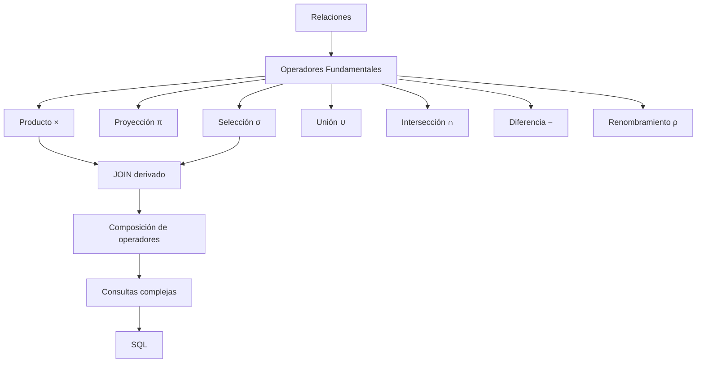

# Resumen

## Resumen narrativo

En esta clase hemos dado un paso decisivo en el estudio del Álgebra Relacional. Si en la sesión anterior comprendimos su origen, su fundamento matemático y su papel como lenguaje formal para expresar consultas, en esta ocasión hemos aprendido las herramientas con las que realmente se construyen esas consultas.

Comenzamos estudiando los operadores fundamentales definidos por Edgar F. Codd. Descubrimos que cada uno resuelve un problema diferente y que, utilizados conjuntamente, permiten expresar consultas de cualquier complejidad.

La **selección (σ)** nos enseñó a filtrar las tuplas de una relación sin modificar su estructura. Comprendimos que constituye la base conceptual de la cláusula `WHERE` de SQL y que responde a preguntas como "¿qué registros cumplen esta condición?".

La **proyección (π)** nos permitió seleccionar únicamente los atributos necesarios, reduciendo la cantidad de información procesada. Además, vimos una diferencia importante respecto a SQL: en el Álgebra Relacional las tuplas duplicadas desaparecen automáticamente porque las relaciones se interpretan como conjuntos.

A continuación estudiamos el ​**producto cartesiano (×)**​. Aunque rara vez se utiliza de forma aislada, comprendimos que constituye un operador fundamental porque genera todas las combinaciones posibles entre dos relaciones y sirve como punto de partida para construir operaciones más sofisticadas.

Posteriormente analizamos los operadores de teoría de conjuntos: ​**unión (∪)**​, **intersección (∩)** y ​**diferencia (−)**​. Aprendimos que estos operadores solo pueden aplicarse entre relaciones compatibles y que permiten combinar, comparar o excluir conjuntos de tuplas según las necesidades de cada consulta.

También estudiamos el operador de ​**renombramiento (ρ)**​, cuya finalidad no consiste en modificar datos, sino en asignar nombres temporales a relaciones o atributos para facilitar la construcción de expresiones complejas y eliminar ambigüedades.

Uno de los momentos más importantes de la clase fue descubrir que el **JOIN** no era originalmente un operador fundamental, sino una operación derivada construida a partir del producto cartesiano y una selección. Esta idea proporciona una comprensión mucho más profunda del funcionamiento interno de los sistemas gestores de bases de datos y prepara el camino para el estudio de las distintas variantes de JOIN en SQL.

Después aprendimos que todos estos operadores pueden combinarse gracias a la propiedad de **cierre** del Álgebra Relacional. Cada operación produce una nueva relación, que puede utilizarse inmediatamente como entrada de la siguiente. Esta característica permite construir consultas complejas mediante una secuencia ordenada de transformaciones sencillas.

Finalmente aplicamos todo lo aprendido a problemas reales de la empresa que sirve como caso de estudio permanente del curso. Vimos cómo analizar una consulta, identificar las relaciones implicadas, decidir qué operadores son necesarios y establecer un orden lógico de ejecución antes de escribir una sola línea de SQL.

Más que memorizar símbolos, el objetivo de esta clase ha sido aprender una forma rigurosa de razonar sobre las consultas. Ese método de trabajo acompañará al estudiante durante el resto de la asignatura.

---

## Mapa conceptual

---

## Lo que el estudiante debería ser capaz de hacer

Al finalizar esta clase el estudiante debería ser capaz de:

* Explicar la finalidad de cada operador fundamental del Álgebra Relacional.
* Diferenciar claramente selección y proyección.
* Comprender el funcionamiento y las limitaciones del producto cartesiano.
* Identificar cuándo utilizar unión, intersección y diferencia.
* Entender el propósito del operador de renombramiento.
* Explicar por qué el JOIN puede construirse a partir de operadores básicos.
* Resolver consultas sencillas descomponiéndolas en una secuencia lógica de operaciones.
* Interpretar la relación existente entre el Álgebra Relacional y SQL.

---

## Relación con la siguiente clase

En esta sesión hemos aprendido **qué operadores existen** y ​**qué hace cada uno de ellos**​.

En la siguiente clase comenzaremos a trabajar con expresiones algebraicas cada vez más completas y aprenderemos a resolver consultas de dificultad creciente utilizando combinaciones de operadores.

Este conocimiento será imprescindible para iniciar posteriormente el bloque dedicado al lenguaje SQL, donde comprobaremos que prácticamente todas las consultas pueden interpretarse como una traducción de las expresiones algebraicas estudiadas hasta ahora.

---

## Ideas clave finales

* El Álgebra Relacional proporciona un conjunto pequeño de operadores capaces de expresar consultas muy complejas.
* Cada operador resuelve un problema específico y produce siempre una nueva relación.
* La composición de operadores permite construir consultas de manera progresiva y sistemática.
* El JOIN puede entenderse como una operación derivada basada en operadores fundamentales.
* Comprender el razonamiento algebraico facilita enormemente el aprendizaje de SQL y ayuda a entender el funcionamiento interno de los sistemas gestores de bases de datos.
* Pensar primero en términos de operadores y relaciones conduce a consultas más claras, correctas y eficientes que memorizar directamente la sintaxis de un lenguaje.

