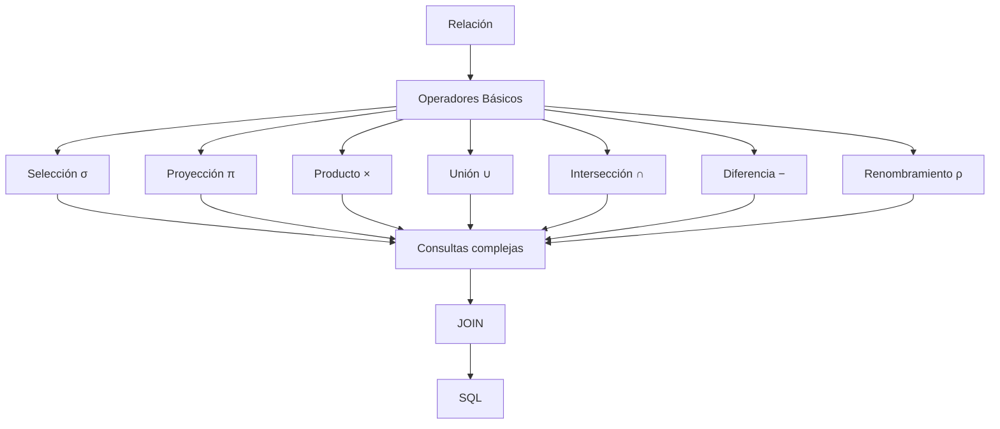

# Clase 12 — Operadores Fundamentales del Álgebra Relacional

## Introducción

En la clase anterior descubrimos que el Álgebra Relacional constituye el fundamento matemático del modelo relacional y la base conceptual sobre la que se construyó SQL.

Aprendimos que una relación puede interpretarse como un conjunto de tuplas y que las consultas no son más que transformaciones sucesivas aplicadas sobre dichas relaciones.

Sin embargo, todavía conocemos estas transformaciones únicamente de forma superficial.

Sabemos que existen operadores, pero aún no entendemos exactamente qué hace cada uno, cuándo debe utilizarse ni cómo pueden combinarse para resolver problemas reales.

Esta clase está dedicada precisamente a ese objetivo.

Estudiaremos los operadores fundamentales del Álgebra Relacional, comenzando por los operadores básicos definidos por Edgar F. Codd y continuando con algunos operadores derivados cuya importancia práctica es enorme, especialmente el ​**JOIN**​, que más adelante se convertirá en una de las herramientas más utilizadas en SQL.

Como en todo el curso, utilizaremos la misma base de datos de nuestra empresa de venta de productos tecnológicos. Cada operador se aplicará sobre relaciones ya conocidas como ​**Cliente**​, ​**Producto**​, ​**Pedido**​, ​**LineaPedido**​, ​**Proveedor**​, **Categoria** o ​**Almacen**​, de modo que el estudiante pueda concentrarse en comprender el razonamiento algebraico sin distraerse con nuevos ejemplos.

A lo largo de la sesión veremos que todos los operadores poseen dos características comunes:

* reciben una o varias relaciones como entrada;
* producen siempre una nueva relación como salida.

Esta propiedad, denominada ​**cierre**​, permitirá construir consultas de complejidad creciente combinando operaciones muy sencillas.

Al finalizar la clase el estudiante no solo conocerá los operadores individualmente, sino que será capaz de leer expresiones algebraicas completas, comprender cómo se ejecutan paso a paso y traducirlas posteriormente a SQL.

---

## Objetivos de aprendizaje

Al finalizar esta sesión el estudiante será capaz de:

* Comprender el funcionamiento formal de los operadores fundamentales del Álgebra Relacional.
* Diferenciar claramente selección, proyección, producto cartesiano, unión, intersección y diferencia.
* Comprender el propósito del operador de renombramiento.
* Entender por qué el JOIN puede construirse a partir de operadores básicos.
* Interpretar expresiones algebraicas compuestas.
* Resolver consultas siguiendo una secuencia lógica de operaciones.
* Traducir operadores algebraicos a consultas SQL equivalentes.
* Aplicar los operadores al caso práctico desarrollado durante el curso.

---

## Competencias desarrolladas

Durante esta clase se reforzarán especialmente las siguientes competencias:

* Razonamiento formal sobre consultas.
* Modelado lógico de operaciones sobre relaciones.
* Lectura de expresiones algebraicas complejas.
* Preparación para el aprendizaje de SQL.
* Comprensión del funcionamiento interno de los optimizadores de consultas.

---

## Conocimientos previos

Para aprovechar correctamente esta sesión el estudiante debe dominar:

* Modelo Relacional.
* Relaciones, tuplas y atributos.
* Concepto de conjunto.
* Operadores unarios y binarios.
* Notación básica del Álgebra Relacional.

---

## Contenido

1. [Selección (σ)](01_seleccion_sigma.md)
2. [Proyección (π)](02_proyeccion_pi.md)
3. [Producto cartesiano](03_producto_cartesiano.md)
4. [Unión](04_union.md)
5. [Intersección](05_interseccion.md)
6. [Diferencia](06_diferencia.md)
7. [Renombramiento](07_renombramiento.md)
8. [JOIN como operación derivada](08_join_como_operacion_derivada.md)
9. [Composición de operaciones](09_composicion_de_operaciones.md)
10. [Resolución paso a paso](10_resolucion_paso_a_paso.md)
11. [Equivalencia con SQL](11_equivalencia_con_sql.md)
12. [Ejercicios guiados](12_ejercicios_guiados.md)
13. [Caso práctico de la empresa](13_caso_practico_empresa.md)
14. [Resumen](14_resumen.md)

---

## Mapa conceptual

---

## Relación con la clase anterior

En la clase anterior comprendimos por qué existe el Álgebra Relacional y cuál es su papel dentro del modelo relacional.

También aprendimos a interpretar las relaciones como conjuntos y vimos que los operadores constituyen el mecanismo mediante el cual pueden transformarse unas relaciones en otras.

Esta clase profundiza precisamente en esos operadores.

Pasaremos de una visión conceptual a una comprensión completamente operativa.

---

## Relación con las siguientes clases

Los operadores estudiados en esta sesión aparecerán constantemente durante el resto del curso.

Cuando aprendamos SQL comprobaremos que prácticamente todas las consultas escritas mediante:

* SELECT
* FROM
* WHERE
* JOIN
* UNION
* INTERSECT
* EXCEPT

pueden interpretarse como combinaciones de estos operadores.

Posteriormente volveremos sobre ellos para estudiar optimización de consultas, árboles de ejecución y planes generados por los SGBD.

---

## Tiempo orientativo

| Apartado                           | Tiempo |
| ------------------------------------ | -------: |
| Selección                         | 12 min |
| Proyección                        | 10 min |
| Producto cartesiano                | 10 min |
| Unión, intersección y diferencia | 20 min |
| Renombramiento                     |  8 min |
| JOIN derivado                      | 12 min |
| Composición de operadores         | 10 min |
| Ejercicios guiados                 | 13 min |
| Cierre                             |  5 min |

