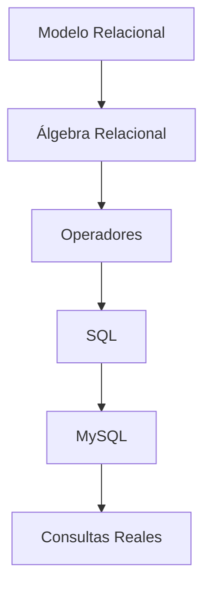

# Resumen

## Introducción

Esta clase ha servido como puente entre dos etapas fundamentales del curso. Por un lado, ha concluido el estudio del Álgebra Relacional como lenguaje formal de consulta. Por otro, ha preparado el inicio del trabajo práctico con SQL y MySQL.

Durante las clases anteriores aprendimos que el Modelo Relacional proporciona una representación lógica de la información basada en relaciones y que el Álgebra Relacional define un conjunto de operaciones para manipular dichas relaciones de forma rigurosa. En esta sesión hemos comprobado que esos conceptos no permanecen únicamente en el ámbito teórico, sino que constituyen la base sobre la que se construyen los sistemas gestores de bases de datos modernos.

El objetivo principal no ha sido aprender una nueva sintaxis, sino comprender que SQL expresa prácticamente las mismas operaciones que el Álgebra Relacional utilizando un lenguaje más cercano a los usuarios y a los desarrolladores.

Al finalizar esta clase, el estudiante debería ser capaz de reconocer la estructura lógica de una consulta independientemente del lenguaje en que esté escrita.

---

### Resumen narrativo

La sesión comenzó respondiendo a una pregunta fundamental: **¿por qué SQL se basa en el Álgebra Relacional?**

Se explicó que el Álgebra Relacional apareció antes que SQL y proporcionó el fundamento matemático necesario para manipular relaciones de manera formal. Posteriormente, SQL adoptó esas mismas operaciones y las transformó en un lenguaje declarativo pensado para facilitar el trabajo diario con las bases de datos.

A continuación se estableció una correspondencia directa entre los principales operadores del Álgebra Relacional y las cláusulas equivalentes de SQL.

Se comprobó que:

* la **proyección (π)** se corresponde con ​**SELECT**​;
* la **selección (σ)** se corresponde con ​**WHERE**​;
* el **producto cartesiano (×)** se implementa mediante ​**CROSS JOIN**​;
* el **JOIN** representa una forma simplificada de expresar un producto cartesiano seguido de una selección;
* las operaciones de conjuntos mantienen prácticamente la misma estructura tanto en Álgebra Relacional como en SQL.

Posteriormente se estudió cómo combinar varias operaciones para construir consultas cada vez más complejas.

Se demostró que una consulta profesional no debe entenderse como una única instrucción, sino como una sucesión de transformaciones sobre relaciones intermedias.

Esta forma de razonar permitió introducir una metodología sistemática para traducir expresiones entre ambos lenguajes.

En la parte final de la clase se realizaron ejercicios de traducción en ambos sentidos.

El estudiante pudo comprobar que una misma consulta puede escribirse utilizando Álgebra Relacional o SQL sin alterar el resultado obtenido.

Finalmente se presentó el siguiente bloque del curso, dedicado íntegramente a MySQL, destacando que el razonamiento aprendido continuará siendo válido durante todo el semestre.

---

## Mapa conceptual

---

## Correspondencia general

| Álgebra Relacional | SQL        | Función                         |
| --------------------- | ------------ | ---------------------------------- |
| π                  | SELECT     | Elegir atributos                 |
| σ                  | WHERE      | Filtrar registros                |
| ×                  | CROSS JOIN | Producto cartesiano              |
| ⋈                  | INNER JOIN | Combinar relaciones              |
| ∪                  | UNION      | Unir resultados                  |
| ∩                  | INTERSECT  | Obtener elementos comunes        |
| −                  | EXCEPT     | Obtener diferencias              |
| ρ                  | AS         | Renombrar relaciones o atributos |

Esta tabla resume la equivalencia conceptual desarrollada a lo largo de toda la sesión y constituye una excelente referencia para las primeras prácticas con SQL.

---

## Lo que el estudiante debería ser capaz de hacer

Al finalizar esta clase el estudiante debería ser capaz de:

* Explicar por qué SQL está basado en el Álgebra Relacional.
* Identificar la equivalencia entre los operadores fundamentales y las cláusulas de SQL.
* Interpretar una consulta SQL desde el punto de vista del Álgebra Relacional.
* Traducir expresiones de Álgebra Relacional a SQL.
* Traducir consultas SQL a expresiones equivalentes de Álgebra Relacional.
* Comprender que el JOIN es una operación derivada del producto cartesiano y la selección.
* Analizar consultas complejas descomponiéndolas en una secuencia de operaciones más simples.
* Utilizar el razonamiento algebraico para comprender cómo trabajan internamente los sistemas gestores de bases de datos.

---

## Relación con la siguiente clase

Con esta sesión concluye el primer gran bloque teórico de la asignatura.

A partir de la siguiente clase comenzaremos a trabajar directamente con ​**MySQL**​, utilizando un sistema gestor de bases de datos real para implementar todos los conceptos estudiados hasta ahora.

Durante el resto del curso dejaremos de escribir expresiones en Álgebra Relacional de forma habitual, pero continuaremos aplicando continuamente sus principios.

Cada consulta SQL que construyamos podrá interpretarse como una expresión algebraica equivalente.

Esta perspectiva permitirá comprender no solo cómo escribir consultas, sino también por qué funcionan y cómo pueden optimizarse.

En consecuencia, el estudiante pasará de trabajar con un modelo lógico abstracto a utilizar herramientas profesionales empleadas diariamente en el desarrollo de aplicaciones y en la administración de bases de datos.

---

## Ideas clave finales

* El Álgebra Relacional constituye el fundamento teórico de SQL y del Modelo Relacional.
* SQL no sustituye al Álgebra Relacional; proporciona una forma práctica de expresar las mismas operaciones.
* Comprender el significado de cada operador es mucho más importante que memorizar la sintaxis del lenguaje.
* Las consultas complejas pueden descomponerse en una secuencia de operaciones sencillas sobre relaciones intermedias.
* Traducir consultas entre Álgebra Relacional y SQL desarrolla una comprensión profunda del funcionamiento de las bases de datos relacionales.
* El conocimiento adquirido en este bloque servirá como base para todo el trabajo práctico con MySQL que se desarrollará durante el resto de la asignatura.
* A partir de la próxima clase el estudiante comenzará a utilizar un SGBD real, aplicando de forma práctica todos los conceptos aprendidos desde el inicio del curso.

