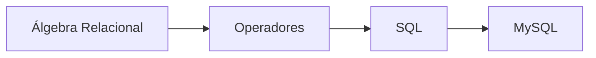

# Clase 13. Correspondencia entre Álgebra Relacional y SQL

## Introducción

Durante las dos clases anteriores se ha estudiado el Álgebra Relacional como lenguaje formal para expresar consultas sobre bases de datos relacionales. Aunque este lenguaje constituye el fundamento matemático del modelo relacional, en los sistemas gestores de bases de datos no se utiliza directamente para consultar la información.

En su lugar se emplea SQL (Structured Query Language), un lenguaje declarativo diseñado para que los usuarios puedan expresar consultas de forma más sencilla y cercana al problema que desean resolver.

Esta diferencia puede llevar a pensar erróneamente que SQL y el Álgebra Relacional son tecnologías independientes. En realidad ocurre exactamente lo contrario: la mayor parte de las consultas escritas en SQL pueden traducirse a expresiones equivalentes de Álgebra Relacional, y los optimizadores internos de los SGBD realizan precisamente esa transformación antes de ejecutar una consulta.

Comprender esta relación permite al estudiante dejar de memorizar sentencias SQL y comenzar a entender cómo razona realmente un sistema gestor de bases de datos.

Durante esta clase se establecerá una correspondencia directa entre ambos lenguajes utilizando el mismo caso de estudio desarrollado a lo largo del curso.

## Objetivos de aprendizaje

Al finalizar esta sesión el estudiante será capaz de:

* Comprender la relación existente entre el Álgebra Relacional y SQL.
* Identificar la equivalencia entre los principales operadores relacionales y las cláusulas SQL.
* Traducir consultas sencillas desde Álgebra Relacional a SQL.
* Traducir consultas SQL al lenguaje del Álgebra Relacional.
* Comprender que SQL es un lenguaje declarativo basado en fundamentos algebraicos.
* Prepararse para comenzar el aprendizaje práctico de MySQL.

## Contenido

1. [¿Por qué SQL se basa en el Álgebra Relacional?](01_por_que_sql_se_basa_en_el_algebra.md)
2. [Operadores relacionales vs SQL](02_operadores_relacionales_vs_sql.md)
3. [SELECT como proyección](03_select_como_proyeccion.md)
4. [WHERE como selección](04_where_como_seleccion.md)
5. [Producto cartesiano y CROSS JOIN](05_producto_cartesiano_y_cross_join.md)
6. [UNION, INTERSECT y EXCEPT](06_union_intersect_except.md)
7. [JOIN desde el Álgebra Relacional](07_join_desde_el_algebra.md)
8. [Consultas compuestas](08_consultas_compuestas.md)
9. [Traducción de Álgebra Relacional a SQL](09_traduccion_algebra_a_sql.md)
10. [Traducción de SQL a Álgebra Relacional](10_traduccion_sql_a_algebra.md)
11. [Ejercicios guiados](11_ejercicios_guiados.md)
12. [Preparación para MySQL](12_preparacion_para_mysql.md)
13. [Resumen](13_resumen.md)

## Mapa conceptual

## Relación con las clases anteriores

En la clase anterior se estudiaron los operadores fundamentales del Álgebra Relacional y se resolvieron consultas progresivamente más complejas mediante selección, proyección, operaciones de conjuntos y JOIN.

Todo ese conocimiento servirá ahora como base para comprender la estructura de las consultas SQL.

## Relación con las siguientes clases

La siguiente unidad marcará el inicio del bloque práctico dedicado a MySQL.

Los estudiantes comenzarán a escribir consultas reales utilizando SQL, comprobando que cada sentencia puede interpretarse como una expresión equivalente del Álgebra Relacional.

Esta transición permitirá comprender SQL desde sus fundamentos y no únicamente como un lenguaje cuya sintaxis debe memorizarse.

