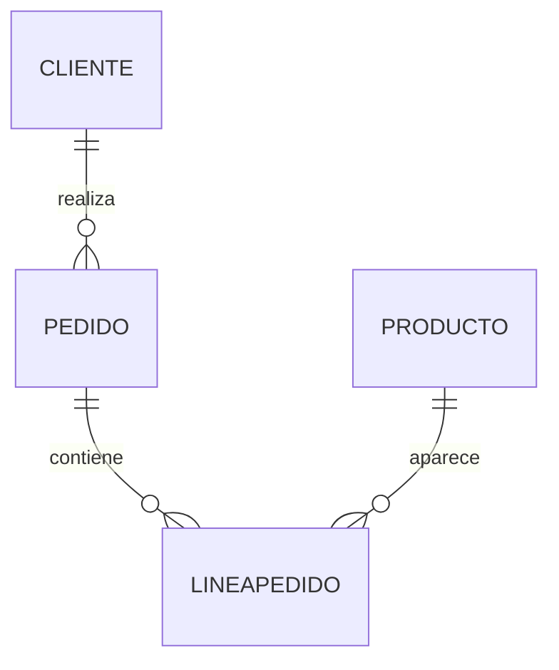

# Dataset inicial de la empresa

## Introducción

Durante todo este taller utilizaremos un único conjunto de relaciones.

El objetivo es que el estudiante no tenga que invertir tiempo en comprender nuevos escenarios o nuevos nombres de tablas en cada ejercicio.

Todas las consultas se resolverán utilizando la misma base de datos simplificada de la empresa de venta de productos tecnológicos que nos acompaña desde el inicio de la asignatura.

Se trata de una versión reducida del modelo desarrollado durante el curso.

Contiene únicamente la información necesaria para practicar los operadores fundamentales del Álgebra Relacional.

Las relaciones son deliberadamente pequeñas para que puedan analizarse visualmente y para que los resultados de cada operación puedan obtenerse manualmente sin necesidad de utilizar un sistema gestor de bases de datos.

Durante el examen el procedimiento será exactamente el mismo.

Primero se proporcionarán unas relaciones.

Después se plantearán una serie de consultas que deberán resolverse utilizando Álgebra Relacional.

Por tanto, es recomendable familiarizarse con este conjunto de datos antes de comenzar los ejercicios.

---

### Relación Cliente

| IdCliente | Nombre       | Ciudad    |
| ----------: | -------------- | ----------- |
|         1 | Ana Ruiz     | Santander |
|         2 | Luis Pérez  | Bilbao    |
|         3 | Marta Gómez | Santander |
|         4 | Pedro López | Oviedo    |
|         5 | Laura Díaz  | Bilbao    |
|         6 | Carlos Vega  | Santander |

Esta relación almacena la información básica de los clientes registrados en la empresa.

Cada cliente queda identificado de forma única mediante ​**IdCliente**​.

---

### Relación Producto

| IdProducto | Nombre              | Categoria      | Precio |
| -----------: | --------------------- | ---------------- | -------: |
|        101 | Monitor 27"         | Pantallas      |    249 |
|        102 | Ratón Inalámbrico | Periféricos   |     35 |
|        103 | Teclado Mecánico   | Periféricos   |     89 |
|        104 | SSD 1 TB            | Almacenamiento |    159 |
|        105 | Portátil 15"       | Ordenadores    |    999 |
|        106 | Webcam HD           | Periféricos   |     79 |

Esta relación representa el catálogo de productos comercializados por la empresa.

---

### Relación Pedido

| IdPedido | IdCliente | Fecha      |
| ---------: | ----------: | ------------ |
|     1001 |         1 | 2025-03-02 |
|     1002 |         2 | 2025-03-05 |
|     1003 |         1 | 2025-03-08 |
|     1004 |         4 | 2025-03-10 |
|     1005 |         6 | 2025-03-15 |

Cada pedido pertenece exactamente a un cliente.

La relación entre ambas tablas se establece mediante el atributo ​**IdCliente**​.

---

### Relación LineaPedido

| IdPedido | IdProducto | Cantidad |
| ---------: | -----------: | ---------: |
|     1001 |        101 |        1 |
|     1001 |        102 |        2 |
|     1002 |        104 |        1 |
|     1003 |        105 |        1 |
|     1003 |        106 |        1 |
|     1004 |        103 |        3 |
|     1005 |        102 |        1 |
|     1005 |        104 |        2 |

Cada fila representa un producto concreto incluido dentro de un pedido.

Un mismo pedido puede contener varias líneas.

Un mismo producto puede aparecer en distintos pedidos.

---

### Esquema conceptual

---

### Observaciones importantes

Antes de comenzar los ejercicios conviene recordar algunas ideas.

* Todas las relaciones representan conjuntos.
* No existen tuplas duplicadas.
* Todas las operaciones producirán nuevas relaciones.
* Ninguna consulta modificará las relaciones originales.
* Todas las expresiones deberán construirse utilizando exclusivamente los operadores del Álgebra Relacional estudiados en clase.

---

### Cómo utilizar el dataset

Durante la resolución de los ejercicios se recomienda seguir el siguiente procedimiento.

1. Identificar las relaciones necesarias.
2. Localizar los atributos implicados.
3. Dibujar mentalmente el recorrido de la información.
4. Decidir qué operadores deben aplicarse.
5. Escribir finalmente la expresión algebraica.

No se debe intentar resolver los ejercicios directamente.

Invertir unos segundos en planificar el razonamiento suele evitar la mayoría de los errores.

---

### Ideas clave

* Todo el taller utilizará un único conjunto de relaciones.
* El dataset representa una versión simplificada de la empresa utilizada durante el curso.
* Los ejercicios deberán resolverse únicamente mediante Álgebra Relacional.
* Comprender bien las relaciones iniciales facilitará enormemente la resolución de los problemas posteriores.
* Este mismo enfoque será utilizado posteriormente en el examen de la asignatura.

