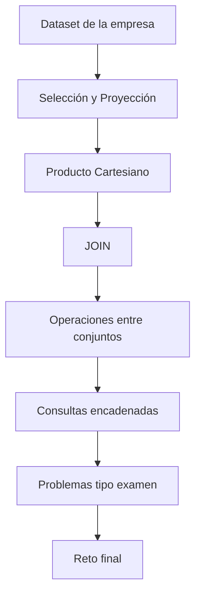

# Taller 1 — Aplicación del Álgebra Relacional

## Introducción

Tras estudiar los fundamentos del Álgebra Relacional y conocer el funcionamiento de sus operadores, llega el momento de poner en práctica todo lo aprendido.

A diferencia de las clases teóricas, el objetivo de este taller no consiste en introducir nuevos conceptos, sino en desarrollar la capacidad de analizar problemas y resolverlos mediante el uso combinado de los operadores estudiados.

En una base de datos real rara vez será suficiente aplicar un único operador. Lo habitual es que una consulta requiera filtrar información, combinar relaciones, seleccionar únicamente determinados atributos y, en ocasiones, realizar operaciones entre conjuntos.

Por este motivo, los ejercicios de este taller están diseñados de forma progresiva.

Todos ellos utilizan el mismo caso de estudio desarrollado durante la asignatura: la base de datos de la empresa dedicada a la venta de productos tecnológicos.

El alumno trabajará siempre sobre las mismas relaciones, exactamente igual que ocurrirá posteriormente en el examen.

El objetivo principal es aprender a razonar.

Antes de escribir una expresión algebraica será necesario identificar:

* qué información solicita el problema;
* en qué relaciones se encuentra dicha información;
* qué operadores deben utilizarse;
* en qué orden deben aplicarse.

Durante la sesión se recomienda resolver todos los ejercicios sobre papel.

El profesor realizará la corrección de manera progresiva, analizando distintas estrategias de resolución y explicando por qué algunas expresiones resultan más adecuadas que otras.

Al finalizar el taller el estudiante habrá resuelto consultas similares a las que aparecerán posteriormente en las prácticas y en el examen de la asignatura.

---

## Objetivos del taller

Al finalizar la sesión el estudiante será capaz de:

* Identificar correctamente las relaciones implicadas en una consulta.
* Seleccionar el operador adecuado para cada problema.
* Combinar varios operadores en una única expresión algebraica.
* Resolver consultas de dificultad creciente.
* Interpretar el significado de una expresión algebraica compleja.
* Prepararse para la resolución de ejercicios de examen.

---

## Desarrollo de la sesión

La sesión seguirá una progresión creciente de dificultad.

Cada bloque reutilizará el mismo conjunto de relaciones para evitar que el estudiante tenga que adaptarse continuamente a nuevos escenarios.

El objetivo será centrar toda la atención en el razonamiento algebraico.

---

## Contenido

1. [Dataset inicial de la empresa](01_dataset_empresa.md)
2. [Ejercicios de selección y proyección](02_ejercicios_seleccion_y_proyeccion.md)
3. [Producto cartesiano y JOIN](03_ejercicios_producto_y_join.md)
4. [Operaciones entre conjuntos](04_ejercicios_union_interseccion_diferencia.md)
5. [Consultas encadenadas](05_consultas_encadenadas.md)
6. [Problemas tipo examen I](06_problemas_tipo_examen_I.md)
7. [Problemas tipo examen II](07_problemas_tipo_examen_II.md)
8. [Reto final](08_reto_final.md)
9. [Soluciones guiadas](09_soluciones_guiadas.md)
10. [Respuestas Bloque 1](10_respuestas_bloque_1.md)
11. [Respuestas Bloque 2](11_respuestas_bloque_2.md)
12. [Respuestas Bloque 3](12_respuestas_bloque_3.md)
13. [Respuestas Bloque 4](13_respuestas_bloque_4.md)
14. [Respuestas Bloque 5](14_respuestas_bloque_5.md)
15. [Respuestas Bloque 6](15_respuestas_bloque_6.md)

---

## Metodología de trabajo

Para cada ejercicio se recomienda seguir siempre el mismo procedimiento:

1. Leer cuidadosamente el enunciado.
2. Identificar las relaciones implicadas.
3. Determinar qué operadores son necesarios.
4. Establecer el orden lógico de aplicación.
5. Escribir la expresión en Álgebra Relacional.
6. Comprobar que el resultado responde exactamente a la pregunta planteada.

No se permitirá utilizar SQL durante este taller.

El objetivo es consolidar el razonamiento algebraico que servirá posteriormente como base para aprender SQL.

---

## Mapa conceptual

---

## Distribución aproximada del tiempo

| Actividad                   | Tiempo |
| ----------------------------- | -------: |
| Presentación del dataset   | 10 min |
| Ejercicios básicos         | 15 min |
| Producto cartesiano y JOIN  | 15 min |
| Operaciones entre conjuntos | 15 min |
| Consultas encadenadas       | 20 min |
| Problemas tipo examen       | 15 min |
| Corrección y debate        | 10 min |

---

## Relación con las clases anteriores

Este taller constituye la aplicación práctica de todo lo estudiado en las clases 11 y 12.

No introduce operadores nuevos.

Su finalidad es consolidar el razonamiento necesario para utilizarlos correctamente.

---

## Relación con las siguientes clases

En las próximas sesiones comenzaremos a trabajar con SQL.

El estudiante comprobará que prácticamente todas las consultas SQL pueden obtenerse traduciendo el razonamiento algebraico desarrollado durante este taller.

Quien domine estos ejercicios encontrará mucho más sencillo aprender el lenguaje SQL.

---

## Recomendaciones

No memorices soluciones.

Cada problema debe analizarse desde cero.

El objetivo no consiste en recordar una expresión concreta, sino en aprender un método sistemático para resolver cualquier consulta utilizando los operadores del Álgebra Relacional.

---

## Material necesario

* Apuntes de las clases 11 y 12.
* Papel para resolver las expresiones.
* Lápiz o bolígrafo.
* Calculadora no necesaria.
* No se utilizará ningún SGBD durante la sesión.

