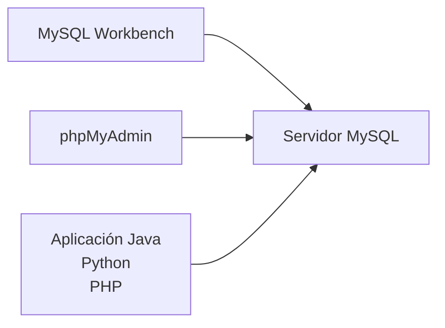

# Herramientas para trabajar con MySQL: MySQL Workbench y phpMyAdmin

## Introducción

Hasta este momento del curso todas las sentencias SQL se han presentado como ejemplos escritos sobre papel. A partir de esta clase comenzaremos a ejecutar esas instrucciones sobre un servidor MySQL real.

Para ello necesitaremos una herramienta que nos permita conectarnos al servidor, escribir sentencias SQL, ejecutarlas y visualizar los resultados.

Es importante comprender que ​**MySQL es el Sistema Gestor de Bases de Datos (SGBD)**​. Las aplicaciones que utilizaremos durante el curso no sustituyen a MySQL, sino que actúan como clientes que se conectan al servidor para enviar instrucciones SQL.

Existen numerosas herramientas para trabajar con MySQL. En esta asignatura utilizaremos principalmente dos:

* ​**MySQL Workbench**​, orientado al desarrollo profesional y al diseño de bases de datos.
* ​**phpMyAdmin**​, una aplicación web muy ligera y cómoda para administrar bases de datos desde el navegador.

Ambas trabajan exactamente sobre el mismo servidor MySQL y ambas ejecutan las mismas sentencias SQL. Lo único que cambia es la interfaz utilizada.

### Cliente y servidor

Antes de comenzar conviene distinguir claramente estos dos conceptos.



El servidor MySQL almacena toda la información.

Los clientes simplemente envían instrucciones SQL al servidor y muestran los resultados obtenidos.

Esto significa que podemos utilizar indistintamente Workbench o phpMyAdmin sin modificar la base de datos.

---

### MySQL Workbench

MySQL Workbench es el entorno gráfico oficial desarrollado por Oracle para trabajar con MySQL.

Está orientado principalmente a desarrolladores, administradores de bases de datos y arquitectos de software.

Entre sus principales características destacan:

* editor SQL muy completo;
* resaltado de sintaxis;
* autocompletado;
* ejecución parcial de scripts;
* administración de usuarios;
* diseño de diagramas EER;
* ingeniería directa e inversa;
* herramientas de administración y monitorización.

Durante el curso será la herramienta recomendada para escribir scripts SQL largos y desarrollar la estructura completa de la base de datos.

---

### phpMyAdmin

phpMyAdmin es una aplicación web escrita en PHP que permite administrar servidores MySQL desde cualquier navegador.

No requiere instalar un entorno gráfico específico, ya que funciona como una página web.

Entre sus ventajas destacan:

* acceso inmediato desde el navegador;
* exploración muy rápida de tablas;
* edición visual de registros;
* importación y exportación de datos;
* ejecución de consultas SQL;
* administración sencilla de usuarios y permisos.

Durante las prácticas utilizaremos con frecuencia phpMyAdmin para comprobar rápidamente el contenido de las tablas mientras desarrollamos consultas SQL.

---

### Comparación entre ambas herramientas

| Característica        | MySQL Workbench | phpMyAdmin                  |
| ------------------------ | ----------------- | ----------------------------- |
| Tipo de aplicación    | Escritorio      | Web                         |
| Instalación           | Sí             | No (si ya está desplegado) |
| Editor SQL             | Muy completo    | Sencillo                    |
| Diseño de diagramas   | Sí             | No                          |
| Administración visual | Muy buena       | Muy buena                   |
| Consultas rápidas     | Excelente       | Excelente                   |
| Uso profesional        | Muy habitual    | Muy habitual                |

No existe una herramienta "mejor".

Cada una resulta más adecuada para determinadas tareas.

En proyectos reales es frecuente alternar ambas durante la misma jornada de trabajo.

---

### Nuestro entorno de laboratorio

Durante esta asignatura utilizaremos Docker para disponer de un servidor MySQL completamente aislado del sistema operativo.

Esto presenta varias ventajas.

* Todos los estudiantes utilizarán exactamente la misma versión de MySQL.
* El entorno podrá reconstruirse en cualquier momento.
* Será muy sencillo reiniciar la base de datos cuando sea necesario.
* No será necesario instalar manualmente un servidor MySQL en el sistema operativo.

El siguiente archivo `docker-compose.yml` crea un servidor MySQL y una instancia de phpMyAdmin preparada para utilizar durante todo el curso.

```yaml
services:

  mysql:
    image: mysql:8.4
    container_name: mysql_bd1
    restart: unless-stopped

    environment:
      MYSQL_ROOT_PASSWORD: root
      MYSQL_DATABASE: empresa_tecnologica
      MYSQL_USER: alumno
      MYSQL_PASSWORD: alumno

    ports:
      - "3306:3306"

    volumes:
      - mysql_data:/var/lib/mysql

    command:
      - --character-set-server=utf8mb4
      - --collation-server=utf8mb4_unicode_ci

  phpmyadmin:
    image: phpmyadmin:latest
    container_name: phpmyadmin_bd1
    restart: unless-stopped

    depends_on:
      - mysql

    environment:
      PMA_HOST: mysql
      PMA_PORT: 3306

    ports:
      - "8080:80"

volumes:

  mysql_data:
```

Una vez iniciado el entorno mediante:

```bash
docker compose up -d
```

tendremos disponibles los siguientes servicios.

| Servicio   | Dirección                                   |
| ------------ | ---------------------------------------------- |
| MySQL      | localhost:3306                               |
| phpMyAdmin | [http://localhost:8080](http://localhost:8080/) |

Para acceder a phpMyAdmin podremos utilizar cualquiera de los siguientes usuarios.

**Administrador**

* Usuario: `root`
* Contraseña: `root`

**Usuario de trabajo**

* Usuario: `alumno`
* Contraseña: `alumno`

Durante la mayor parte del curso trabajaremos con el usuario ​**alumno**​, reservando la cuenta **root** para tareas de administración.

---

### Flujo de trabajo recomendado

Durante las prácticas seguiremos normalmente el siguiente proceso:

1. Iniciar los contenedores Docker.
2. Abrir MySQL Workbench y conectarse al servidor.
3. Crear o modificar el esquema mediante scripts SQL.
4. Utilizar phpMyAdmin para comprobar visualmente las tablas y los datos.
5. Corregir los scripts cuando sea necesario.

Este flujo de trabajo es muy similar al empleado por numerosos equipos de desarrollo profesionales.

---

### Errores frecuentes

Uno de los errores más habituales consiste en confundir MySQL con MySQL Workbench o phpMyAdmin.

MySQL es el servidor donde realmente se almacenan los datos.

Workbench y phpMyAdmin únicamente actúan como clientes.

También es frecuente olvidar iniciar los contenedores Docker antes de intentar conectarse, lo que provoca errores de conexión aunque la configuración sea correcta.

Por último, algunos estudiantes modifican datos directamente desde phpMyAdmin y olvidan actualizar posteriormente sus scripts SQL. En un proyecto profesional, los scripts constituyen la documentación reproducible de la base de datos y deben mantenerse siempre sincronizados con el estado del servidor.

### Ideas clave

* MySQL es el servidor; Workbench y phpMyAdmin son clientes.
* Ambos clientes ejecutan exactamente las mismas sentencias SQL.
* MySQL Workbench será la herramienta principal para desarrollar scripts y diseñar la base de datos.
* phpMyAdmin resulta especialmente útil para inspeccionar tablas y verificar rápidamente los datos almacenados.
* Docker garantiza que todos los estudiantes trabajen sobre un entorno homogéneo y fácilmente reproducible.
* El entorno definido mediante `docker-compose.yml` será la base de todas las prácticas realizadas durante el resto de la asignatura.

