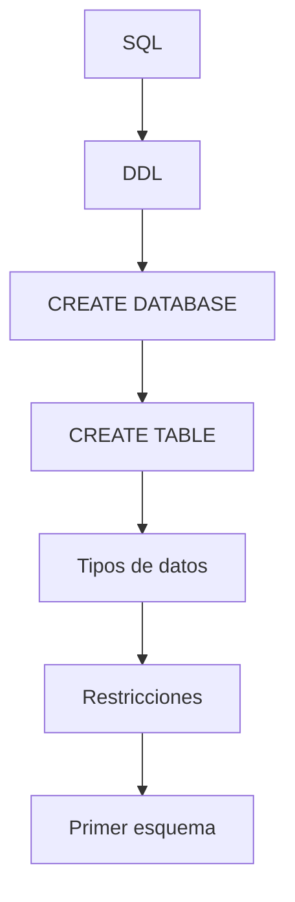

# Resumen

## Introducción

Con esta clase comienza el bloque práctico de la asignatura. Después de estudiar durante trece sesiones los fundamentos teóricos del Modelo Relacional y del Álgebra Relacional, hemos dado el primer paso hacia la construcción de una base de datos real utilizando MySQL.

A partir de ahora cada nueva clase ampliará el mismo proyecto, incorporando nuevas tablas, restricciones, consultas y mecanismos de administración hasta obtener una base de datos empresarial completamente funcional.

---

### Resumen narrativo

La sesión comenzó presentando SQL como el lenguaje estándar utilizado para interactuar con los sistemas gestores de bases de datos relacionales.

Se explicó que SQL está formado por varios sublenguajes especializados, cada uno orientado a una tarea diferente: definición de estructuras, manipulación de datos, consultas, control de transacciones y administración de permisos.

Posteriormente se introdujeron las herramientas que utilizaremos durante el resto del curso.

Se diferenció claramente entre el servidor MySQL y los clientes que se conectan a él, utilizando Docker para desplegar un entorno homogéneo basado en **MySQL** y ​**phpMyAdmin**​, complementado por **MySQL Workbench** para el desarrollo de scripts.

Una vez preparado el entorno, se creó la base de datos `empresa_tecnologica`, aprendiendo a utilizar instrucciones como `CREATE DATABASE`, `SHOW DATABASES`, `USE` y `SELECT DATABASE()` para verificar el estado del servidor.

A continuación se estudiaron los principales tipos de datos de MySQL, analizando cuándo utilizar `INT`, `VARCHAR`, `DECIMAL`, `DATE`, `DATETIME` y `BOOLEAN`.

Sobre esta base se construyó la primera tabla del proyecto mediante `CREATE TABLE`, comprobando posteriormente su estructura mediante `SHOW TABLES` y `DESC`.

La segunda mitad de la sesión estuvo dedicada a las restricciones básicas de integridad.

Se estudiaron las claves primarias, la restricción `NOT NULL`, los valores por defecto mediante `DEFAULT` y la generación automática de identificadores con `AUTO_INCREMENT`.

Finalmente se construyó el primer esquema físico del caso práctico, compuesto por las entidades ​**Cliente**​, ​**Empleado**​, **Categoría** y ​**Producto**​, estableciendo además una convención de nomenclatura que mantendremos durante todo el semestre.

---

## Mapa conceptual

---

## Lo que el estudiante debería ser capaz de hacer

Al finalizar esta clase el estudiante debería ser capaz de:

* Diferenciar los principales sublenguajes de SQL.
* Configurar un entorno básico de trabajo utilizando Docker, MySQL, phpMyAdmin y MySQL Workbench.
* Crear y seleccionar una base de datos.
* Elegir correctamente los tipos de datos más habituales.
* Crear tablas mediante `CREATE TABLE`.
* Definir claves primarias.
* Utilizar `NOT NULL`, `DEFAULT` y `AUTO_INCREMENT`.
* Verificar la estructura de una base de datos mediante `SHOW` y `DESC`.
* Aplicar una convención uniforme de nomenclatura.

---

## Relación con la siguiente clase

La estructura de la base de datos ya está preparada.

En la siguiente sesión comenzaremos a poblarla con información utilizando el ​**Lenguaje de Manipulación de Datos (DML)**​.

Aprenderemos a insertar registros mediante `INSERT`, a consultar el contenido de las tablas para verificar los resultados y a comprender cómo se almacenan realmente los datos dentro del sistema gestor.

A partir de ese momento, el proyecto dejará de ser únicamente un esquema vacío para convertirse en una base de datos funcional sobre la que realizaremos consultas y operaciones cada vez más complejas.

---

## Ideas clave finales

* SQL es el lenguaje estándar para definir, manipular y consultar bases de datos relacionales.
* MySQL es el SGBD que utilizaremos durante el resto del curso, apoyándonos en Docker, phpMyAdmin y MySQL Workbench.
* Una buena definición de tablas comienza con una correcta elección de los tipos de datos.
* Las restricciones (`PRIMARY KEY`, `NOT NULL`, `DEFAULT` y `AUTO_INCREMENT`) garantizan la calidad e integridad de la información.
* El caso práctico ha dejado de ser un modelo conceptual y ha comenzado a convertirse en una base de datos real.
* Todas las clases posteriores ampliarán este mismo proyecto, reutilizando las tablas y convenciones definidas en esta sesión.

