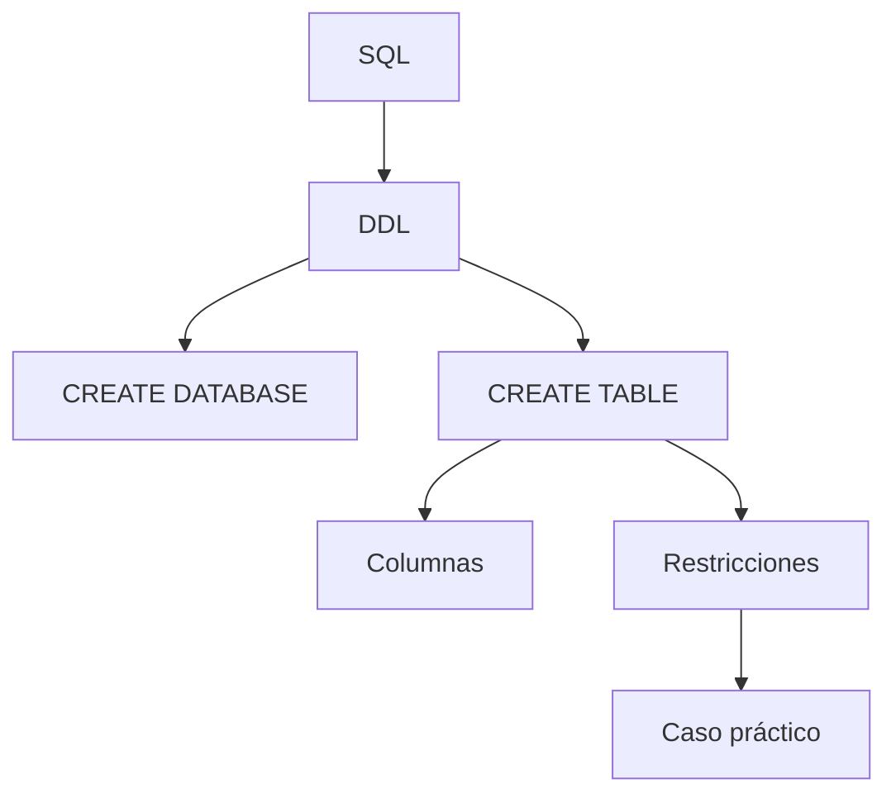

# Clase 14. SQL DDL: CREATE DATABASE y CREATE TABLE

## Introducción

Con esta clase comienza una nueva etapa del curso. Después de haber estudiado los fundamentos del Modelo Relacional, el Álgebra Relacional y la correspondencia entre este último y SQL, llega el momento de trabajar con un Sistema Gestor de Bases de Datos (SGBD) real.

A partir de ahora dejaremos de utilizar únicamente ejemplos teóricos para comenzar a construir una base de datos completamente funcional utilizando ​**MySQL**​. Durante el resto del semestre el caso práctico de la empresa comercial acompañará todas las clases, evolucionando progresivamente hasta convertirse en un sistema de información completo.

Esta transición supone un cambio importante en la forma de aprender. Hasta ahora el objetivo consistía en comprender cómo se organizan y consultan los datos desde un punto de vista lógico. En adelante aprenderemos también cómo definir físicamente una base de datos, cómo crear sus tablas, cómo establecer restricciones de integridad y cómo utilizar las herramientas que emplean los desarrolladores y administradores de bases de datos en proyectos profesionales.

Aunque la asignatura entra ahora en una fase eminentemente práctica, el razonamiento aprendido en las clases anteriores seguirá siendo la base sobre la que construiremos todo el trabajo posterior.

## Objetivos de aprendizaje

Al finalizar esta sesión el estudiante será capaz de:

* Comprender la estructura general del lenguaje SQL.
* Diferenciar los distintos sublenguajes que forman SQL.
* Conocer el entorno de trabajo de MySQL Workbench.
* Crear una base de datos utilizando instrucciones DDL.
* Seleccionar adecuadamente los tipos de datos más habituales.
* Crear tablas mediante la sentencia `CREATE TABLE`.
* Definir claves primarias y restricciones básicas.
* Utilizar correctamente `NOT NULL`, `DEFAULT` y `AUTO_INCREMENT`.
* Construir el primer esquema físico del caso práctico.
* Aplicar convenciones de nomenclatura utilizadas en proyectos profesionales.

## Contenido

1. [Introducción a SQL](01_introduccion_a_sql.md)
2. [Los lenguajes de SQL](02_lenguajes_de_sql.md)
3. [Herramientas para trabajar con MySQL: MySQL Workbench y phpMyAdmin](03_mysql_workbench_phpmyadmin.md)
4. [Creación de una base de datos](04_creacion_de_una_base_de_datos.md)
5. [Tipos de datos](05_tipos_de_datos.md)
6. [CREATE TABLE](06_create_table.md)
7. [Clave primaria](07_clave_primaria.md)
8. [NOT NULL](08_not_null.md)
9. [DEFAULT](09_default.md)
10. [AUTO\_INCREMENT](10_auto_increment.md)
11. [Primer esquema del caso práctico](11_primer_esquema_del_caso_practico.md)
12. [Buenas prácticas de nomenclatura](12_buenas_practicas_de_nomenclatura.md)
13. [Errores frecuentes](13_errores_frecuentes.md)
14. [Resumen](14_resumen.md)

## Mapa conceptual

## Relación con las clases anteriores

En la clase anterior se demostró que SQL constituye la implementación práctica de los principios definidos por el Álgebra Relacional. El estudiante aprendió a interpretar una consulta SQL desde un punto de vista lógico y a traducir expresiones entre ambos lenguajes.

En esta nueva unidad comenzaremos a utilizar SQL no para consultar información, sino para crear la propia estructura de la base de datos donde posteriormente almacenaremos los datos del caso práctico.

## Relación con las siguientes clases

Las tablas creadas durante esta sesión servirán como base para las próximas unidades.

Una vez definido el esquema físico, comenzaremos a insertar registros mediante sentencias DML y, posteriormente, aprenderemos a recuperar la información utilizando consultas SQL cada vez más complejas.

