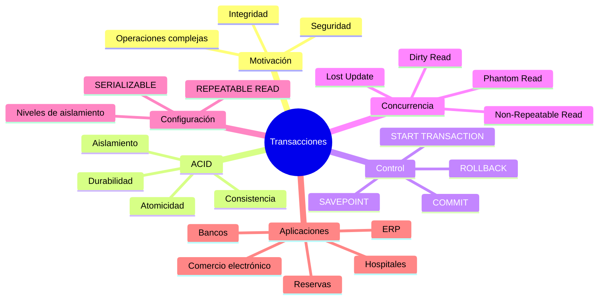

# Resumen

## Introducción

En esta clase hemos estudiado uno de los mecanismos más importantes de cualquier Sistema Gestor de Bases de Datos Relacional: **las transacciones**.

Hasta ahora habíamos aprendido a crear tablas, insertar datos, modificarlos, eliminarlos y realizar consultas de distinta complejidad. Sin embargo, todas esas operaciones se habían estudiado de forma aislada.

En un entorno profesional, las aplicaciones rara vez ejecutan una única instrucción SQL. Lo habitual es que una acción del usuario implique múltiples operaciones relacionadas que deben ejecutarse conjuntamente.

Las transacciones proporcionan precisamente ese mecanismo de agrupación, permitiendo tratar un conjunto de sentencias SQL como una única unidad lógica de trabajo.

Gracias a ellas, las bases de datos modernas pueden mantener la integridad de la información incluso cuando se producen errores, fallos del sistema o miles de usuarios trabajan simultáneamente.

## Competencias adquiridas

Al finalizar esta clase el estudiante ha desarrollado las siguientes competencias:

- Comprender qué es una transacción.
- Identificar cuándo una operación debe ejecutarse mediante una transacción.
- Diferenciar una operación SQL individual de una unidad lógica de negocio.
- Comprender el significado de las propiedades ACID.
- Utilizar correctamente `START TRANSACTION`.
- Confirmar cambios mediante `COMMIT`.
- Cancelar operaciones mediante `ROLLBACK`.
- Crear y utilizar puntos de restauración mediante `SAVEPOINT`.
- Comprender los distintos niveles de aislamiento.
- Identificar los principales problemas de concurrencia.
- Diseñar operaciones empresariales seguras utilizando transacciones.

Estas competencias constituyen la base para desarrollar aplicaciones fiables sobre MySQL.

## Resumen de los conceptos estudiados

Durante la clase se abordaron los siguientes contenidos.

### ¿Por qué existen las transacciones?

Se estudió el problema de ejecutar múltiples operaciones independientes sobre la base de datos.

Se comprobó que, sin un mecanismo de control, un fallo intermedio puede dejar la información en un estado inconsistente.

Las transacciones resuelven este problema aplicando la filosofía de:

> Todo o nada.

### Transferencia bancaria

La transferencia bancaria sirvió como ejemplo conductor durante toda la clase.

A través de ella se observó cómo una única operación de negocio implica múltiples instrucciones SQL:

- Comprobación de cuentas.
- Validación del saldo.
- Descuento del importe.
- Ingreso en la cuenta destino.
- Registro de movimientos.

Todas ellas deben ejecutarse conjuntamente.

### Propiedades ACID

Se estudiaron las cuatro propiedades fundamentales de una transacción.

**Atomicidad**

Una transacción nunca puede quedar ejecutada parcialmente.

**Consistencia**

La base de datos debe permanecer siempre en un estado válido.

**Aislamiento**

Las transacciones concurrentes no deben interferirse entre sí.

**Durabilidad**

Una vez confirmado un `COMMIT`, los cambios permanecen almacenados incluso tras un fallo del sistema.

Estas cuatro propiedades constituyen el fundamento del procesamiento transaccional.

### Control de transacciones

Se aprendió a utilizar las instrucciones fundamentales.

```sql
START TRANSACTION;
```

Inicia una nueva transacción.

```sql
COMMIT;
```

Confirma definitivamente todos los cambios.

```sql
ROLLBACK;
```

Deshace todas las modificaciones realizadas desde el inicio de la transacción.

Estas tres instrucciones forman el ciclo básico de cualquier operación transaccional.

### SAVEPOINT

Se introdujo el concepto de punto de restauración.

Gracias a los SAVEPOINT es posible volver únicamente a una parte concreta de la transacción sin cancelar completamente el trabajo realizado.

Esta característica resulta especialmente útil en procesos empresariales complejos.

### Niveles de aislamiento

Se analizaron los cuatro niveles definidos por el estándar SQL.

| Nivel | Características principales |
|--------|-----------------------------|
| READ UNCOMMITTED | Máximo rendimiento, mínima protección |
| READ COMMITTED | Evita lecturas sucias |
| REPEATABLE READ | Garantiza lecturas repetibles |
| SERIALIZABLE | Máxima protección frente a concurrencia |

También se explicó que InnoDB utiliza **REPEATABLE READ** como nivel de aislamiento predeterminado.

### Problemas de concurrencia

Se estudiaron los principales fenómenos que pueden producirse cuando varias transacciones trabajan simultáneamente.

- Dirty Read.
- Non-Repeatable Read.
- Phantom Read.
- Lost Update.

Comprender estos problemas permite seleccionar correctamente el nivel de aislamiento adecuado para cada aplicación.

### Caso práctico empresarial

Finalmente se integraron todos los conceptos en un escenario empresarial completo.

Durante una única transacción se realizaron operaciones sobre varias tablas:

- Pedido.
- DetallePedido.
- Producto.
- MovimientoInventario.

Se comprobó cómo una transacción garantiza que todas las modificaciones se confirmen conjuntamente o se cancelen por completo.

## Relación con clases anteriores

Esta clase se apoya directamente sobre gran parte de los contenidos estudiados anteriormente.

En particular:

- DDL para la creación de tablas.
- Restricciones de integridad.
- Inserción y modificación de datos.
- Consultas SQL.
- JOIN.
- Subconsultas.
- Vistas.
- Procedimientos almacenados.

Las transacciones no sustituyen a estos elementos, sino que los coordinan para ejecutar operaciones complejas de forma segura.

## Preparación para la siguiente clase

En la siguiente clase continuaremos ampliando las capacidades avanzadas de MySQL mediante el estudio de los **Triggers (Disparadores)**.

Los triggers permiten ejecutar automáticamente código SQL cuando ocurre un determinado evento sobre una tabla.

Se utilizarán conjuntamente con las transacciones para implementar reglas de negocio directamente dentro del SGBD.

El alumno descubrirá cómo automatizar validaciones, auditorías y operaciones relacionadas sin necesidad de que intervenga la aplicación cliente.

## Mapa conceptual



## Ideas clave

- Una transacción agrupa múltiples instrucciones SQL en una única unidad lógica.
- Las propiedades ACID garantizan la fiabilidad del procesamiento transaccional.
- `COMMIT` convierte los cambios en permanentes.
- `ROLLBACK` restaura completamente el estado anterior.
- Los SAVEPOINT permiten realizar recuperaciones parciales.
- Los niveles de aislamiento controlan la interacción entre transacciones concurrentes.
- Los problemas de concurrencia son inevitables en sistemas multiusuario y deben gestionarse correctamente.
- InnoDB implementa mecanismos avanzados para mantener la consistencia y el rendimiento.
- Las transacciones constituyen uno de los pilares fundamentales de cualquier aplicación empresarial basada en bases de datos.

## Conclusión

Las transacciones representan uno de los elementos diferenciadores más importantes de un sistema gestor de bases de datos profesional. Gracias a ellas, MySQL puede garantizar que operaciones complejas se ejecuten de forma segura incluso en entornos con miles de usuarios concurrentes, fallos de hardware o interrupciones inesperadas.

Comprender el funcionamiento de las transacciones y del modelo ACID no solo permite escribir mejor código SQL, sino también diseñar aplicaciones capaces de mantener la integridad de la información a lo largo del tiempo.

Con este conocimiento, el estudiante dispone ya de una base sólida para abordar mecanismos todavía más avanzados de automatización y control interno del SGBD, que serán objeto de estudio en las siguientes clases del curso.

