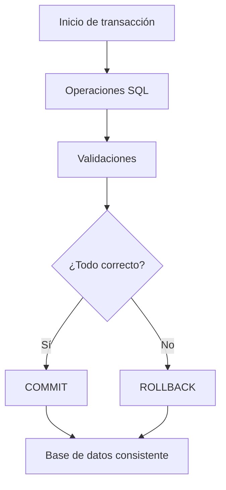

# Clase 23. SQL Avanzado: Transacciones

## Descripción

Hasta este punto del curso hemos aprendido a diseñar bases de datos, crear tablas, establecer relaciones, manipular información mediante SQL, realizar consultas simples y complejas, construir vistas y encapsular lógica mediante procedimientos almacenados.

Sin embargo, todavía existe un problema fundamental que aparece en cualquier sistema utilizado por múltiples usuarios al mismo tiempo: ¿qué ocurre si una operación compleja queda a medio ejecutar?

Imaginemos una transferencia bancaria en la que primero se descuenta dinero de una cuenta y después se ingresa en otra. Si el servidor falla justo entre ambas operaciones, el dinero desaparecería.

Este tipo de situaciones ocurre constantemente en aplicaciones reales:

- Bancos
- Tiendas online
- Sistemas hospitalarios
- Aerolíneas
- Sistemas de reservas
- Plataformas de pago
- ERP empresariales
- Aplicaciones móviles

Las transacciones existen precisamente para garantizar que una operación compleja se complete correctamente o no se realice en absoluto.

Durante esta clase estudiaremos uno de los pilares más importantes de cualquier SGBD moderno: el procesamiento transaccional.

Aprenderemos cómo MySQL protege los datos frente a errores, caídas del sistema y accesos simultáneos de cientos o miles de usuarios.

También estudiaremos las propiedades ACID, los distintos niveles de aislamiento, los problemas clásicos de concurrencia y las herramientas que proporciona SQL para controlar todo este comportamiento.

Esta es una de las clases más importantes de todo el curso porque explica por qué una base de datos relacional es mucho más que un conjunto de tablas.

---

## Objetivos

Al finalizar esta clase el estudiante será capaz de:

- Comprender qué es una transacción.
- Entender por qué existen las transacciones.
- Diferenciar una operación simple de una operación transaccional.
- Comprender las propiedades ACID.
- Utilizar BEGIN.
- Utilizar COMMIT.
- Utilizar ROLLBACK.
- Utilizar SAVEPOINT.
- Comprender el funcionamiento interno de una transacción.
- Identificar problemas de concurrencia.
- Comprender los niveles de aislamiento de MySQL.
- Diseñar operaciones críticas de forma segura.

---

## Conocimientos previos

Para aprovechar correctamente esta clase el alumno debe dominar:

- Modelo relacional
- Claves primarias y foráneas
- SQL DDL
- SQL DML
- SELECT
- JOIN
- Subconsultas
- Vistas
- Procedimientos almacenados

---

## Índice

- [01. ¿Por qué existen las transacciones?](01_por_que_existen_las_transacciones.md)
- [02. Ejemplo de transferencia bancaria](02_ejemplo_de_transferencia_bancaria.md)
- [03. Atomicidad](03_atomicidad.md)
- [04. Consistencia](04_consistencia.md)
- [05. Aislamiento](05_aislamiento.md)
- [06. Durabilidad](06_durabilidad.md)
- [07. Propiedades ACID](07_acid.md)
- [08. BEGIN, COMMIT y ROLLBACK](08_begin_commit_rollback.md)
- [09. SAVEPOINT](09_savepoint.md)
- [10. Niveles de aislamiento](10_niveles_de_aislamiento.md)
- [11. Problemas de concurrencia](11_problemas_de_concurrencia.md)
- [12. Caso práctico empresarial](12_caso_practico_empresa.md)
- [13. Errores frecuentes](13_errores_frecuentes.md)
- [14. Resumen](14_resumen.md)

---

## Caso práctico de la clase

Durante toda la clase trabajaremos con la empresa ficticia utilizada a lo largo del curso.

La empresa incorpora ahora nuevos módulos:

- Tesorería
- Facturación
- Inventario
- Pedidos
- Pagos
- Gestión bancaria

Analizaremos operaciones como:

- Cobro de pedidos
- Pago a proveedores
- Transferencias bancarias
- Cancelaciones
- Reservas de stock
- Confirmación de compras

Todas estas operaciones deberán ejecutarse mediante transacciones.

---

## Prácticas que realizará el alumno

Al finalizar la clase el alumno habrá desarrollado:

- Varias transacciones completas.
- Transferencias bancarias seguras.
- Cancelaciones mediante ROLLBACK.
- Confirmaciones mediante COMMIT.
- Recuperaciones mediante SAVEPOINT.
- Simulaciones de concurrencia.
- Resolución de conflictos entre usuarios.

---

## Relación con clases anteriores

Las transacciones utilizan todo lo aprendido anteriormente.

Una transacción puede contener:

- INSERT
- UPDATE
- DELETE
- Procedimientos almacenados
- Consultas
- Validaciones
- Funciones

Es el mecanismo que permite ejecutar todas estas operaciones como una única unidad lógica.

---

## Relación con clases posteriores

Las transacciones servirán de base para comprender:

- Triggers
- Eventos
- Optimización
- Bloqueos
- Motores de almacenamiento
- Arquitectura interna del SGBD

---

## Esquema conceptual

---

Las transacciones constituyen uno de los mecanismos fundamentales que diferencian una base de datos profesional de un simple sistema de almacenamiento de información. Su correcta comprensión resulta imprescindible para desarrollar aplicaciones fiables y seguras.

