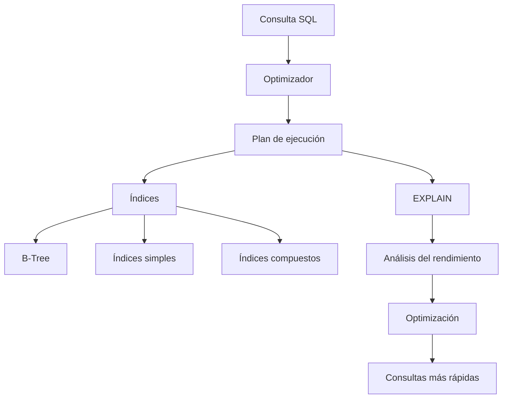

# Resumen

## Introducción

En esta clase hemos dado el primer paso hacia uno de los aspectos más importantes del desarrollo profesional de bases de datos: **la optimización del rendimiento**.

Hasta ahora, el objetivo principal había sido aprender a modelar datos, escribir consultas correctas y utilizar las distintas características que ofrece MySQL.

Sin embargo, una consulta correcta no siempre es una consulta eficiente.

A medida que una base de datos crece desde unos pocos cientos de registros hasta millones de filas, el tiempo de ejecución de las consultas puede convertirse en un problema crítico.

La optimización busca obtener exactamente el mismo resultado utilizando la menor cantidad posible de recursos.

Durante esta clase hemos estudiado cómo trabaja internamente MySQL, qué papel desempeñan los índices, cómo analizar un plan de ejecución mediante `EXPLAIN` y qué técnicas permiten mejorar el rendimiento de las consultas más habituales.

## Síntesis de la clase

Comenzamos comprendiendo por qué una consulta puede resultar lenta.

Aprendimos que el rendimiento depende de numerosos factores, entre ellos:

- El volumen de datos.
- La existencia de índices.
- La complejidad de la consulta.
- El número de tablas implicadas.
- Las operaciones de ordenación y agrupación.
- Las decisiones tomadas por el optimizador.

Posteriormente analizamos el funcionamiento interno de MySQL.

Estudiamos las diferentes fases por las que pasa una consulta:

1. Recepción.
2. Análisis léxico.
3. Análisis sintáctico.
4. Comprobación semántica.
5. Optimización.
6. Generación del plan de ejecución.
7. Acceso al motor de almacenamiento.
8. Devolución del resultado.

Comprender este proceso permite interpretar correctamente el comportamiento del sistema gestor de bases de datos.

A continuación estudiamos los índices.

Aprendimos que un índice es una estructura auxiliar que permite localizar registros mucho más rápidamente que un recorrido completo de la tabla.

También vimos que los índices no son gratuitos.

Cada uno de ellos ocupa espacio adicional y debe mantenerse actualizado durante las operaciones de inserción, modificación y eliminación.

Después profundizamos en la estructura **B-Tree**, utilizada por el motor InnoDB para implementar la mayoría de los índices.

Analizamos cómo su organización jerárquica permite localizar información en muy pocos accesos incluso cuando la tabla contiene millones de registros.

Posteriormente aprendimos a crear índices mediante:

```sql
CREATE INDEX
```

y analizamos los índices compuestos.

Comprendimos la importancia del orden de las columnas y la denominada **regla del prefijo izquierdo**, uno de los conceptos fundamentales para diseñar correctamente índices sobre varias columnas.

También estudiamos situaciones en las que **no conviene crear índices**, evitando errores habituales como indexar columnas con muy pocos valores distintos o añadir índices innecesarios que ralentizan las operaciones de escritura.

En la segunda mitad de la clase introdujimos la herramienta:

```sql
EXPLAIN
```

Aprendimos que permite visualizar el plan de ejecución generado por el optimizador y conocer aspectos como:

- Índices utilizados.
- Tipo de acceso.
- Número estimado de filas procesadas.
- Estrategia elegida para resolver la consulta.

Posteriormente analizamos las columnas más importantes del plan de ejecución:

- `type`
- `key`
- `rows`
- `Extra`

y aprendimos a interpretar la información que proporciona cada una de ellas.

Finalmente estudiamos distintas técnicas para optimizar consultas:

- Reducir el número de filas procesadas.
- Aprovechar correctamente los índices.
- Evitar funciones sobre columnas indexadas.
- Seleccionar únicamente las columnas necesarias.
- Analizar sistemáticamente el rendimiento mediante `EXPLAIN`.

Todo ello se aplicó en un caso práctico empresarial basado en la empresa ficticia utilizada durante todo el curso.

## Competencias adquiridas

Al finalizar esta clase el estudiante es capaz de:

- Comprender por qué una consulta puede resultar lenta.
- Explicar el proceso interno seguido por MySQL para ejecutar una consulta.
- Entender el funcionamiento general del optimizador.
- Crear índices simples y compuestos.
- Comprender la estructura B-Tree.
- Analizar cuándo conviene crear un índice y cuándo no.
- Utilizar `EXPLAIN` para estudiar un plan de ejecución.
- Interpretar los principales indicadores del plan.
- Detectar consultas susceptibles de optimización.
- Aplicar técnicas básicas de mejora del rendimiento.

Estas competencias constituyen la base para abordar optimizaciones más avanzadas.

## Relación con clases anteriores

Esta clase se apoya directamente sobre todos los conocimientos adquiridos previamente.

En particular:

- SQL DDL para la creación de tablas.
- SQL DML para la manipulación de datos.
- Consultas `SELECT`.
- Funciones de agregación.
- `GROUP BY`.
- `HAVING`.
- `JOIN`.
- Subconsultas.
- Vistas.
- Procedimientos almacenados.
- Transacciones.

Todas estas herramientas continúan utilizándose.

La diferencia es que ahora las analizamos desde el punto de vista del rendimiento.

## Preparación para la siguiente clase

En la siguiente sesión profundizaremos todavía más en la optimización de MySQL.

Estudiaremos aspectos como:

- Estrategias avanzadas del optimizador.
- Estadísticas utilizadas para estimar costes.
- Índices especializados.
- Optimización de consultas complejas.
- Técnicas para mejorar el rendimiento en bases de datos de gran tamaño.

Los conocimientos adquiridos en esta clase serán imprescindibles para comprender dichos conceptos.

## Mapa conceptual



## Ideas clave

- Una consulta correcta puede no ser eficiente.
- El optimizador decide cómo ejecutar cada consulta.
- Los índices aceleran el acceso a la información, pero también tienen costes.
- La estructura B-Tree permite búsquedas muy rápidas incluso sobre millones de registros.
- Los índices compuestos dependen del orden de sus columnas.
- `EXPLAIN` es la principal herramienta para estudiar el comportamiento del optimizador.
- Toda optimización debe basarse en mediciones objetivas.
- Diseñar correctamente suele aportar más rendimiento que aumentar el hardware.

## Conclusión

La optimización constituye una de las competencias que diferencian a un desarrollador de bases de datos principiante de un profesional. Saber escribir consultas SQL es imprescindible, pero comprender cómo las ejecuta realmente el sistema gestor permite desarrollar aplicaciones escalables, eficientes y preparadas para trabajar con grandes volúmenes de información.

Con esta clase finaliza el primer bloque dedicado al rendimiento. A partir de la siguiente sesión continuaremos profundizando en técnicas avanzadas de optimización que permitirán comprender con mayor detalle el funcionamiento interno de MySQL y sacar el máximo partido al optimizador de consultas.

