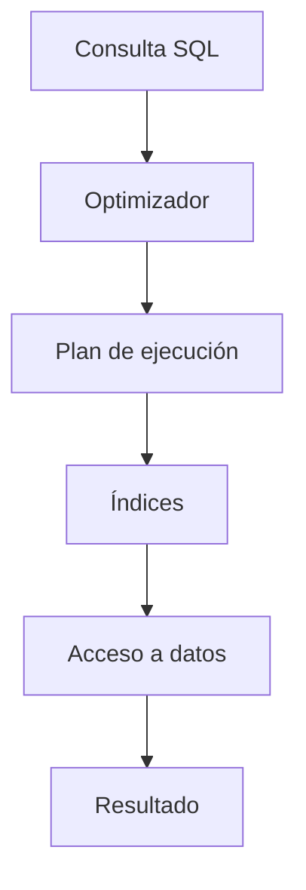

# Clase 24. Optimización I: Índices y EXPLAIN

## Descripción

Hasta este momento del curso hemos aprendido a diseñar bases de datos relacionales, crear tablas, establecer relaciones entre ellas, manipular información mediante SQL y utilizar características avanzadas como procedimientos almacenados y transacciones.

Sin embargo, todavía existe un aspecto fundamental para cualquier base de datos profesional: **el rendimiento**.

Una consulta SQL puede ser completamente correcta desde el punto de vista funcional y, aun así, resultar inaceptable en un entorno real debido a su tiempo de ejecución.

Mientras una consulta sobre una tabla con cien registros puede responder en una fracción de segundo, la misma consulta sobre una tabla con cien millones de registros puede tardar varios minutos si no está correctamente optimizada.

La optimización consiste en conseguir que el SGBD obtenga exactamente el mismo resultado utilizando la menor cantidad posible de recursos.

En esta clase estudiaremos cómo trabaja internamente MySQL cuando ejecuta una consulta, qué son los índices, cómo están organizados físicamente mediante árboles B-Tree, cuándo deben utilizarse y cuándo resultan contraproducentes.

También aprenderemos a utilizar la herramienta **EXPLAIN**, que permite inspeccionar el plan de ejecución generado por el optimizador de consultas.

Esta clase constituye la primera parte del bloque dedicado al rendimiento y servirá de base para comprender optimizaciones más avanzadas en clases posteriores.

## Objetivos

Al finalizar esta clase el estudiante será capaz de:

- Comprender por qué una consulta puede ser lenta.
- Entender cómo procesa MySQL una consulta SQL.
- Explicar qué es un índice y cómo funciona.
- Comprender la estructura B-Tree utilizada por InnoDB.
- Crear índices simples y compuestos.
- Identificar situaciones en las que un índice mejora el rendimiento.
- Detectar casos en los que un índice puede perjudicar el sistema.
- Utilizar la instrucción `EXPLAIN`.
- Interpretar un plan básico de ejecución.
- Optimizar consultas sencillas utilizando índices.

## Conocimientos previos

Para aprovechar correctamente esta clase es recomendable dominar:

- Modelo relacional.
- SQL DDL.
- SQL DML.
- SELECT.
- WHERE.
- ORDER BY.
- GROUP BY.
- JOIN.
- Subconsultas.
- Transacciones.

## Índice

- [01. ¿Por qué una consulta es lenta?](01_por_que_una_consulta_es_lenta.md)
- [02. Cómo trabaja MySQL](02_como_trabaja_mysql.md)
- [03. ¿Qué es un índice?](03_que_es_un_indice.md)
- [04. Estructuras B-Tree](04_estructuras_b_tree.md)
- [05. CREATE INDEX](05_create_index.md)
- [06. Índices compuestos](06_indices_compuestos.md)
- [07. Cuándo no usar índices](07_cuando_no_usar_indices.md)
- [08. EXPLAIN](08_explain.md)
- [09. Lectura del plan de ejecución](09_lectura_del_plan_de_ejecucion.md)
- [10. Optimización de consultas](10_optimizacion_de_consultas.md)
- [11. Caso práctico empresarial](11_caso_practico_empresa.md)
- [12. Buenas prácticas](12_buenas_practicas.md)
- [13. Errores frecuentes](13_errores_frecuentes.md)
- [14. Resumen](14_resumen.md)

## Caso práctico

Durante toda la clase trabajaremos con la empresa ficticia utilizada a lo largo del curso.

La empresa ha crecido considerablemente y ahora almacena:

- Más de un millón de clientes.
- Más de diez millones de pedidos.
- Decenas de millones de líneas de pedido.
- Un catálogo con cientos de miles de productos.

Los responsables comienzan a detectar que determinadas consultas tardan varios segundos e incluso minutos.

Nuestro objetivo será analizar esas consultas y optimizarlas sin modificar los resultados obtenidos.

## Prácticas que realizará el alumno

Durante la clase el estudiante:

- Analizará consultas lentas.
- Creará índices simples.
- Creará índices compuestos.
- Comparará tiempos de ejecución.
- Interpretará planes de ejecución mediante EXPLAIN.
- Mejorará consultas reales.
- Comprenderá el funcionamiento del optimizador de MySQL.

## Relación con clases anteriores

Esta clase utiliza todos los conocimientos adquiridos hasta el momento.

Las consultas que optimizaremos incluirán:

- SELECT.
- JOIN.
- GROUP BY.
- ORDER BY.
- Funciones.
- Subconsultas.

La diferencia es que ahora nos centraremos en **cómo ejecuta MySQL esas consultas**, no únicamente en escribirlas correctamente.

## Relación con clases posteriores

En las siguientes clases continuaremos profundizando en:

- Optimización avanzada.
- Estadísticas.
- Costes del optimizador.
- Particionado.
- Motores de almacenamiento.
- Administración del rendimiento.

Todo ello partirá de los conceptos introducidos en esta sesión.

## Esquema conceptual

La optimización no consiste en escribir consultas diferentes, sino en conseguir que MySQL encuentre la forma más eficiente de ejecutarlas.

