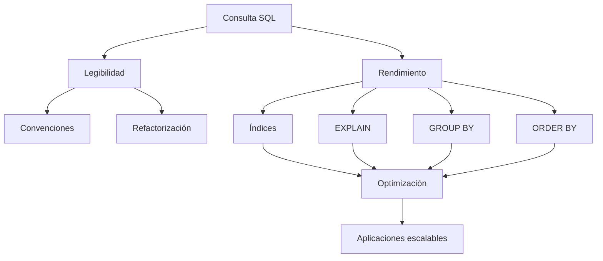

# Resumen

## Introducción

En esta clase hemos estudiado un aspecto fundamental del desarrollo profesional de bases de datos que, con frecuencia, recibe menos atención que los índices o el propio optimizador: **la calidad del código SQL**.

Una base de datos eficiente no depende únicamente del hardware, del motor de almacenamiento o del número de índices existentes. Gran parte del rendimiento de una aplicación está directamente relacionado con la forma en que se escriben las consultas.

Dos consultas pueden devolver exactamente el mismo resultado y, sin embargo:

- consumir tiempos muy diferentes,
- utilizar distintos índices,
- generar planes de ejecución completamente distintos,
- o presentar enormes diferencias de legibilidad y mantenimiento.

Por ello, optimizar no significa únicamente hacer que una consulta sea más rápida.

También significa construir un código claro, consistente, fácil de mantener y preparado para evolucionar junto con la aplicación.

## Síntesis de la clase

Comenzamos estudiando que dos consultas funcionalmente equivalentes pueden tener costes completamente diferentes.

Aprendimos que obtener el resultado correcto es únicamente el primer paso.

Un desarrollador profesional también debe analizar:

- el coste de ejecución,
- el consumo de recursos,
- la facilidad de mantenimiento,
- la claridad del código.

Posteriormente analizamos la importancia de la legibilidad del código SQL.

Estudiamos cómo una buena indentación, una organización uniforme de las cláusulas y el uso de alias descriptivos facilitan enormemente la comprensión de una consulta.

También vimos la importancia de mantener un formato consistente en todo el proyecto.

A continuación revisamos las convenciones de nomenclatura.

Aprendimos que tablas, columnas, índices, claves y restricciones deben seguir un criterio uniforme para facilitar el trabajo de todos los miembros del equipo.

Después analizamos por qué conviene evitar el uso sistemático de:

```sql
SELECT *
```

Comprendimos que seleccionar únicamente las columnas necesarias:

- reduce el volumen de datos transferidos,
- disminuye el consumo de memoria,
- facilita el mantenimiento,
- y permite aprovechar determinadas optimizaciones como los índices de cobertura.

Posteriormente estudiamos cuándo las subconsultas resultan apropiadas y cuándo pueden sustituirse por soluciones más sencillas.

Vimos que no existe una regla universal y que tanto los `JOIN` como las subconsultas son herramientas válidas cuyo uso depende del problema concreto.

Más adelante analizamos distintas técnicas de reescritura de consultas.

Aprendimos a:

- eliminar redundancias,
- simplificar expresiones,
- reorganizar condiciones,
- evitar funciones innecesarias,
- y expresar una misma lógica de forma más clara.

También comparamos el uso de `JOIN` frente a subconsultas.

Comprendimos que ninguna de las dos estrategias es universalmente superior y que la decisión debe apoyarse siempre en el análisis del plan de ejecución mediante:

```sql
EXPLAIN
```

Posteriormente revisamos el uso correcto de los índices.

Aprendimos que:

- deben diseñarse pensando en las consultas reales,
- conviene evitar índices innecesarios,
- y siempre es recomendable comprobar mediante `EXPLAIN` que realmente están siendo utilizados.

Después estudiamos técnicas específicas para optimizar consultas que utilizan:

- `GROUP BY`,
- `ORDER BY`.

Analizamos cómo:

- filtrar previamente los datos,
- utilizar índices adecuados,
- reducir el número de columnas implicadas,
- y evitar cálculos innecesarios

puede mejorar considerablemente el rendimiento.

A continuación revisamos diversos casos reales inspirados en problemas habituales encontrados en aplicaciones empresariales.

Estos ejemplos mostraron cómo pequeñas modificaciones producen mejoras significativas cuando el volumen de datos es elevado.

Finalmente estudiamos la refactorización de consultas.

Aprendimos que refactorizar consiste en mejorar el código SQL sin modificar el resultado obtenido.

La refactorización permite:

- mejorar la legibilidad,
- simplificar consultas,
- facilitar futuras modificaciones,
- y, en muchas ocasiones, obtener también mejoras de rendimiento.

La clase concluyó con una recopilación de buenas prácticas generales que pueden aplicarse prácticamente a cualquier proyecto desarrollado sobre MySQL.

## Competencias adquiridas

Al finalizar esta clase el estudiante es capaz de:

- Escribir consultas SQL más claras y mantenibles.
- Aplicar convenciones de nomenclatura profesionales.
- Evitar el uso innecesario de `SELECT *`.
- Identificar subconsultas susceptibles de simplificación.
- Reescribir consultas sin modificar su comportamiento.
- Comparar el uso de `JOIN` y subconsultas.
- Diseñar consultas que aprovechen correctamente los índices.
- Optimizar operaciones con `GROUP BY`.
- Optimizar operaciones con `ORDER BY`.
- Analizar problemas reales de rendimiento.
- Refactorizar consultas existentes.
- Aplicar criterios profesionales para desarrollar código SQL de alta calidad.

## Relación con clases anteriores

Esta clase complementa directamente la anterior.

En la Clase 24 aprendimos:

- cómo trabaja el optimizador,
- cómo funcionan los índices,
- cómo interpretar `EXPLAIN`.

En esta clase hemos aprendido cómo escribir consultas que permitan aprovechar todas esas capacidades.

Ambas sesiones forman un bloque dedicado a la optimización del rendimiento.

## Preparación para la siguiente clase

En la siguiente parte del curso comenzaremos a estudiar aspectos internos del funcionamiento de MySQL y técnicas más avanzadas relacionadas con la administración, el rendimiento y la gestión de bases de datos en entornos reales.

Los conocimientos adquiridos sobre optimización constituirán la base para comprender cómo afectan las decisiones de diseño al comportamiento global del sistema.

## Mapa conceptual



## Ideas clave

- Una consulta correcta no siempre es una consulta eficiente.
- La claridad del código también forma parte de la calidad del software.
- `SELECT *` debe utilizarse únicamente cuando realmente sea necesario.
- Los índices deben diseñarse pensando en las consultas reales.
- No existe una regla universal sobre `JOIN` o subconsultas.
- `GROUP BY` y `ORDER BY` pueden optimizarse mediante un buen diseño.
- La refactorización mejora el código sin modificar su comportamiento.
- `EXPLAIN` debe formar parte del proceso habitual de desarrollo.
- Toda optimización debe apoyarse en mediciones objetivas.

## Conclusión

La optimización no consiste en memorizar reglas aisladas ni en aplicar técnicas de forma automática. Requiere comprender cómo trabaja el motor de base de datos, escribir consultas claras, analizar el comportamiento del optimizador y mantener una actitud crítica orientada a la mejora continua.

Un desarrollador profesional no se limita a conseguir que una consulta funcione; también procura que sea eficiente, comprensible, fácil de mantener y capaz de seguir ofreciendo un buen rendimiento cuando la aplicación crezca. Esa combinación de corrección, claridad y eficiencia constituye uno de los pilares fundamentales del desarrollo de aplicaciones basadas en bases de datos relacionales.

