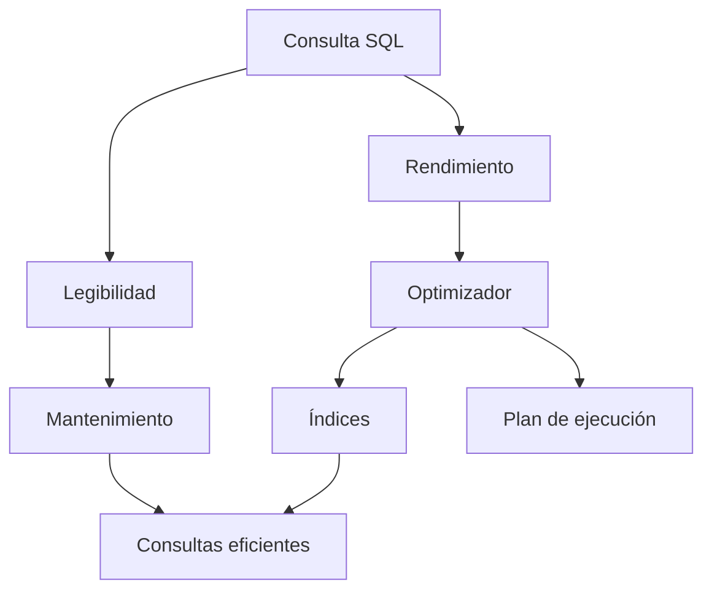

# Clase 25. Optimización II: Buenas prácticas y rendimiento

## Descripción

En la clase anterior estudiamos los fundamentos de la optimización de consultas en MySQL. Aprendimos cómo trabaja el optimizador, qué son los índices, cómo interpretar un plan de ejecución mediante `EXPLAIN` y cómo pequeñas modificaciones en el diseño pueden producir mejoras significativas en el rendimiento.

Sin embargo, la optimización de una base de datos no depende únicamente del motor de almacenamiento o de la existencia de índices adecuados.

En muchos casos, el rendimiento viene determinado por la forma en la que escribimos nuestras consultas SQL.

Dos consultas distintas pueden devolver exactamente el mismo resultado y, sin embargo, consumir cantidades de recursos completamente diferentes.

Un pequeño cambio en el orden de una condición, la utilización innecesaria de una subconsulta, el abuso de `SELECT *` o una mala organización del código SQL pueden convertir una consulta rápida en otra muy costosa.

Esta clase se centra en el desarrollo de buenas prácticas para escribir consultas SQL eficientes, mantenibles y fáciles de comprender. Se estudiarán técnicas de refactorización, convenciones de nomenclatura, diferencias entre distintas estrategias para resolver un mismo problema y criterios para seleccionar la alternativa más adecuada.

El objetivo no es únicamente conseguir consultas más rápidas, sino también construir código SQL profesional que pueda mantenerse correctamente durante años.

## Objetivos

Al finalizar esta clase el estudiante será capaz de:

- Comprender que varias consultas pueden producir el mismo resultado con costes muy diferentes.
- Escribir consultas SQL más legibles y mantenibles.
- Aplicar convenciones de nomenclatura consistentes.
- Evitar el uso innecesario de `SELECT *`.
- Detectar subconsultas que pueden simplificarse.
- Reescribir consultas para facilitar el trabajo del optimizador.
- Comparar el uso de `JOIN` frente a subconsultas.
- Aprovechar correctamente los índices existentes.
- Optimizar consultas con `GROUP BY`.
- Optimizar consultas con `ORDER BY`.
- Analizar casos reales de problemas de rendimiento.
- Refactorizar consultas heredadas.
- Aplicar un conjunto de buenas prácticas generales para el desarrollo profesional.

## Conocimientos previos

Para aprovechar correctamente esta clase es recomendable dominar:

- SQL DDL.
- SQL DML.
- SELECT.
- Funciones.
- GROUP BY.
- HAVING.
- ORDER BY.
- JOIN.
- Subconsultas.
- Índices.
- EXPLAIN.

## Índice

- [01. ¿Por qué dos consultas pueden dar el mismo resultado?](01_por_que_dos_consultas_pueden_dar_el_mismo_resultado.md)
- [02. Legibilidad del código SQL](02_legibilidad_del_codigo_sql.md)
- [03. Convenciones de nomenclatura](03_convenciones_de_nomenclatura.md)
- [04. Evitar SELECT *](04_evitar_select_asterisco.md)
- [05. Evitar subconsultas innecesarias](05_evitar_subconsultas_innecesarias.md)
- [06. Reescritura de consultas](06_reescritura_de_consultas.md)
- [07. JOIN vs Subconsulta](07_join_vs_subconsulta.md)
- [08. Uso correcto de índices](08_uso_correcto_de_indices.md)
- [09. Optimización de GROUP BY](09_optimizacion_de_group_by.md)
- [10. Optimización de ORDER BY](10_optimizacion_de_order_by.md)
- [11. Casos reales de rendimiento](11_casos_reales_de_rendimiento.md)
- [12. Refactorización de consultas](12_refactorizacion_de_consultas.md)
- [13. Buenas prácticas generales](13_buenas_practicas_generales.md)
- [14. Resumen](14_resumen.md)

## Caso práctico

La empresa ficticia **TechShop** continúa creciendo.

El departamento de desarrollo ha heredado una aplicación con varios años de antigüedad. A lo largo del tiempo distintos programadores han ido incorporando consultas SQL utilizando estilos muy diferentes.

Aunque todas funcionan correctamente, algunas presentan problemas importantes:

- Consultas extremadamente largas.
- Subconsultas innecesarias.
- Uso excesivo de `SELECT *`.
- Índices desaprovechados.
- Código difícil de mantener.
- Bajo rendimiento en determinadas operaciones.

Durante esta clase revisaremos dichas consultas y las iremos mejorando progresivamente.

## Prácticas que realizará el alumno

Durante la sesión el estudiante:

- Comparará distintas formas de escribir una misma consulta.
- Identificará consultas poco eficientes.
- Reescribirá consultas heredadas.
- Mejorará la legibilidad del código SQL.
- Reducirá el trabajo realizado por MySQL.
- Comparará distintas estrategias de resolución.
- Aplicará criterios profesionales de desarrollo.

## Relación con clases anteriores

La clase anterior explicó cómo trabaja el optimizador y cómo analizar el rendimiento mediante `EXPLAIN`.

En esta ocasión nos centraremos en cómo escribir consultas que faciliten el trabajo del optimizador y resulten más fáciles de mantener.

## Relación con clases posteriores

Las buenas prácticas estudiadas en esta clase serán fundamentales para comprender:

- Optimización avanzada.
- Administración del rendimiento.
- Motores de almacenamiento.
- Escalabilidad.
- Diseño de aplicaciones de altas prestaciones.

## Esquema conceptual

El objetivo final consiste en escribir consultas que sean simultáneamente correctas, eficientes y fáciles de mantener.

