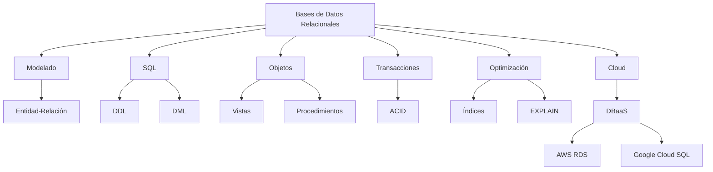

# Resumen del curso

## Introducción

Con esta clase concluye el curso de **Bases de Datos Relacionales**.

A lo largo de las veintiséis clases hemos recorrido un camino que comenzó con los conceptos más básicos sobre almacenamiento de información y finaliza con una visión de las infraestructuras cloud y las tendencias tecnológicas que están definiendo el futuro de las bases de datos.

El objetivo del curso no ha sido únicamente enseñar a escribir consultas SQL, sino proporcionar una comprensión sólida de los principios que sustentan el diseño, desarrollo y administración de sistemas de información basados en bases de datos relacionales.

Estos conocimientos constituyen una parte esencial de la formación de cualquier ingeniero informático.

## Competencias adquiridas

Al finalizar el curso el estudiante es capaz de:

- Comprender la evolución histórica de las bases de datos.
- Explicar el modelo relacional y sus fundamentos.
- Diseñar esquemas mediante modelos entidad-relación.
- Transformar modelos conceptuales en esquemas relacionales.
- Crear bases de datos utilizando MySQL.
- Definir tablas, restricciones e índices.
- Manipular información mediante SQL.
- Realizar consultas simples y avanzadas.
- Utilizar funciones de agregación.
- Trabajar con `JOIN` y subconsultas.
- Crear y utilizar vistas.
- Desarrollar procedimientos almacenados.
- Gestionar transacciones y comprender las propiedades ACID.
- Analizar problemas de concurrencia.
- Optimizar consultas mediante índices y `EXPLAIN`.
- Aplicar buenas prácticas de desarrollo SQL.
- Comprender el funcionamiento de los servicios DBaaS.
- Analizar arquitecturas cloud para bases de datos relacionales.

## Evolución del aprendizaje

El contenido del curso ha seguido una progresión cuidadosamente planificada.

Primero aprendimos a comprender qué es una base de datos y cómo modelar correctamente la información.

Posteriormente desarrollamos competencias relacionadas con la creación de esquemas y la manipulación de datos mediante SQL.

Más adelante incorporamos consultas avanzadas, procedimientos almacenados y transacciones.

Finalmente estudiamos aspectos relacionados con el rendimiento, la optimización y el despliegue profesional de MySQL en infraestructuras cloud.

Cada bloque ha servido como base para el siguiente.

## Más allá de SQL

Aunque SQL ha ocupado una parte importante del curso, las bases de datos no consisten únicamente en escribir consultas.

Un profesional debe ser capaz de:

- analizar problemas,
- diseñar soluciones,
- garantizar la integridad de la información,
- optimizar el rendimiento,
- planificar el crecimiento de una aplicación,
- proteger los datos frente a fallos y accesos no autorizados.

Estas competencias son las que diferencian a un desarrollador capaz de construir aplicaciones robustas y escalables.

## Relación con Bases de Datos NoSQL

Este curso constituye el punto de partida para estudiar otros modelos de almacenamiento.

En la asignatura de **Bases de Datos NoSQL** se analizarán tecnologías como:

- MongoDB.
- Neo4j.
- Bases de datos clave-valor.
- Bases de datos columnares.
- Bases de datos vectoriales.

Lejos de sustituir al modelo relacional, estas tecnologías lo complementan para resolver problemas específicos.

Comprender primero las bases de datos relacionales permitirá comparar con criterio las ventajas e inconvenientes de cada modelo.

## Mapa conceptual del curso

## Ideas clave

- El diseño correcto de una base de datos es tan importante como su implementación.
- SQL constituye una herramienta fundamental para manipular información relacional.
- La integridad y la consistencia deben preservarse durante todo el ciclo de vida de una aplicación.
- El rendimiento depende tanto del diseño como de la calidad de las consultas.
- Las bases de datos cloud representan actualmente una parte esencial del desarrollo profesional.
- Las tecnologías NoSQL complementan al modelo relacional, pero no lo sustituyen.

## Conclusión

Finalizar este curso supone haber adquirido una base sólida sobre la que construir conocimientos mucho más avanzados. El estudiante ya dispone de las competencias necesarias para diseñar y desarrollar aplicaciones basadas en MySQL, analizar su rendimiento y comprender cómo se despliegan en entornos profesionales.

Las bases de datos relacionales continúan siendo uno de los pilares fundamentales de la ingeniería del software. Dominar sus principios no solo permite desarrollar mejores aplicaciones, sino que facilita comprender tecnologías posteriores, arquitecturas distribuidas y nuevos modelos de almacenamiento.

Con estos conocimientos, el estudiante está preparado para dar el siguiente paso: explorar el amplio ecosistema de las **Bases de Datos NoSQL**, donde descubrirá nuevas formas de modelar y gestionar la información manteniendo siempre los fundamentos aprendidos en este curso.

