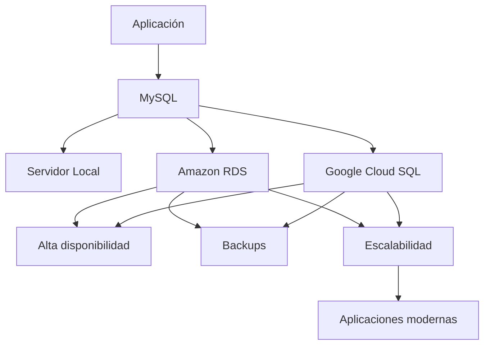

# Clase 26. MySQL Cloud: AWS RDS y Google Cloud SQL

## Descripción

A lo largo de este curso hemos aprendido a diseñar bases de datos relacionales, modelar información, escribir consultas SQL, desarrollar procedimientos almacenados, gestionar transacciones y optimizar el rendimiento de nuestras aplicaciones utilizando MySQL.

Sin embargo, en el desarrollo profesional actual existe un cambio muy importante respecto a cómo se despliegan y administran las bases de datos. Cada vez es menos frecuente que una empresa instale un servidor físico dedicado en sus propias instalaciones para alojar su sistema gestor de bases de datos. En su lugar, muchas organizaciones optan por contratar servicios administrados en la nube que les permiten disponer de bases de datos altamente disponibles, escalables y seguras sin tener que encargarse directamente del mantenimiento de la infraestructura.

Esta forma de trabajar ha transformado completamente el papel del administrador de bases de datos y del desarrollador de aplicaciones. Hoy en día, es habitual que un proyecto despliegue su base de datos mediante servicios como **Amazon RDS** o **Google Cloud SQL**, donde gran parte de las tareas de administración son realizadas automáticamente por el proveedor de la nube.

En esta clase estudiaremos cómo funcionan estos servicios, qué ventajas ofrecen respecto a una instalación tradicional de MySQL y cuáles son sus principales limitaciones. Analizaremos conceptos como **Database as a Service (DBaaS)**, alta disponibilidad, copias de seguridad automáticas, escalabilidad, seguridad y modelos de costes.

No se pretende convertir al estudiante en administrador de infraestructuras cloud, sino proporcionar una visión general que le permita comprender cómo se utilizan actualmente las bases de datos relacionales en proyectos profesionales.

Esta clase también sirve como cierre del curso, conectando todos los conocimientos adquiridos con el entorno tecnológico utilizado actualmente por la industria.

## Objetivos

Al finalizar esta clase el estudiante será capaz de:

- Comprender por qué las empresas migran sus bases de datos a la nube.
- Explicar el concepto de **Database as a Service (DBaaS)**.
- Diferenciar una instalación tradicional de MySQL de un servicio cloud administrado.
- Comprender la arquitectura básica de Amazon RDS.
- Comprender la arquitectura básica de Google Cloud SQL.
- Entender el concepto de alta disponibilidad.
- Explicar cómo funcionan las copias de seguridad automáticas.
- Diferenciar la escalabilidad vertical de la horizontal.
- Comprender las medidas básicas de seguridad en bases de datos cloud.
- Analizar los principales modelos de costes utilizados por los proveedores cloud.
- Conocer ejemplos reales de utilización de bases de datos administradas.
- Identificar las tendencias actuales del mercado relacionadas con MySQL en la nube.

## Conocimientos previos

Para aprovechar correctamente esta clase el estudiante debería dominar:

- Modelado relacional.
- SQL DDL.
- SQL DML.
- Consultas avanzadas.
- Procedimientos almacenados.
- Transacciones.
- Optimización mediante índices.
- Análisis de consultas con `EXPLAIN`.

## Índice

- [01. ¿Por qué llevar una base de datos a la nube?](01_por_que_llevar_una_bd_a_la_nube.md)
- [02. ¿Qué es DBaaS?](02_que_es_db_aas.md)
- [03. MySQL On-Premise vs Cloud](03_mysql_on_premise_vs_cloud.md)
- [04. Arquitectura básica de AWS RDS](04_arquitectura_basica_de_aws_rds.md)
- [05. Arquitectura básica de Google Cloud SQL](05_arquitectura_basica_de_google_cloud_sql.md)
- [06. Alta disponibilidad](06_alta_disponibilidad.md)
- [07. Copias de seguridad](07_copias_de_seguridad.md)
- [08. Escalabilidad vertical y horizontal](08_escalabilidad_vertical_y_horizontal.md)
- [09. Seguridad básica](09_seguridad_basica.md)
- [10. Costes y modelos de pago](10_costes_y_modelos_de_pago.md)
- [11. Casos reales de empresas](11_casos_reales_de_empresas.md)
- [12. Tendencias actuales](12_tendencias_actuales.md)
- [13. Resumen del curso](13_resumen_del_curso.md)

## Caso práctico

La empresa **TechShop**, utilizada durante todo el curso, ha experimentado un importante crecimiento. El número de clientes aumenta continuamente, la aplicación web ya presta servicio a usuarios de varios países y la infraestructura local comienza a mostrar limitaciones.

El departamento de tecnología debe decidir entre seguir administrando un servidor MySQL propio o migrar la base de datos a un servicio gestionado en la nube.

A lo largo de la clase iremos analizando esta decisión desde distintos puntos de vista:

- Coste.
- Administración.
- Seguridad.
- Escalabilidad.
- Disponibilidad.
- Mantenimiento.
- Copias de seguridad.
- Recuperación ante desastres.

## Prácticas que realizará el alumno

Durante esta clase el estudiante:

- Comparará arquitecturas locales y cloud.
- Analizará distintas opciones de despliegue.
- Interpretará esquemas de arquitectura.
- Evaluará ventajas e inconvenientes de los servicios administrados.
- Resolverá casos prácticos basados en empresas reales.
- Comprenderá cuándo resulta recomendable utilizar servicios DBaaS.

## Relación con clases anteriores

Esta clase integra conocimientos adquiridos durante todo el curso.

Todos los conceptos aprendidos sobre diseño, SQL, transacciones y optimización siguen siendo válidos independientemente del lugar donde se ejecute MySQL.

Lo que cambia ahora es la forma en que se despliega, administra y mantiene la infraestructura.

## Relación con clases posteriores

Esta es la última clase del curso de Bases de Datos Relacionales.

Los conocimientos adquiridos servirán como punto de partida para el curso de **Bases de Datos NoSQL**, donde se estudiarán MongoDB, Neo4j, bases de datos vectoriales y otros modelos de almacenamiento utilizados actualmente en sistemas distribuidos.

## Esquema conceptual

Esta clase mostrará cómo las bases de datos relacionales continúan siendo un elemento fundamental del desarrollo de software moderno, adaptándose a las nuevas infraestructuras basadas en la nube.

