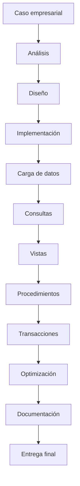

# Taller 2. Desarrollo de un caso práctico completo con SQL

## Descripción

Este taller constituye el proyecto integrador del curso de **Bases de Datos Relacionales**. A diferencia de las clases anteriores, cuyo objetivo era aprender progresivamente los conceptos teóricos y prácticos de MySQL, este taller plantea un escenario empresarial completo donde el estudiante deberá aplicar de forma conjunta todos los conocimientos adquiridos.

El trabajo reproduce, de manera simplificada pero realista, el ciclo de vida de un proyecto de bases de datos dentro de una empresa: analizar los requisitos, diseñar el modelo de datos, implementar el esquema, cargar información, desarrollar consultas, optimizar el rendimiento, documentar la solución y preparar una entrega profesional.

No se trata de una colección de ejercicios independientes. Todos los bloques forman parte del mismo proyecto y utilizan la misma base de datos, denominada **TechShop**, una empresa ficticia de comercio electrónico cuya estructura se irá construyendo progresivamente.

Aunque el taller puede desarrollarse en aproximadamente cuatro sesiones de laboratorio, el material contiene un número muy superior de ejercicios. Durante las clases presenciales el profesor resolverá algunos problemas representativos y guiará el trabajo de los estudiantes. El resto de actividades deberán realizarse de forma individual o en pequeños grupos, tanto en el aula como fuera de ella.

El objetivo final no es únicamente obtener una base de datos funcional, sino desarrollar la capacidad de enfrentarse a un problema abierto utilizando criterios profesionales.

## Objetivos

Al finalizar el taller el estudiante será capaz de:

- Analizar los requisitos de una empresa antes de diseñar una base de datos.
- Identificar entidades, atributos y relaciones relevantes.
- Diseñar un esquema relacional completo.
- Implementar la base de datos en MySQL.
- Cargar datos de prueba de forma coherente.
- Escribir consultas SQL de distinta complejidad.
- Utilizar funciones de agregación y agrupación.
- Resolver problemas mediante JOIN.
- Emplear subconsultas cuando sean necesarias.
- Crear vistas reutilizables.
- Desarrollar procedimientos almacenados.
- Gestionar transacciones.
- Analizar el rendimiento mediante índices y EXPLAIN.
- Documentar correctamente un proyecto de base de datos.
- Presentar una solución técnica de forma profesional.

## Conocimientos previos

Para realizar este taller se recomienda haber completado todas las clases del curso:

- Modelado entidad-relación.
- Diseño relacional.
- SQL DDL.
- SQL DML.
- Funciones.
- GROUP BY.
- HAVING.
- JOIN.
- Subconsultas.
- Vistas.
- Procedimientos almacenados.
- Transacciones.
- Optimización.
- Índices.
- EXPLAIN.

## Metodología de trabajo

Cada bloque sigue una estructura similar.

1. Introducción al problema.
2. Explicación del objetivo.
3. Ejercicios guiados por el profesor.
4. Ejercicios para realizar durante la clase.
5. Retos de ampliación.
6. Trabajo recomendado para casa.
7. Lista de comprobación.

Los ejercicios están ordenados aproximadamente por dificultad creciente.

No es necesario completar todos durante la sesión presencial.

## Organización temporal recomendada

Aunque cada docente puede adaptar el ritmo del taller, se propone la siguiente distribución para sesiones de aproximadamente 100 minutos.

| Sesión | Contenido |
|--------|-----------|
| 1 | Presentación del caso, análisis del problema y diseño del esquema |
| 2 | Implementación del modelo y carga de datos |
| 3 | Consultas SQL, agregaciones y JOIN |
| 4 | Subconsultas, vistas, procedimientos, transacciones y optimización |

Los ejercicios restantes podrán realizarse como trabajo autónomo.

## Caso práctico

Durante todo el taller trabajaremos con la empresa ficticia **TechShop**.

TechShop comenzó como una pequeña tienda informática local.

Con el paso de los años ha evolucionado hasta convertirse en una empresa de comercio electrónico que vende miles de productos tecnológicos a clientes de todo el país.

Actualmente dispone de:

- varios departamentos,
- numerosos empleados,
- miles de clientes,
- cientos de proveedores,
- un amplio catálogo de productos,
- múltiples categorías,
- pedidos diarios,
- pagos,
- envíos,
- devoluciones.

La empresa desea rediseñar completamente su sistema de información utilizando una base de datos relacional moderna implementada en MySQL.

El equipo de desarrollo ha sido contratado para construir esta nueva base de datos desde cero.

Ese equipo seremos nosotros.

## Índice

- [01. Presentación del caso](01_presentacion_del_caso.md)
- [02. Análisis del modelo](02_analisis_del_modelo.md)
- [03. Creación del esquema](03_creacion_del_esquema.md)
- [04. Carga de datos](04_carga_de_datos.md)
- [05. Consultas básicas](05_consultas_basicas.md)
- [06. Consultas con agregación](06_consultas_con_agregacion.md)
- [07. Consultas con JOIN](07_consultas_con_join.md)
- [08. Subconsultas](08_subconsultas.md)
- [09. Vistas](09_vistas.md)
- [10. Procedimientos almacenados](10_procedimientos.md)
- [11. Transacciones](11_transacciones.md)
- [12. Optimización](12_optimizacion.md)
- [13. Documentación](13_documentacion.md)
- [14. Entrega](14_entrega.md)

## Material necesario

Para desarrollar el taller se recomienda disponer de:

- MySQL 8.
- MySQL Workbench o un cliente SQL equivalente.
- Editor de texto o IDE.
- Git para gestionar el repositorio.
- Acceso al repositorio del curso.

## Sistema de trabajo

Cada ejercicio indicará uno de los siguientes tipos.

🟢 **Ejercicio guiado**

El profesor resolverá paso a paso el problema explicando el razonamiento seguido.

🟡 **Ejercicio de aula**

Los estudiantes dispondrán de aproximadamente 15 minutos para resolverlo individualmente o por parejas.

Posteriormente se realizará una corrección conjunta.

🔵 **Trabajo autónomo**

Se recomienda realizarlo fuera del horario de clase.

🔴 **Reto**

Ejercicio de dificultad elevada pensado para consolidar conocimientos o ampliar competencias.

## Recomendaciones

Durante el desarrollo del taller es importante no intentar resolver todos los ejercicios inmediatamente.

En proyectos reales resulta habitual:

- analizar primero el problema,
- diseñar antes de programar,
- verificar continuamente el resultado,
- documentar cada decisión,
- revisar el trabajo antes de darlo por finalizado.

Estas mismas prácticas deberán seguirse durante el taller.

## Relación con el curso

Este taller integra prácticamente todos los contenidos estudiados durante las veintiséis clases anteriores.

Su realización demuestra que el estudiante no solo conoce la sintaxis de SQL, sino que es capaz de utilizarla para resolver problemas reales de forma estructurada y profesional.

## Esquema conceptual

