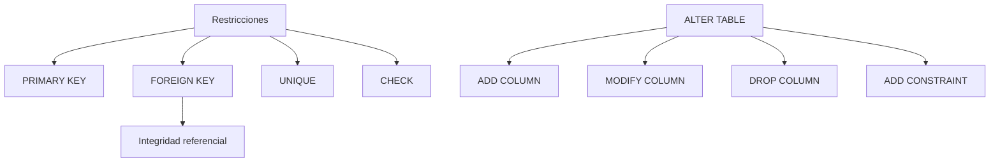

# Resumen

## Introducción

En esta clase hemos dado un paso fundamental en la construcción de una base de datos profesional.

Hasta la sesión anterior éramos capaces de crear bases de datos y tablas, definir columnas y seleccionar tipos de datos adecuados. Sin embargo, todavía no disponíamos de mecanismos que garantizaran la consistencia de la información ni de herramientas para modificar el esquema una vez creado.

En esta sesión hemos aprendido precisamente cómo proteger los datos y cómo hacer evolucionar una base de datos sin necesidad de reconstruirla desde cero.

Estos dos conceptos —**integridad** y ​**evolución del esquema**​— forman parte del trabajo cotidiano de cualquier administrador o desarrollador de bases de datos.

---

## Resumen narrativo

La clase comenzó analizando el concepto de **restricción** (​*constraint*​), comprendiendo que una base de datos no debe limitarse a almacenar información, sino que también debe garantizar automáticamente su validez.

A continuación profundizamos en la ​**clave primaria (`PRIMARY KEY`)**​, estudiando su papel como identificador único de cada registro y comprendiendo por qué todas las relaciones del modelo relacional se construyen sobre ella.

Posteriormente introdujimos las ​**claves foráneas (`FOREIGN KEY`)**​, aprendiendo cómo conectar tablas y cómo representar las relaciones entre entidades de manera segura y consistente.

Después estudiamos las restricciones **`UNIQUE`** y ​**`CHECK`**​, que permiten impedir valores duplicados y validar reglas sencillas de negocio directamente desde el propio servidor MySQL.

La segunda mitad de la clase estuvo dedicada a la sentencia ​**`ALTER TABLE`**​, una de las herramientas más utilizadas durante el mantenimiento de bases de datos.

Aprendimos a:

* añadir columnas (`ADD COLUMN`);
* modificar columnas (`MODIFY COLUMN`);
* eliminar columnas (`DROP COLUMN`);
* incorporar nuevas restricciones (`ADD CONSTRAINT`).

Finalmente analizamos el concepto de ​**integridad referencial**​, estudiando el comportamiento de las acciones `RESTRICT`, `CASCADE` y `SET NULL`, y aplicamos todos estos conocimientos sobre el caso práctico de la empresa tecnológica, creando la primera relación real entre las tablas `Producto` y `Categoria`.

---

## Mapa conceptual

---

## Lo que el estudiante debería ser capaz de hacer

Al finalizar esta clase el estudiante debería ser capaz de:

* Explicar la finalidad de las restricciones dentro del modelo relacional.
* Diferenciar entre `PRIMARY KEY`, `FOREIGN KEY`, `UNIQUE` y `CHECK`.
* Crear relaciones entre tablas mediante claves foráneas.
* Comprender el funcionamiento de la integridad referencial.
* Añadir restricciones a tablas ya existentes.
* Modificar la estructura de una tabla mediante `ALTER TABLE`.
* Añadir, modificar y eliminar columnas.
* Verificar correctamente las modificaciones utilizando `DESC` y `SHOW CREATE TABLE`.
* Evolucionar un esquema de base de datos sin perder la información almacenada.

---

## Relación con la siguiente clase

Con esta sesión finaliza el bloque dedicado al ​**Lenguaje de Definición de Datos (DDL)**​.

Nuestra base de datos ya dispone de:

* un esquema estructurado;
* claves primarias;
* restricciones de integridad;
* la primera relación entre tablas;
* capacidad para evolucionar mediante modificaciones controladas.

A partir de la siguiente clase comenzaremos el estudio del ​**Lenguaje de Manipulación de Datos (DML)**​.

Por primera vez empezaremos a trabajar con datos reales utilizando instrucciones como:

* `INSERT`;
* `UPDATE`;
* `DELETE`.

La base de datos dejará de ser únicamente una estructura vacía y comenzará a almacenar información sobre clientes, categorías, productos y el resto de entidades del caso práctico.

Todo el trabajo realizado en las clases 14 y 15 servirá como fundamento para las consultas y operaciones que desarrollaremos durante el resto del curso.

---

## Conexión con el resto de la asignatura

La progresión del curso hasta este momento ha sido completamente intencionada:

* **Clases 1–13:** fundamentos del modelo relacional, Álgebra Relacional y SQL como lenguaje de consulta.
* **Clase 14:** creación del esquema físico mediante DDL.
* **Clase 15:** protección del esquema mediante restricciones y evolución con `ALTER TABLE`.
* **Clases 16 en adelante:** manipulación de datos, consultas, agregación, joins, subconsultas, vistas, índices, transacciones y optimización.

Cada nuevo tema se apoyará directamente sobre los conceptos construidos hasta ahora.

---

## Ideas clave finales

* Las restricciones garantizan la calidad y coherencia de la información almacenada.
* La clave primaria identifica los registros y constituye la base de todas las relaciones.
* Las claves foráneas implementan la integridad referencial entre tablas.
* `UNIQUE` y `CHECK` permiten expresar reglas de negocio directamente en la base de datos.
* `ALTER TABLE` hace posible evolucionar un esquema sin reconstruirlo desde cero.
* Las bases de datos profesionales cambian continuamente, y SQL proporciona herramientas para gestionar esos cambios de forma segura.
* Con esta clase concluye el bloque de DDL y queda preparada la base de datos para comenzar a trabajar con información real mediante el lenguaje DML.

