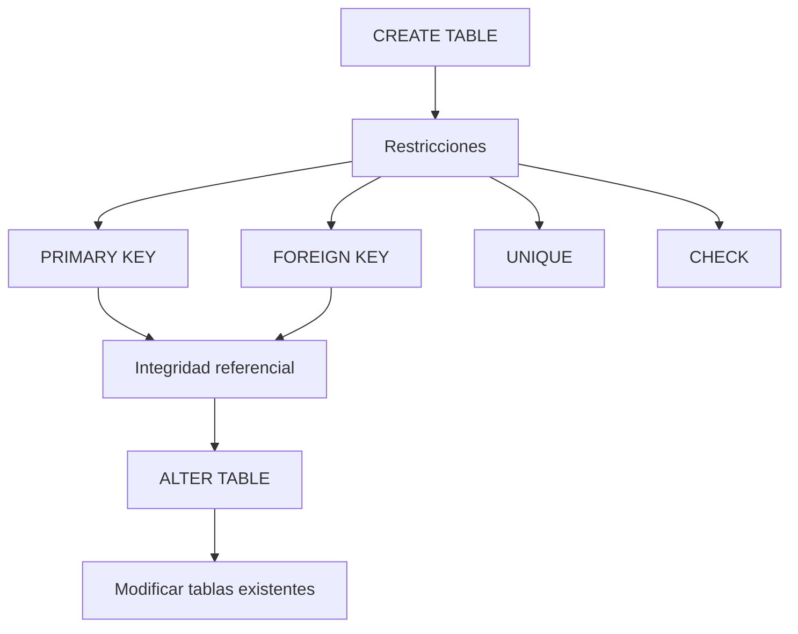

# Clase 15. SQL DDL: Restricciones, Claves y ALTER TABLE

## Introducción

En la clase anterior aprendimos a crear una base de datos y definir la estructura inicial de nuestras tablas utilizando el Lenguaje de Definición de Datos (DDL). También conocimos los tipos de datos más habituales de MySQL y aplicamos las primeras restricciones básicas como `PRIMARY KEY`, `NOT NULL`, `DEFAULT` y `AUTO_INCREMENT`.

Sin embargo, una base de datos profesional necesita algo más que tablas bien definidas. Debe ser capaz de proteger automáticamente la información almacenada, impedir inconsistencias y evolucionar conforme cambian las necesidades del negocio.

Esta sesión está dedicada precisamente a esos dos aspectos.

En primer lugar estudiaremos las principales restricciones de integridad que ofrece MySQL, comprendiendo cómo garantizan la coherencia de la información y cómo permiten representar correctamente las relaciones del modelo relacional.

Posteriormente aprenderemos a modificar la estructura de una base de datos ya existente mediante la sentencia `ALTER TABLE`, una herramienta imprescindible en cualquier proyecto profesional, ya que las bases de datos rara vez permanecen invariables durante toda la vida de una aplicación.

Al finalizar esta clase, nuestro caso práctico dejará de estar formado por un conjunto de tablas independientes y comenzará a transformarse en una verdadera base de datos relacional.

---

## Objetivos de aprendizaje

Al finalizar esta sesión el estudiante será capaz de:

* Comprender el papel de las restricciones dentro del modelo relacional.
* Profundizar en el funcionamiento de las claves primarias.
* Crear relaciones entre tablas mediante claves foráneas.
* Utilizar restricciones `UNIQUE` y `CHECK`.
* Modificar tablas existentes mediante `ALTER TABLE`.
* Añadir, modificar y eliminar columnas.
* Incorporar restricciones a tablas ya creadas.
* Comprender el funcionamiento de la integridad referencial en MySQL.
* Evolucionar progresivamente el esquema del caso práctico sin reconstruir la base de datos desde cero.

---

## Contenido

1. [¿Por qué existen las restricciones?](01_por_que_existen_las_restricciones.md)
2. [PRIMARY KEY](02_primary_key.md)
3. [FOREIGN KEY](03_foreign_key.md)
4. [UNIQUE](04_unique.md)
5. [CHECK](05_check.md)
6. [ALTER TABLE](06_alter_table.md)
7. [ADD COLUMN](07_add_column.md)
8. [MODIFY COLUMN](08_modify_column.md)
9. [DROP COLUMN](09_drop_column.md)
10. [ADD CONSTRAINT](10_add_constraint.md)
11. [Integridad referencial en MySQL](11_integridad_referencial_en_mysql.md)
12. [Caso práctico](12_caso_practico.md)
13. [Errores frecuentes](13_errores_frecuentes.md)
14. [Resumen](14_resumen.md)

---

## Mapa conceptual

---

## Relación con las clases anteriores

Durante las clases anteriores construimos los fundamentos del modelo relacional y aprendimos a utilizar SQL para crear bases de datos y tablas.

En particular:

* comprendimos el Álgebra Relacional y su correspondencia con SQL;
* aprendimos el funcionamiento del lenguaje DDL;
* creamos la base de datos `empresa_tecnologica`;
* diseñamos las primeras tablas del caso práctico;
* estudiamos los principales tipos de datos y restricciones básicas.

Esta sesión parte directamente de ese trabajo y comienza a conectar las tablas entre sí.

---

## Relación con las siguientes clases

Una vez finalizada esta clase, la estructura de la base de datos será mucho más robusta y cercana a un sistema profesional.

La siguiente sesión iniciará el estudio del Lenguaje de Manipulación de Datos (DML), donde aprenderemos a insertar, modificar y eliminar registros respetando todas las restricciones definidas en esta clase.

A partir de ese momento comenzaremos a poblar la base de datos del caso práctico y a trabajar con información real, preparando el terreno para las consultas SQL que estudiaremos posteriormente.

