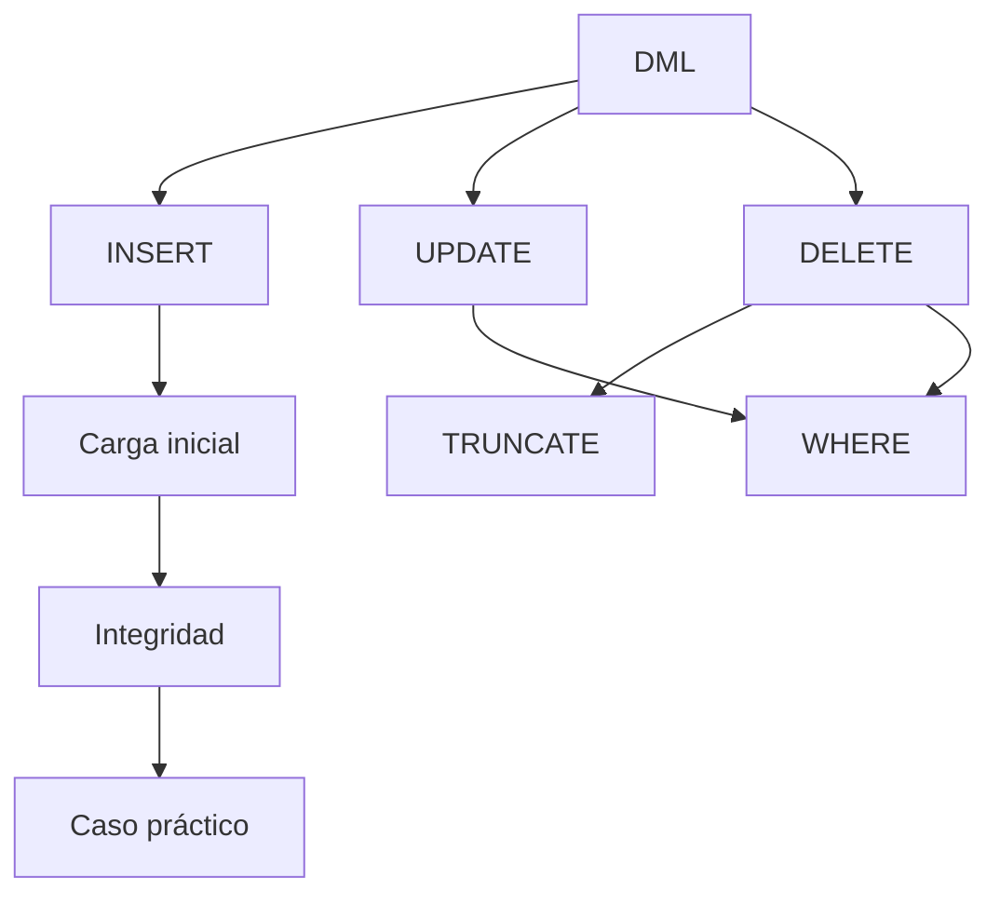

# Resumen

## Introducción

Con esta clase comienza una nueva etapa del curso.

Hasta ahora nos habíamos centrado en construir la estructura de la base de datos mediante el Lenguaje de Definición de Datos (DDL). Creamos bases de datos, tablas, restricciones y relaciones entre entidades.

Sin embargo, una base de datos sin información no puede responder preguntas ni aportar valor a una organización.

En esta sesión hemos aprendido a trabajar con los datos propiamente dichos, utilizando el ​**Lenguaje de Manipulación de Datos (DML)**​.

A partir de ahora, prácticamente todas las clases combinarán consultas con operaciones de inserción, modificación y eliminación sobre un conjunto de datos cada vez más completo.

---

## Resumen narrativo

La clase comenzó diferenciando claramente el papel del **DDL** y del ​**DML**​, comprendiendo que ambos forman parte del lenguaje SQL, pero persiguen objetivos distintos.

Posteriormente estudiamos la sentencia ​**`INSERT`**​, aprendiendo a añadir nuevos registros tanto de forma individual como mediante inserciones múltiples.

A continuación introdujimos ​**`INSERT ... SELECT`**​, una técnica muy utilizada para copiar información entre tablas o generar nuevos conjuntos de datos a partir de consultas existentes.

Después analizamos la sentencia ​**`UPDATE`**​, destinada a modificar registros ya almacenados, prestando especial atención al uso correcto de la cláusula `WHERE`.

Seguidamente estudiamos ​**`DELETE`**​, comprendiendo cómo eliminar registros individuales o conjuntos completos de filas, siempre respetando las restricciones de integridad referencial.

También diferenciamos **`DELETE`** y ​**`TRUNCATE`**​, entendiendo cuándo resulta más apropiado utilizar cada uno de ellos.

La parte final de la clase estuvo dedicada a la carga inicial de datos, la integridad durante las inserciones, los errores más frecuentes y un caso práctico completo sobre la base de datos de la empresa tecnológica.

---

## Mapa conceptual



---

## Lo que el estudiante debería ser capaz de hacer

Al finalizar esta clase el estudiante debería ser capaz de:

* Explicar qué es el Lenguaje de Manipulación de Datos.
* Insertar registros individuales y múltiples.
* Utilizar `INSERT ... SELECT`.
* Modificar información mediante `UPDATE`.
* Eliminar registros utilizando `DELETE`.
* Diferenciar claramente `DELETE` y `TRUNCATE`.
* Comprender por qué `WHERE` es imprescindible en operaciones de modificación.
* Respetar las restricciones de integridad al insertar datos.
* Poblar correctamente una base de datos con información inicial.
* Detectar y corregir los errores más habituales relacionados con DML.

---

## Relación con la siguiente clase

Hasta este momento hemos aprendido a crear la estructura de una base de datos y a llenarla con información.

A partir de la siguiente sesión cambiaremos completamente de perspectiva.

En lugar de modificar los datos, comenzaremos a ​**consultarlos**​.

Estudiaremos el ​**Lenguaje de Consulta de Datos (DQL)**​, comenzando por la sentencia más utilizada de todo SQL:

```sql
SELECT
```

Aprenderemos a:

* recuperar información de una tabla;
* seleccionar columnas concretas;
* utilizar alias;
* ordenar resultados;
* limitar el número de filas mostradas.

Todas estas consultas se realizarán utilizando los datos que hemos insertado durante esta clase.

---

## Conexión con el resto de la asignatura

La evolución del curso hasta este punto puede resumirse de la siguiente forma:

| Bloque              | Contenido                    |
| --------------------- | ------------------------------ |
| Modelo Relacional   | Fundamentos teóricos        |
| Álgebra Relacional | Base matemática de SQL      |
| SQL DDL             | Creación del esquema        |
| SQL DML             | Manipulación de los datos   |
| Próximo bloque     | Consultas SQL (`SELECT`) |

A partir de ahora las clases estarán mucho más orientadas a la resolución de problemas reales mediante consultas sobre bases de datos pobladas.

---

## Ideas clave

* DML permite manipular la información almacenada en una base de datos.
* `INSERT`, `UPDATE` y `DELETE` constituyen las operaciones fundamentales sobre los registros.
* `TRUNCATE` permite vaciar rápidamente una tabla completa.
* La cláusula `WHERE` es esencial para realizar modificaciones seguras.
* Las restricciones continúan protegiendo la integridad durante todas las operaciones DML.
* La carga inicial de datos constituye el punto de partida para cualquier proyecto profesional.
* Con esta clase queda preparada la base de datos para comenzar el bloque dedicado a consultas SQL mediante `SELECT`, el núcleo del trabajo cotidiano con bases de datos relacionales.

