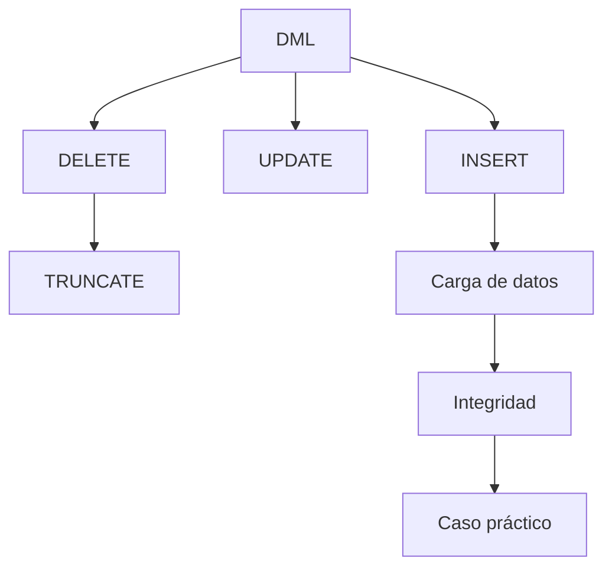

# Clase 16. SQL DML: INSERT, UPDATE y DELETE

## Introducción

En las dos clases anteriores hemos construido la estructura de nuestra base de datos utilizando el Lenguaje de Definición de Datos (DDL). Creamos la base de datos, definimos tablas, seleccionamos tipos de datos adecuados y establecimos restricciones para garantizar la integridad de la información.

Sin embargo, una base de datos formada únicamente por tablas vacías tiene poca utilidad.

El verdadero objetivo de un sistema gestor de bases de datos es almacenar, modificar y administrar información real.

A partir de esta sesión comenzaremos a trabajar con el ​**Lenguaje de Manipulación de Datos (Data Manipulation Language, DML)**​, el conjunto de instrucciones de SQL encargado de insertar, actualizar y eliminar registros.

Estas operaciones constituyen el trabajo diario de prácticamente cualquier aplicación informática. Cada vez que un usuario crea una cuenta, modifica su dirección, registra un pedido o elimina un elemento de su carrito de compra, la aplicación está ejecutando instrucciones DML sobre la base de datos.

Durante esta clase aprenderemos a realizar estas operaciones de forma segura, respetando todas las restricciones estudiadas anteriormente y comprendiendo las consecuencias que cada modificación produce sobre la información almacenada.

Como en el resto del curso, utilizaremos exclusivamente la base de datos de la empresa tecnológica, que continuará creciendo progresivamente durante las próximas semanas.

---

## Objetivos de aprendizaje

Al finalizar esta sesión el estudiante será capaz de:

* Comprender el propósito del Lenguaje de Manipulación de Datos (DML).
* Insertar registros mediante `INSERT`.
* Insertar múltiples registros en una única sentencia.
* Utilizar `INSERT ... SELECT`.
* Modificar información existente mediante `UPDATE`.
* Eliminar registros utilizando `DELETE`.
* Diferenciar entre `DELETE` y `TRUNCATE`.
* Comprender la importancia de la cláusula `WHERE` en las operaciones de modificación.
* Poblar correctamente la base de datos del caso práctico.
* Interpretar los errores más habituales relacionados con la manipulación de datos.

---

## Contenido

1. [¿Qué es DML?](01_que_es_dml.md)
2. [INSERT básico](02_insert_basico.md)
3. [INSERT múltiple](03_insert_multiple.md)
4. [INSERT ... SELECT](04_insert_select.md)
5. [UPDATE](05_update.md)
6. [DELETE](06_delete.md)
7. [TRUNCATE](07_truncate.md)
8. [La importancia del WHERE](08_importancia_del_where.md)
9. [Carga inicial de datos](09_carga_inicial_de_datos.md)
10. [Integridad al insertar](10_integridad_al_insertar.md)
11. [Errores habituales](11_errores_habituales.md)
12. [Caso práctico de la empresa](12_caso_practico_empresa.md)
13. [Ejercicios guiados](13_ejercicios_guiados.md)
14. [Resumen](14_resumen.md)

---

## Mapa conceptual

---

## Relación con las clases anteriores

En las clases anteriores construimos el esquema físico de la base de datos.

Aprendimos a:

* crear bases de datos;
* crear tablas;
* definir tipos de datos;
* establecer claves primarias;
* crear claves foráneas;
* aplicar restricciones;
* modificar el esquema mediante `ALTER TABLE`.

Todas estas estructuras permanecerán exactamente iguales durante esta sesión.

La diferencia es que ahora comenzaremos a almacenar información real en ellas.

---

## Relación con las siguientes clases

Una vez que la base de datos contenga datos reales podremos comenzar a responder preguntas sobre esa información.

Las próximas clases introducirán el **Lenguaje de Consulta de Datos (DQL)** mediante la sentencia `SELECT`.

Todo el contenido de dichas sesiones dependerá directamente de la información que aprenderemos a insertar y administrar en esta clase.

