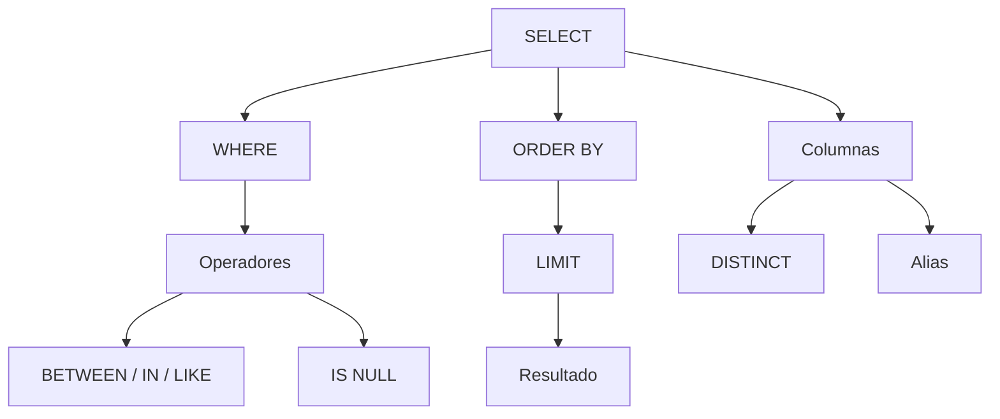

# Resumen

## Introducción

Con esta clase comienza el bloque central de la programación en SQL.

Hasta ahora hemos aprendido a diseñar bases de datos mediante el modelo relacional, a crear tablas utilizando DDL y a manipular los datos mediante DML.

A partir de este momento nuestro objetivo principal será ​**consultar la información almacenada**​.

La sentencia `SELECT` constituye la herramienta más utilizada en cualquier sistema gestor de bases de datos y será la base sobre la que construiremos el resto del curso.

---

## Resumen de la clase

Durante esta sesión hemos aprendido que una consulta SQL comienza con la sentencia `SELECT`, encargada de recuperar información sin modificar la base de datos.

Posteriormente estudiamos la ​**proyección de columnas**​, comprendiendo por qué en aplicaciones profesionales resulta recomendable seleccionar únicamente la información necesaria en lugar de utilizar `SELECT *`.

Después incorporamos los ​**alias**​, que permiten mejorar la presentación de los resultados mediante nombres temporales para columnas.

A continuación analizamos el uso de ​**`DISTINCT`**​, útil para eliminar valores duplicados en una consulta.

El siguiente gran bloque estuvo dedicado a ​**`WHERE`**​, la cláusula encargada de filtrar registros.

Para construir filtros más expresivos aprendimos a utilizar:

* operadores relacionales;
* operadores lógicos;
* `BETWEEN`;
* `IN`;
* `LIKE`;
* `IS NULL`.

Posteriormente vimos cómo ordenar resultados mediante `ORDER BY` y limitar el número de filas utilizando `LIMIT`.

Finalmente estudiamos el **orden lógico de ejecución** de una consulta SQL, resolvimos un caso práctico completo y analizamos los errores más habituales cometidos por los principiantes.

---

## Mapa conceptual

---

## Competencias adquiridas

Al finalizar esta clase el estudiante es capaz de:

* Recuperar información mediante `SELECT`.
* Seleccionar columnas concretas.
* Utilizar alias para mejorar la presentación.
* Eliminar duplicados mediante `DISTINCT`.
* Filtrar registros utilizando `WHERE`.
* Aplicar operadores relacionales y lógicos.
* Utilizar `BETWEEN`, `IN`, `LIKE` e `IS NULL`.
* Ordenar resultados con `ORDER BY`.
* Limitar el número de filas mediante `LIMIT`.
* Comprender el orden lógico de ejecución de una consulta SQL.

---

## Relación con la siguiente clase

Hasta ahora todas nuestras consultas devolvían registros individuales.

Sin embargo, en muchas ocasiones necesitamos responder preguntas como:

* ¿Cuántos clientes hay registrados?
* ¿Cuál es el precio medio de los productos?
* ¿Cuál es el producto más caro?
* ¿Cuál es el stock total disponible?

Para resolver este tipo de problemas estudiaremos las ​**funciones de agregación**​, como:

* `COUNT()`
* `SUM()`
* `AVG()`
* `MIN()`
* `MAX()`

Estas funciones nos permitirán resumir grandes cantidades de información mediante un único resultado, preparando el camino para el estudio de `GROUP BY` y `HAVING`.

---

## Ideas clave

* `SELECT` es la sentencia más utilizada de todo SQL.
* Las consultas permiten recuperar información sin modificar la base de datos.
* El filtrado, la ordenación y la limitación de resultados constituyen la base de prácticamente todas las consultas SQL.
* Comprender el orden lógico de ejecución facilita la construcción de consultas correctas y eficientes.
* Esta clase marca el inicio del bloque más importante del curso: el desarrollo de consultas sobre bases de datos relacionales.

