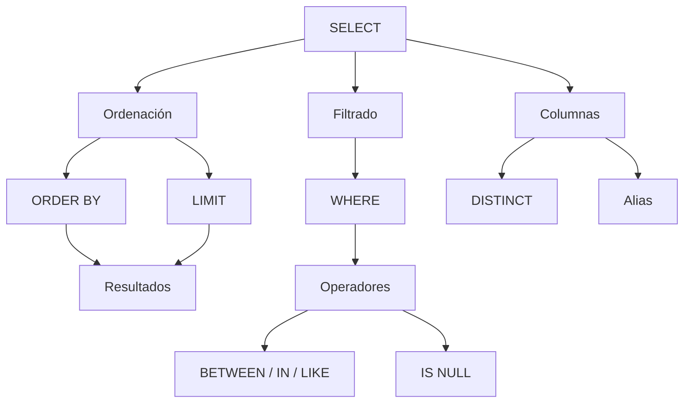

# Clase 17. SQL DQL: SELECT y consultas básicas

## Introducción

Hasta este momento del curso hemos construido una base de datos completa.

Primero diseñamos el modelo relacional, después creamos físicamente las tablas mediante el Lenguaje de Definición de Datos (DDL) y finalmente aprendimos a insertar, modificar y eliminar información utilizando el Lenguaje de Manipulación de Datos (DML).

A partir de esta clase comienza el bloque más importante de toda la asignatura.

Aprenderemos a **consultar la información almacenada** mediante la sentencia `SELECT`, que constituye el núcleo del Lenguaje de Consulta de Datos (​**DQL**​, ​*Data Query Language*​).

En prácticamente cualquier aplicación informática, las consultas representan la inmensa mayoría de las operaciones realizadas sobre una base de datos. Mostrar productos, buscar clientes, consultar pedidos, generar informes o visualizar estadísticas son tareas que se realizan constantemente mediante consultas SQL.

Durante esta clase comenzaremos con las consultas más sencillas, aprendiendo a recuperar información de una tabla, filtrar registros y ordenar resultados. En las próximas sesiones ampliaremos estos conocimientos hasta construir consultas complejas sobre múltiples tablas.

---

## Objetivos de aprendizaje

Al finalizar esta sesión el estudiante será capaz de:

* Comprender el propósito del Lenguaje de Consulta de Datos (DQL).
* Utilizar correctamente la sentencia `SELECT`.
* Seleccionar columnas concretas de una tabla.
* Utilizar alias para mejorar la presentación de los resultados.
* Eliminar duplicados mediante `DISTINCT`.
* Filtrar registros utilizando `WHERE`.
* Aplicar operadores relacionales y lógicos.
* Utilizar `BETWEEN`, `IN`, `LIKE` e `IS NULL`.
* Ordenar resultados mediante `ORDER BY`.
* Limitar el número de filas utilizando `LIMIT`.
* Comprender el orden lógico de ejecución de una consulta SQL.

---

## Índice

1. [La consulta SELECT](01_la_consulta_select.md)
2. [Proyección de columnas](02_proyeccion_de_columnas.md)
3. [Alias](03_alias.md)
4. [DISTINCT](04_distinct.md)
5. [WHERE](05_where.md)
6. [Operadores relacionales](06_operadores_relacionales.md)
7. [Operadores lógicos](07_operadores_logicos.md)
8. [BETWEEN, IN y LIKE](08_between_in_like.md)
9. [IS NULL](09_is_null.md)
10. [ORDER BY](10_order_by.md)
11. [LIMIT](11_limit.md)
12. [Orden lógico de ejecución](12_orden_logico_de_ejecucion.md)
13. [Caso práctico](13_caso_practico.md)
14. [Errores frecuentes](14_errores_frecuentes.md)
15. [Resumen](15_resumen.md)

---

## Mapa conceptual

---

## Relación con las clases anteriores

Todo lo aprendido hasta ahora será utilizado en esta sesión.

Las tablas creadas mediante DDL y pobladas mediante DML constituirán el origen de todas nuestras consultas.

No modificaremos la estructura de la base de datos ni insertaremos nuevos registros.

Nuestro objetivo será aprender a **extraer información** de forma eficiente.

---

## Relación con las siguientes clases

Esta clase introduce únicamente los fundamentos de `SELECT`.

Las siguientes sesiones ampliarán progresivamente estas capacidades mediante:

* funciones de agregación (`COUNT`, `SUM`, `AVG`, `MIN`, `MAX`);
* agrupaciones (`GROUP BY`);
* filtrado de grupos (`HAVING`);
* consultas sobre varias tablas (`JOIN`);
* subconsultas;
* vistas;
* optimización de consultas.

A partir de este punto el curso entra en el bloque central de SQL, donde construiremos consultas cada vez más cercanas a las utilizadas en entornos profesionales.

