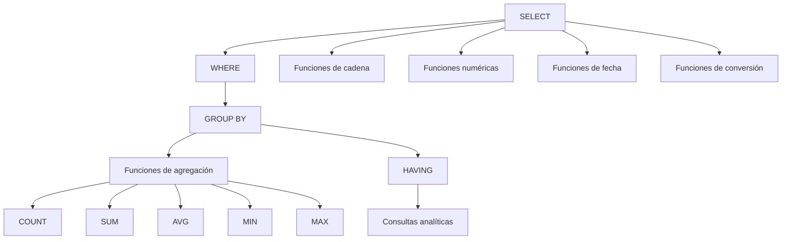

# Resumen

## Introducción

Con esta clase damos un paso importante en el aprendizaje de SQL.

Hasta ahora nuestras consultas se centraban en **recuperar registros individuales** mediante `SELECT` y filtrarlos utilizando `WHERE`.

A partir de esta sesión hemos aprendido a ​**obtener información resumida**​, generar estadísticas y construir consultas analíticas capaces de responder preguntas de negocio.

Este tipo de consultas son las que utilizan habitualmente analistas de datos, departamentos financieros, responsables comerciales y herramientas de ​*Business Intelligence*​.

---

## Resumen de la clase

Comenzamos comprendiendo la necesidad de **agrupar datos** para transformar grandes cantidades de registros en información útil para la toma de decisiones.

Posteriormente estudiamos las ​**funciones de agregación**​, observando cómo permiten resumir múltiples filas mediante un único resultado.

Aprendimos el funcionamiento de:

* `COUNT()`
* `SUM()`
* `AVG()`
* `MIN()`
* `MAX()`

A continuación incorporamos la cláusula ​**`GROUP BY`**​, que divide los registros en grupos para calcular estadísticas independientes sobre cada uno de ellos.

Después estudiamos ​**`HAVING`**​, utilizada para filtrar los grupos obtenidos tras la agregación, diferenciándola claramente de `WHERE`, que actúa sobre filas individuales antes del agrupamiento.

La segunda parte de la sesión estuvo dedicada a las funciones que transforman valores individuales:

* funciones de cadena;
* funciones numéricas;
* funciones de fecha;
* funciones de conversión.

Estas funciones permiten manipular datos sin necesidad de modificar la información almacenada.

Finalmente aplicamos todos estos conocimientos en un caso práctico completo y analizamos los errores más frecuentes cometidos durante el desarrollo de consultas analíticas.

---

## Mapa conceptual

---

## Competencias adquiridas

Al finalizar esta clase el estudiante es capaz de:

* utilizar funciones de agregación para resumir datos;
* calcular totales, medias, máximos y mínimos;
* agrupar registros mediante `GROUP BY`;
* filtrar grupos utilizando `HAVING`;
* distinguir claramente entre `WHERE` y `HAVING`;
* aplicar funciones de cadena para transformar texto;
* utilizar funciones numéricas para realizar cálculos;
* trabajar con fechas y horas mediante funciones específicas;
* convertir datos entre distintos tipos utilizando `CAST()`;
* construir consultas analíticas utilizadas en entornos empresariales.

---

## Errores que ya debemos evitar

Después de esta sesión el estudiante debería evitar errores como:

* utilizar `WHERE` en lugar de `HAVING`;
* olvidar la cláusula `GROUP BY` cuando es necesaria;
* confundir `COUNT(*)` con `COUNT(columna)`;
* no utilizar alias en funciones de agregación;
* desconocer el comportamiento de los valores `NULL`;
* aplicar funciones innecesarias sobre los resultados.

Corregir estos errores desde las primeras etapas facilitará el desarrollo de consultas mucho más complejas en las siguientes unidades.

---

## Relación con la siguiente clase

Hasta este momento todas las consultas han trabajado sobre ​**una única tabla**​.

Sin embargo, en una base de datos real la información se encuentra distribuida entre múltiples tablas relacionadas.

Por ejemplo:

* los clientes están separados de los pedidos;
* los pedidos contienen productos;
* los productos pertenecen a categorías;
* los empleados trabajan en departamentos.

Para responder preguntas como:

* ¿Qué clientes han realizado pedidos?
* ¿Qué productos pertenecen a cada categoría?
* ¿Qué empleado atendió cada venta?

necesitaremos combinar información procedente de varias tablas.

La siguiente clase estará dedicada a uno de los conceptos más importantes de todo SQL:

* `INNER JOIN`
* `LEFT JOIN`
* `RIGHT JOIN`
* `CROSS JOIN`
* relaciones entre claves primarias y claves foráneas

El dominio de los `JOIN` marcará el paso desde consultas básicas hacia consultas profesionales utilizadas diariamente en el desarrollo de aplicaciones.

---

## Ideas clave

* Las funciones de agregación permiten transformar datos en información útil.
* `GROUP BY` crea grupos de registros y `HAVING` filtra dichos grupos.
* Las funciones de cadena, numéricas, de fecha y de conversión amplían enormemente las posibilidades de SQL.
* Las consultas analíticas constituyen la base de los sistemas de información empresariales.
* El siguiente gran paso será aprender a combinar múltiples tablas mediante `JOIN`, uno de los temas más importantes de todo el curso.

