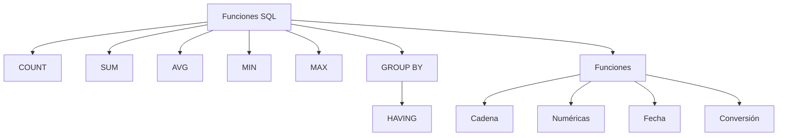

# Clase 18. SQL DQL: Funciones, GROUP BY y HAVING

## Introducción

En la clase anterior aprendimos a recuperar información de una o varias tablas utilizando la sentencia `SELECT`. También vimos cómo filtrar registros mediante `WHERE`, ordenar resultados con `ORDER BY` y limitar el número de filas mediante `LIMIT`.

Sin embargo, muchas de las preguntas que aparecen en un entorno empresarial no buscan mostrar registros individuales, sino ​**obtener información resumida**​.

Por ejemplo:

* ¿Cuántos clientes tiene la empresa?
* ¿Cuál es el precio medio de los productos?
* ¿Qué categoría contiene más artículos?
* ¿Cuál es el salario máximo de un departamento?
* ¿Cuánto stock total existe en el almacén?
* ¿Cuántos pedidos realizó cada cliente?

Responder a este tipo de preguntas requiere utilizar **funciones de agregación** y ​**agrupaciones**​.

Este bloque constituye uno de los pilares fundamentales de SQL y será utilizado constantemente en informes, paneles de control (​*dashboards*​), inteligencia de negocio (Business Intelligence), auditorías y análisis de datos.

> **Nota:** Aunque en el título inicial aparecía "SQL DML", el contenido de esta sesión pertenece realmente al ​**Lenguaje de Consulta de Datos (DQL)**​, ya que no modifica información, sino que obtiene resultados a partir de los datos almacenados.

---

## Objetivos de aprendizaje

Al finalizar esta sesión el estudiante será capaz de:

* Comprender por qué es necesario agrupar información.
* Utilizar correctamente las funciones de agregación.
* Aplicar `COUNT`, `SUM`, `AVG`, `MIN` y `MAX`.
* Agrupar registros mediante `GROUP BY`.
* Filtrar grupos utilizando `HAVING`.
* Diferenciar claramente `WHERE` y `HAVING`.
* Utilizar funciones de cadena, numéricas y de fecha.
* Aplicar funciones de conversión de tipos.
* Resolver consultas analíticas reales sobre una base de datos empresarial.

---

## Índice

1. [¿Por qué agrupar datos?](01_por_que_agrupar_datos.md)
2. [Funciones de agregación](02_funciones_de_agregacion.md)
3. [COUNT](03_count.md)
4. [SUM, AVG, MIN y MAX](04_sum_avg_min_max.md)
5. [GROUP BY](05_group_by.md)
6. [HAVING](06_having.md)
7. [GROUP BY vs WHERE](07_group_by_vs_where.md)
8. [Funciones de cadena](08_funciones_de_cadena.md)
9. [Funciones numéricas](09_funciones_numericas.md)
10. [Funciones de fecha](10_funciones_de_fecha.md)
11. [Funciones de conversión](11_funciones_de_conversion.md)
12. [Caso práctico completo](12_caso_practico_completo.md)
13. [Errores frecuentes](13_errores_frecuentes.md)
14. [Resumen](14_resumen.md)

---

## Relación con las clases anteriores

Hasta ahora todas las consultas devolvían registros individuales.

A partir de esta clase aprenderemos a generar ​**información resumida**​, obteniendo indicadores, estadísticas y métricas a partir de grandes cantidades de datos.

Este cambio supone el paso desde las consultas operativas hacia las consultas analíticas.

---

## Metodología de la clase

Durante toda la sesión seguiremos el mismo esquema de trabajo:

1. Explicación del concepto.
2. Consulta SQL.
3. Ejecución en MySQL.
4. Interpretación del resultado.
5. Variaciones y ejercicios adicionales.

Todas las consultas se ejecutarán directamente sobre la base de datos creada en las clases anteriores utilizando **MySQL Workbench** y ​**phpMyAdmin**​.

---

## Mapa conceptual

---

## Relación con las siguientes clases

Las agrupaciones constituyen la base de numerosos conceptos que estudiaremos posteriormente.

En las próximas sesiones utilizaremos estos conocimientos junto con:

* `INNER JOIN`
* `LEFT JOIN`
* `RIGHT JOIN`
* Subconsultas
* Vistas
* Consultas de análisis

A partir de ese momento construiremos consultas similares a las utilizadas diariamente en departamentos financieros, comerciales y de análisis de datos.

